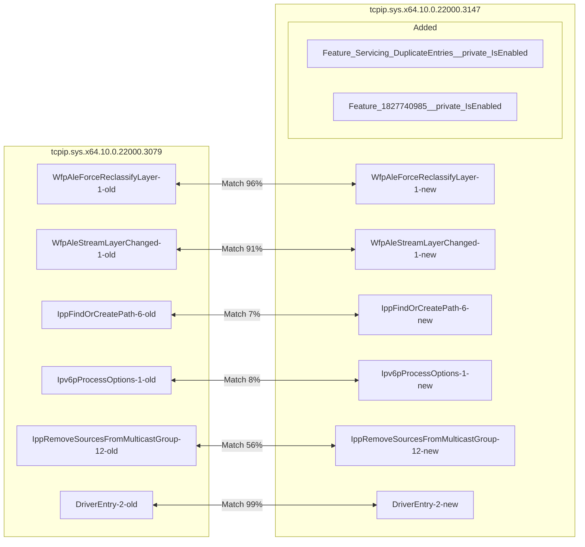
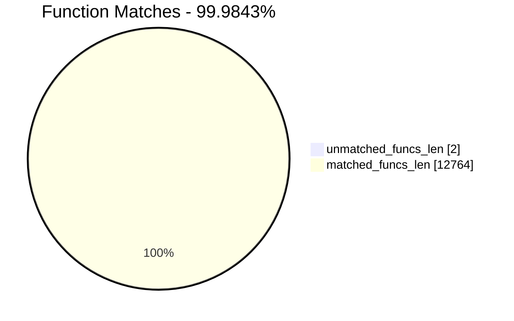
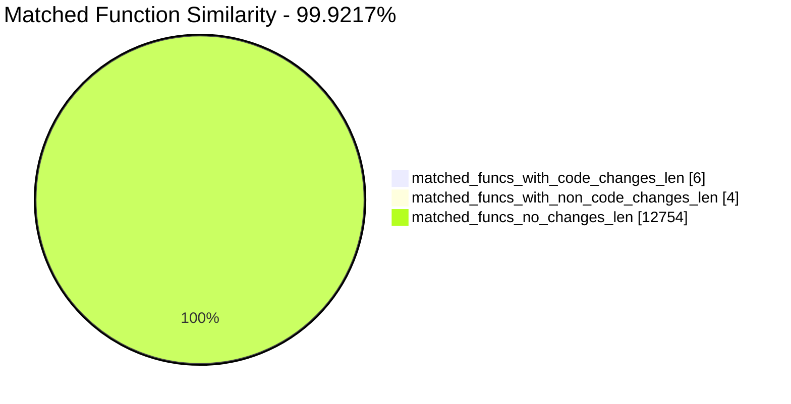
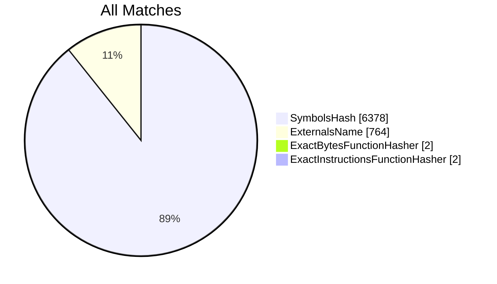
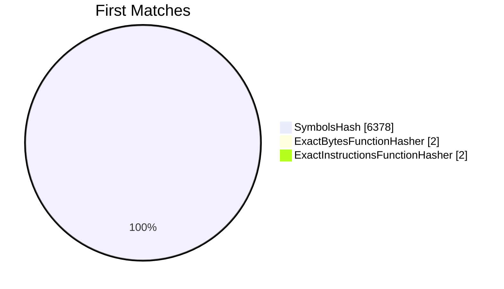
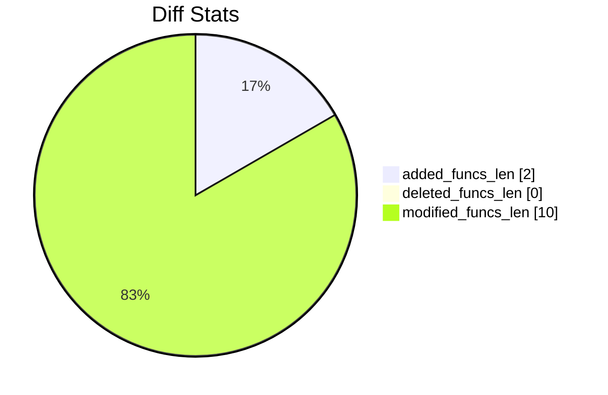
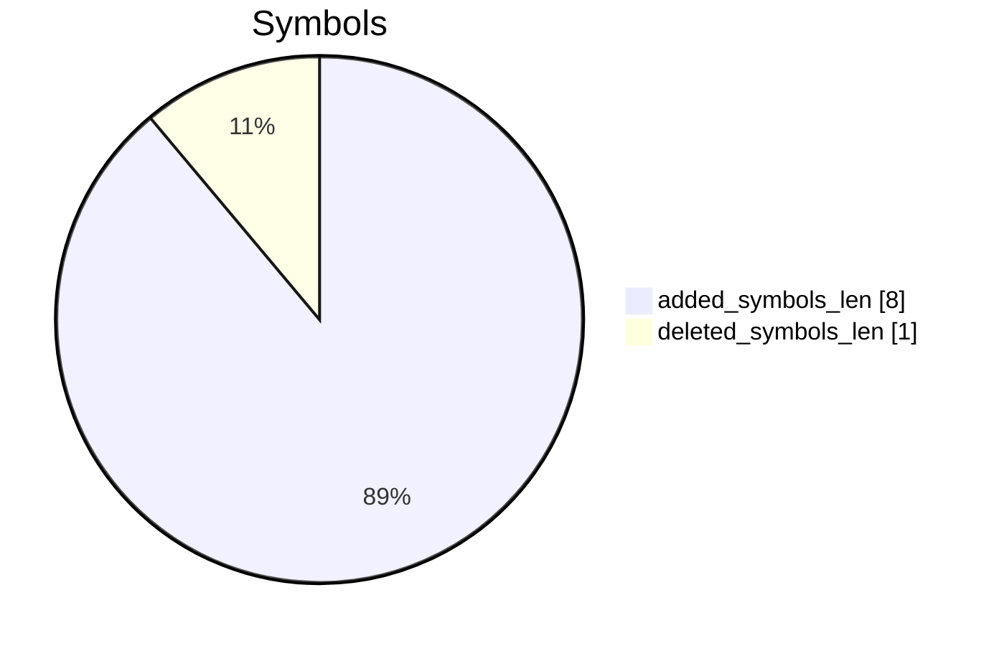

# tcpip.sys.x64.10.0.22000.3079-tcpip.sys.x64.10.0.22000.3147 Diff

# TOC

* [Visual Chart Diff](#visual-chart-diff)
* [Metadata](#metadata)
	* [Ghidra Diff Engine](#ghidra-diff-engine)
		* [Command Line](#command-line)
	* [Binary Metadata Diff](#binary-metadata-diff)
	* [Program Options](#program-options)
	* [Diff Stats](#diff-stats)
	* [Strings](#strings)
* [Deleted](#deleted)
* [Added](#added)
	* [Feature_Servicing_DuplicateEntries__private_IsEnabled](#feature_servicing_duplicateentries__private_isenabled)
	* [Feature_1827740985__private_IsEnabled](#feature_1827740985__private_isenabled)
* [Modified](#modified)
	* [WfpAleForceReclassifyLayer](#wfpaleforcereclassifylayer)
	* [WfpAleStreamLayerChanged](#wfpalestreamlayerchanged)
	* [IppFindOrCreatePath](#ippfindorcreatepath)
	* [Ipv6pProcessOptions](#ipv6pprocessoptions)
	* [IppRemoveSourcesFromMulticastGroup](#ippremovesourcesfrommulticastgroup)
	* [DriverEntry](#driverentry)
* [Modified (No Code Changes)](#modified-no-code-changes)
	* [OlmNotifyAddInterface](#olmnotifyaddinterface)
	* [wil_details_FeatureReporting_ReportUsageToService](#wil_details_featurereporting_reportusagetoservice)
	* [wil_details_FeatureStateCache_GetCachedFeatureEnabledState](#wil_details_featurestatecache_getcachedfeatureenabledstate)

# Visual Chart Diff










# Metadata

## Ghidra Diff Engine

### Command Line

#### Captured Command Line


```
ghidriff --project-location ghidra_projects --project-name ghidriff --symbols-path symbols --threaded --log-level INFO --file-log-level INFO --log-path ghidriff.log --min-func-len 10 --gdt [] --bsim --max-ram-percent 60.0 --max-section-funcs 200 tcpip.sys.x64.10.0.22000.3079 tcpip.sys.x64.10.0.22000.3147
```


#### Verbose Args


<details>

```
--old ['tcpip.sys.x64.10.0.22000.3079'] --new [['tcpip.sys.x64.10.0.22000.3147']] --engine VersionTrackingDiff --output-path ghidriffs --summary False --project-location ghidra_projects --project-name ghidriff --symbols-path symbols --threaded True --force-analysis False --force-diff False --no-symbols False --log-level INFO --file-log-level INFO --log-path ghidriff.log --va False --min-func-len 10 --use-calling-counts False --gdt [] --bsim True --bsim-full False --max-ram-percent 60.0 --print-flags False --jvm-args None --side-by-side False --max-section-funcs 200 --md-title None
```


</details>

#### Download Original PEs


```
wget https://msdl.microsoft.com/download/symbols/tcpip.sys/0578F210317000/tcpip.sys -O tcpip.sys.x64.10.0.22000.3079
wget https://msdl.microsoft.com/download/symbols/tcpip.sys/67023CB3318000/tcpip.sys -O tcpip.sys.x64.10.0.22000.3139
```


## Binary Metadata Diff


```diff
--- tcpip.sys.x64.10.0.22000.3079 Meta
+++ tcpip.sys.x64.10.0.22000.3147 Meta
@@ -1,44 +1,44 @@
-Program Name: tcpip.sys.x64.10.0.22000.3079
+Program Name: tcpip.sys.x64.10.0.22000.3147
 Language ID: x86:LE:64:default (4.0)
 Compiler ID: windows
 Processor: x86
 Endian: Little
 Address Size: 64
 Minimum Address: 1c0000000
 Maximum Address: ff0000184f
-# of Bytes: 3246148
+# of Bytes: 3246220
 # of Memory Blocks: 18
-# of Instructions: 505803
-# of Defined Data: 18192
-# of Functions: 6382
-# of Symbols: 68879
+# of Instructions: 505823
+# of Defined Data: 18198
+# of Functions: 6384
+# of Symbols: 68893
 # of Data Types: 454
 # of Data Type Categories: 31
 Analyzed: true
 Compiler: visualstudio:unknown
 Created With Ghidra Version: 11.1
-Date Created: Fri Aug 16 16:49:26 UTC 2024
+Date Created: Fri Aug 16 16:49:29 UTC 2024
 Executable Format: Portable Executable (PE)
-Executable Location: /workspaces/ghidriff/tcpip.sys.x64.10.0.22000.3079
-Executable MD5: 13887b649adb01891a203c6969f6c311
-Executable SHA256: bd8c587dd50f83d34f90f371cd56bae4d0c7d10079e207e7fe0f51d4de3bbbfa
-FSRL: file:///workspaces/ghidriff/tcpip.sys.x64.10.0.22000.3079?MD5=13887b649adb01891a203c6969f6c311
+Executable Location: /workspaces/ghidriff/tcpip.sys.x64.10.0.22000.3147
+Executable MD5: ebb09305578013574fc0c57612cea611
+Executable SHA256: e8f6ab535d49ff06aca803dd5995007ed4680492402c81ea35767bce84cf8177
+FSRL: file:///workspaces/ghidriff/tcpip.sys.x64.10.0.22000.3147?MD5=ebb09305578013574fc0c57612cea611
 PDB Age: 1
 PDB File: tcpip.pdb
-PDB GUID: 40a06e27-e476-5e89-7a5a-9659b79634bb
+PDB GUID: 808705cc-83c8-3b31-8c63-d9d8bd42d065
 PDB Loaded: true
 PDB Version: RSDS
 PE Property[CompanyName]: Microsoft Corporation
 PE Property[FileDescription]: TCP/IP Driver
-PE Property[FileVersion]: 10.0.22000.3079 (WinBuild.160101.0800)
+PE Property[FileVersion]: 10.0.22000.3139 (WinBuild.160101.0800)
 PE Property[InternalName]: tcpip.sys
 PE Property[LegalCopyright]: © Microsoft Corporation. All rights reserved.
 PE Property[OriginalFilename]: tcpip.sys
 PE Property[ProductName]: Microsoft® Windows® Operating System
-PE Property[ProductVersion]: 10.0.22000.3079
+PE Property[ProductVersion]: 10.0.22000.3139
 PE Property[Translation]: 4b00409
 Preferred Root Namespace Category: 
 RTTI Found: false
 Relocatable: true
 SectionAlignment: 4096
 Should Ask To Analyze: false

```


## Program Options


<details>
<summary>Ghidra tcpip.sys.x64.10.0.22000.3079 Decompiler Options</summary>


|Decompiler Option|Value|
| :---: | :---: |
|Prototype Evaluation|__fastcall|

</details>


<details>
<summary>Ghidra tcpip.sys.x64.10.0.22000.3079 Specification extensions Options</summary>


|Specification extensions Option|Value|
| :---: | :---: |
|FormatVersion|0|
|VersionCounter|0|

</details>


<details>
<summary>Ghidra tcpip.sys.x64.10.0.22000.3079 Analyzers Options</summary>


|Analyzers Option|Value|
| :---: | :---: |
|ASCII Strings|true|
|ASCII Strings.Create Strings Containing Existing Strings|true|
|ASCII Strings.Create Strings Containing References|true|
|ASCII Strings.Force Model Reload|false|
|ASCII Strings.Minimum String Length|LEN_5|
|ASCII Strings.Model File|StringModel.sng|
|ASCII Strings.Require Null Termination for String|true|
|ASCII Strings.Search Only in Accessible Memory Blocks|true|
|ASCII Strings.String Start Alignment|ALIGN_1|
|ASCII Strings.String end alignment|4|
|Aggressive Instruction Finder|false|
|Aggressive Instruction Finder.Create Analysis Bookmarks|true|
|Apply Data Archives|true|
|Apply Data Archives.Archive Chooser|[Auto-Detect]|
|Apply Data Archives.Create Analysis Bookmarks|true|
|Apply Data Archives.GDT User File Archive Path|None|
|Apply Data Archives.User Project Archive Path|None|
|Call Convention ID|true|
|Call Convention ID.Analysis Decompiler Timeout (sec)|60|
|Call-Fixup Installer|true|
|Condense Filler Bytes|false|
|Condense Filler Bytes.Filler Value|Auto|
|Condense Filler Bytes.Minimum number of sequential bytes|1|
|Create Address Tables|true|
|Create Address Tables.Allow Offcut References|false|
|Create Address Tables.Auto Label Table|false|
|Create Address Tables.Create Analysis Bookmarks|true|
|Create Address Tables.Maxmimum Pointer Distance|16777215|
|Create Address Tables.Minimum Pointer Address|4132|
|Create Address Tables.Minimum Table Size|2|
|Create Address Tables.Pointer Alignment|1|
|Create Address Tables.Relocation Table Guide|true|
|Create Address Tables.Table Alignment|4|
|Data Reference|true|
|Data Reference.Address Table Alignment|1|
|Data Reference.Address Table Minimum Size|2|
|Data Reference.Align End of Strings|false|
|Data Reference.Ascii String References|true|
|Data Reference.Create Address Tables|true|
|Data Reference.Minimum String Length|5|
|Data Reference.References to Pointers|true|
|Data Reference.Relocation Table Guide|true|
|Data Reference.Respect Execute Flag|true|
|Data Reference.Subroutine References|true|
|Data Reference.Switch Table References|false|
|Data Reference.Unicode String References|true|
|Decompiler Parameter ID|true|
|Decompiler Parameter ID.Analysis Clear Level|ANALYSIS|
|Decompiler Parameter ID.Analysis Decompiler Timeout (sec)|60|
|Decompiler Parameter ID.Commit Data Types|true|
|Decompiler Parameter ID.Commit Void Return Values|false|
|Decompiler Parameter ID.Prototype Evaluation|__fastcall|
|Decompiler Switch Analysis|true|
|Decompiler Switch Analysis.Analysis Decompiler Timeout (sec)|60|
|Demangler Microsoft|true|
|Demangler Microsoft.Apply Function Calling Conventions|true|
|Demangler Microsoft.Apply Function Signatures|true|
|Disassemble Entry Points|true|
|Disassemble Entry Points.Respect Execute Flag|true|
|Embedded Media|true|
|Embedded Media.Create Analysis Bookmarks|true|
|External Entry References|true|
|Function ID|true|
|Function ID.Always Apply FID Labels|false|
|Function ID.Create Analysis Bookmarks|true|
|Function ID.Instruction Count Threshold|14.6|
|Function ID.Multiple Match Threshold|30.0|
|Function Start Search|true|
|Function Start Search.Bookmark Functions|false|
|Function Start Search.Search Data Blocks|false|
|Non-Returning Functions - Discovered|true|
|Non-Returning Functions - Discovered.Create Analysis Bookmarks|true|
|Non-Returning Functions - Discovered.Function Non-return Threshold|3|
|Non-Returning Functions - Discovered.Repair Flow Damage|true|
|Non-Returning Functions - Known|true|
|Non-Returning Functions - Known.Create Analysis Bookmarks|true|
|PDB MSDIA|false|
|PDB MSDIA.Search remote symbol servers|false|
|PDB Universal|true|
|PDB Universal.Search remote symbol servers|false|
|Reference|true|
|Reference.Address Table Alignment|1|
|Reference.Address Table Minimum Size|2|
|Reference.Align End of Strings|false|
|Reference.Ascii String References|true|
|Reference.Create Address Tables|true|
|Reference.Minimum String Length|5|
|Reference.References to Pointers|true|
|Reference.Relocation Table Guide|true|
|Reference.Respect Execute Flag|true|
|Reference.Subroutine References|true|
|Reference.Switch Table References|false|
|Reference.Unicode String References|true|
|Scalar Operand References|true|
|Scalar Operand References.Relocation Table Guide|true|
|Shared Return Calls|true|
|Shared Return Calls.Allow Conditional Jumps|false|
|Shared Return Calls.Assume Contiguous Functions Only|false|
|Stack|true|
|Stack.Create Local Variables|true|
|Stack.Create Param Variables|true|
|Stack.useNewFunctionStackAnalysis|true|
|Subroutine References|true|
|Subroutine References.Create Thunks Early|true|
|Variadic Function Signature Override|false|
|Variadic Function Signature Override.Create Analysis Bookmarks|false|
|Windows x86 PE Exception Handling|true|
|Windows x86 PE RTTI Analyzer|true|
|Windows x86 Thread Environment Block (TEB) Analyzer|true|
|Windows x86 Thread Environment Block (TEB) Analyzer.Starting Address of the TEB||
|Windows x86 Thread Environment Block (TEB) Analyzer.Windows OS Version|Windows 7|
|WindowsPE x86 Propagate External Parameters|false|
|WindowsResourceReference|true|
|WindowsResourceReference.Create Analysis Bookmarks|true|
|x86 Constant Reference Analyzer|true|
|x86 Constant Reference Analyzer.Create Data from pointer|false|
|x86 Constant Reference Analyzer.Function parameter/return Pointer analysis|true|
|x86 Constant Reference Analyzer.Max Threads|2|
|x86 Constant Reference Analyzer.Min absolute reference|4|
|x86 Constant Reference Analyzer.Require pointer param data type|false|
|x86 Constant Reference Analyzer.Speculative reference max|512|
|x86 Constant Reference Analyzer.Speculative reference min|1024|
|x86 Constant Reference Analyzer.Stored Value Pointer analysis|true|
|x86 Constant Reference Analyzer.Trust values read from writable memory|true|

</details>


<details>
<summary>Ghidra tcpip.sys.x64.10.0.22000.3147 Decompiler Options</summary>


|Decompiler Option|Value|
| :---: | :---: |
|Prototype Evaluation|__fastcall|

</details>


<details>
<summary>Ghidra tcpip.sys.x64.10.0.22000.3147 Specification extensions Options</summary>


|Specification extensions Option|Value|
| :---: | :---: |
|FormatVersion|0|
|VersionCounter|0|

</details>


<details>
<summary>Ghidra tcpip.sys.x64.10.0.22000.3147 Analyzers Options</summary>


|Analyzers Option|Value|
| :---: | :---: |
|ASCII Strings|true|
|ASCII Strings.Create Strings Containing Existing Strings|true|
|ASCII Strings.Create Strings Containing References|true|
|ASCII Strings.Force Model Reload|false|
|ASCII Strings.Minimum String Length|LEN_5|
|ASCII Strings.Model File|StringModel.sng|
|ASCII Strings.Require Null Termination for String|true|
|ASCII Strings.Search Only in Accessible Memory Blocks|true|
|ASCII Strings.String Start Alignment|ALIGN_1|
|ASCII Strings.String end alignment|4|
|Aggressive Instruction Finder|false|
|Aggressive Instruction Finder.Create Analysis Bookmarks|true|
|Apply Data Archives|true|
|Apply Data Archives.Archive Chooser|[Auto-Detect]|
|Apply Data Archives.Create Analysis Bookmarks|true|
|Apply Data Archives.GDT User File Archive Path|None|
|Apply Data Archives.User Project Archive Path|None|
|Call Convention ID|true|
|Call Convention ID.Analysis Decompiler Timeout (sec)|60|
|Call-Fixup Installer|true|
|Condense Filler Bytes|false|
|Condense Filler Bytes.Filler Value|Auto|
|Condense Filler Bytes.Minimum number of sequential bytes|1|
|Create Address Tables|true|
|Create Address Tables.Allow Offcut References|false|
|Create Address Tables.Auto Label Table|false|
|Create Address Tables.Create Analysis Bookmarks|true|
|Create Address Tables.Maxmimum Pointer Distance|16777215|
|Create Address Tables.Minimum Pointer Address|4132|
|Create Address Tables.Minimum Table Size|2|
|Create Address Tables.Pointer Alignment|1|
|Create Address Tables.Relocation Table Guide|true|
|Create Address Tables.Table Alignment|4|
|Data Reference|true|
|Data Reference.Address Table Alignment|1|
|Data Reference.Address Table Minimum Size|2|
|Data Reference.Align End of Strings|false|
|Data Reference.Ascii String References|true|
|Data Reference.Create Address Tables|true|
|Data Reference.Minimum String Length|5|
|Data Reference.References to Pointers|true|
|Data Reference.Relocation Table Guide|true|
|Data Reference.Respect Execute Flag|true|
|Data Reference.Subroutine References|true|
|Data Reference.Switch Table References|false|
|Data Reference.Unicode String References|true|
|Decompiler Parameter ID|true|
|Decompiler Parameter ID.Analysis Clear Level|ANALYSIS|
|Decompiler Parameter ID.Analysis Decompiler Timeout (sec)|60|
|Decompiler Parameter ID.Commit Data Types|true|
|Decompiler Parameter ID.Commit Void Return Values|false|
|Decompiler Parameter ID.Prototype Evaluation|__fastcall|
|Decompiler Switch Analysis|true|
|Decompiler Switch Analysis.Analysis Decompiler Timeout (sec)|60|
|Demangler Microsoft|true|
|Demangler Microsoft.Apply Function Calling Conventions|true|
|Demangler Microsoft.Apply Function Signatures|true|
|Disassemble Entry Points|true|
|Disassemble Entry Points.Respect Execute Flag|true|
|Embedded Media|true|
|Embedded Media.Create Analysis Bookmarks|true|
|External Entry References|true|
|Function ID|true|
|Function ID.Always Apply FID Labels|false|
|Function ID.Create Analysis Bookmarks|true|
|Function ID.Instruction Count Threshold|14.6|
|Function ID.Multiple Match Threshold|30.0|
|Function Start Search|true|
|Function Start Search.Bookmark Functions|false|
|Function Start Search.Search Data Blocks|false|
|Non-Returning Functions - Discovered|true|
|Non-Returning Functions - Discovered.Create Analysis Bookmarks|true|
|Non-Returning Functions - Discovered.Function Non-return Threshold|3|
|Non-Returning Functions - Discovered.Repair Flow Damage|true|
|Non-Returning Functions - Known|true|
|Non-Returning Functions - Known.Create Analysis Bookmarks|true|
|PDB MSDIA|false|
|PDB MSDIA.Search remote symbol servers|false|
|PDB Universal|true|
|PDB Universal.Search remote symbol servers|false|
|Reference|true|
|Reference.Address Table Alignment|1|
|Reference.Address Table Minimum Size|2|
|Reference.Align End of Strings|false|
|Reference.Ascii String References|true|
|Reference.Create Address Tables|true|
|Reference.Minimum String Length|5|
|Reference.References to Pointers|true|
|Reference.Relocation Table Guide|true|
|Reference.Respect Execute Flag|true|
|Reference.Subroutine References|true|
|Reference.Switch Table References|false|
|Reference.Unicode String References|true|
|Scalar Operand References|true|
|Scalar Operand References.Relocation Table Guide|true|
|Shared Return Calls|true|
|Shared Return Calls.Allow Conditional Jumps|false|
|Shared Return Calls.Assume Contiguous Functions Only|false|
|Stack|true|
|Stack.Create Local Variables|true|
|Stack.Create Param Variables|true|
|Stack.useNewFunctionStackAnalysis|true|
|Subroutine References|true|
|Subroutine References.Create Thunks Early|true|
|Variadic Function Signature Override|false|
|Variadic Function Signature Override.Create Analysis Bookmarks|false|
|Windows x86 PE Exception Handling|true|
|Windows x86 PE RTTI Analyzer|true|
|Windows x86 Thread Environment Block (TEB) Analyzer|true|
|Windows x86 Thread Environment Block (TEB) Analyzer.Starting Address of the TEB||
|Windows x86 Thread Environment Block (TEB) Analyzer.Windows OS Version|Windows 7|
|WindowsPE x86 Propagate External Parameters|false|
|WindowsResourceReference|true|
|WindowsResourceReference.Create Analysis Bookmarks|true|
|x86 Constant Reference Analyzer|true|
|x86 Constant Reference Analyzer.Create Data from pointer|false|
|x86 Constant Reference Analyzer.Function parameter/return Pointer analysis|true|
|x86 Constant Reference Analyzer.Max Threads|2|
|x86 Constant Reference Analyzer.Min absolute reference|4|
|x86 Constant Reference Analyzer.Require pointer param data type|false|
|x86 Constant Reference Analyzer.Speculative reference max|512|
|x86 Constant Reference Analyzer.Speculative reference min|1024|
|x86 Constant Reference Analyzer.Stored Value Pointer analysis|true|
|x86 Constant Reference Analyzer.Trust values read from writable memory|true|

</details>

## Diff Stats


|Stat|Value|
| :---: | :---: |
|added_funcs_len|2|
|deleted_funcs_len|0|
|modified_funcs_len|10|
|added_symbols_len|8|
|deleted_symbols_len|1|
|diff_time|17.294471502304077|
|deleted_strings_len|0|
|added_strings_len|0|
|match_types|Counter({'SymbolsHash': 6378, 'ExternalsName': 764, 'ExactBytesFunctionHasher': 2, 'ExactInstructionsFunctionHasher': 2})|
|items_to_process|21|
|diff_types|Counter({'address': 9, 'length': 7, 'code': 6, 'refcount': 5, 'called': 4, 'calling': 3, 'sig': 1})|
|unmatched_funcs_len|2|
|total_funcs_len|12766|
|matched_funcs_len|12764|
|matched_funcs_with_code_changes_len|6|
|matched_funcs_with_non_code_changes_len|4|
|matched_funcs_no_changes_len|12754|
|match_func_similarity_percent|99.9217%|
|func_match_overall_percent|99.9843%|
|first_matches|Counter({'SymbolsHash': 6378, 'ExactBytesFunctionHasher': 2, 'ExactInstructionsFunctionHasher': 2})|













## Strings


*No string differences found*

# Deleted

# Added

## Feature_Servicing_DuplicateEntries__private_IsEnabled

### Function Meta


|Key|tcpip.sys.x64.10.0.22000.3147|
| :---: | :---: |
|name|Feature_Servicing_DuplicateEntries__private_IsEnabled|
|fullname|Feature_Servicing_DuplicateEntries__private_IsEnabled|
|refcount|2|
|length|94|
|called|wil_details_FeatureReporting_ReportUsageToService<br>wil_details_FeatureStateCache_GetCachedFeatureEnabledState|
|calling|DriverEntry|
|paramcount|0|
|address|1c00c6798|
|sig|uint __fastcall Feature_Servicing_DuplicateEntries__private_IsEnabled(void)|
|sym_type|Function|
|sym_source|IMPORTED|
|external|False|


```diff
--- Feature_Servicing_DuplicateEntries__private_IsEnabled
+++ Feature_Servicing_DuplicateEntries__private_IsEnabled
@@ -0,0 +1,17 @@
+
+uint Feature_Servicing_DuplicateEntries__private_IsEnabled(void)
+
+{
+  ulonglong uVar1;
+  uint uVar2;
+  
+  uVar1 = wil_details_FeatureStateCache_GetCachedFeatureEnabledState
+                    ((uint *)&Feature_Servicing_DuplicateEntries__private_featureState,0x1c0204120);
+  uVar2 = (uint)(uVar1 >> 3) & 1;
+  wil_details_FeatureReporting_ReportUsageToService
+            ((uint *)&Feature_Servicing_DuplicateEntries__private_reporting,0x30492ea,
+             (uint)uVar1 >> 8 & 1,(uint)(uVar1 >> 9) & 1,
+             &Feature_Servicing_TcpBatchOptimization_logged_traits,uVar2);
+  return uVar2;
+}
+

```


## Feature_1827740985__private_IsEnabled

### Function Meta


|Key|tcpip.sys.x64.10.0.22000.3147|
| :---: | :---: |
|name|Feature_1827740985__private_IsEnabled|
|fullname|Feature_1827740985__private_IsEnabled|
|refcount|2|
|length|94|
|called|wil_details_FeatureReporting_ReportUsageToService<br>wil_details_FeatureStateCache_GetCachedFeatureEnabledState|
|calling|Ipv6pProcessOptions|
|paramcount|0|
|address|1c00c8904|
|sig|uint __fastcall Feature_1827740985__private_IsEnabled(void)|
|sym_type|Function|
|sym_source|IMPORTED|
|external|False|


```diff
--- Feature_1827740985__private_IsEnabled
+++ Feature_1827740985__private_IsEnabled
@@ -0,0 +1,16 @@
+
+uint Feature_1827740985__private_IsEnabled(void)
+
+{
+  ulonglong uVar1;
+  uint uVar2;
+  
+  uVar1 = wil_details_FeatureStateCache_GetCachedFeatureEnabledState
+                    ((uint *)&Feature_1827740985__private_featureState,0x1c0204180);
+  uVar2 = (uint)(uVar1 >> 3) & 1;
+  wil_details_FeatureReporting_ReportUsageToService
+            ((uint *)&Feature_1827740985__private_reporting,0x31b6205,(uint)uVar1 >> 8 & 1,
+             (uint)(uVar1 >> 9) & 1,&Feature_Servicing_CompartmentMemoryLeak_logged_traits,uVar2);
+  return uVar2;
+}
+

```


# Modified


*Modified functions contain code changes*
## WfpAleForceReclassifyLayer

### Match Info


|Key|tcpip.sys.x64.10.0.22000.3079 - tcpip.sys.x64.10.0.22000.3147|
| :---: | :---: |
|diff_type|code,length,address|
|ratio|0.93|
|i_ratio|0.72|
|m_ratio|0.96|
|b_ratio|0.96|
|match_types|SymbolsHash|

### Function Meta Diff


|Key|tcpip.sys.x64.10.0.22000.3079|tcpip.sys.x64.10.0.22000.3147|
| :---: | :---: | :---: |
|name|WfpAleForceReclassifyLayer|WfpAleForceReclassifyLayer|
|fullname|WfpAleForceReclassifyLayer|WfpAleForceReclassifyLayer|
|refcount|5|5|
|`length`|647|707|
|called|NTOSKRNL.EXE::KeReleaseInStackQueuedSpinLock<br>NTOSKRNL.EXE::RtlEndEnumerationHashTable<br>NTOSKRNL.EXE::RtlEnumerateEntryHashTable<br>NTOSKRNL.EXE::RtlInitEnumerationHashTable<br>RtlAcquireScalableWriteLock<br>WfpAleDecrementWaitRef<br>WfpAleReferenceEndpoint<br>WfpAlepReauthorizeOrReclassifyListen<br>WfpAlepReauthorizeOrReclassifyPort|NTOSKRNL.EXE::KeReleaseInStackQueuedSpinLock<br>NTOSKRNL.EXE::RtlEndEnumerationHashTable<br>NTOSKRNL.EXE::RtlEnumerateEntryHashTable<br>NTOSKRNL.EXE::RtlInitEnumerationHashTable<br>RtlAcquireScalableWriteLock<br>WfpAleDecrementWaitRef<br>WfpAleReferenceEndpoint<br>WfpAlepReauthorizeOrReclassifyListen<br>WfpAlepReauthorizeOrReclassifyPort|
|calling|InetStartInspectionModule|InetStartInspectionModule|
|paramcount|1|1|
|`address`|1c009f2a0|1c009f740|
|sig|ulonglong __fastcall WfpAleForceReclassifyLayer(ushort param_1)|ulonglong __fastcall WfpAleForceReclassifyLayer(ushort param_1)|
|sym_type|Function|Function|
|sym_source|IMPORTED|IMPORTED|
|external|False|False|

### WfpAleForceReclassifyLayer Diff


```diff
--- WfpAleForceReclassifyLayer
+++ WfpAleForceReclassifyLayer
@@ -1,170 +1,170 @@
 
 ulonglong WfpAleForceReclassifyLayer(ushort param_1)
 
 {
   int *piVar1;
   undefined8 *puVar2;
   code *pcVar3;
   uint uVar4;
   int iVar5;
   longlong lVar6;
   undefined8 uVar7;
   ulonglong extraout_RAX;
   short sVar8;
   uint *puVar9;
   undefined8 *puVar10;
   int iVar11;
   ulonglong unaff_RSI;
   ulonglong uVar12;
   longlong lVar13;
   longlong **pplVar14;
   ushort unaff_R12W;
   undefined2 unaff_R13W;
   uint uVar15;
   ulonglong uVar16;
   ulonglong uVar17;
   undefined8 uStackY_b0;
   undefined8 uStackY_a8;
   undefined auStackY_a0 [8];
   undefined8 uStackY_98;
   ushort *puStackY_90;
   undefined4 *in_stack_ffffffffffffff78;
   longlong **pplVar18;
   
   uVar17 = (ulonglong)param_1;
   pplVar18 = (longlong **)&stack0xffffffffffffff88;
   uVar4 = 0;
   uVar12 = unaff_RSI & 0xffffffffffffff00;
   uVar16 = 0;
   puVar10 = (undefined8 *)&stack0xffffffffffffff88;
   if (*endpointHandleTable != 0) {
     do {
-      uStackY_b0 = 0x1c009f320;
+      uStackY_b0 = 0x1c009f7c0;
       RtlAcquireScalableWriteLock((longlong)(endpointHandleTable + uVar16 * 0x60 + 0x10));
       puVar9 = endpointHandleTable + uVar16 * 0x60 + 0x60;
-      uStackY_b0 = 0x1c009f33e;
+      uStackY_b0 = 0x1c009f7de;
       RtlInitEnumerationHashTable(puVar9,&stack0xffffffffffffffb8);
       puVar10 = (undefined8 *)&DAT_0;
 LAB_1:
       iVar11 = (int)uVar12;
-      uStackY_b0 = 0x1c009f35b;
+      uStackY_b0 = 0x1c009f7fb;
       lVar6 = RtlEnumerateEntryHashTable(puVar9,&stack0xffffffffffffffb8);
       if (lVar6 != 0) {
         lVar13 = lVar6 + -0x200;
         if ((param_1 - 0x28 & 0xfffd) != 0) goto LAB_2;
         uVar15 = *(uint *)(lVar6 + -0x1cc) & 0x20;
         goto LAB_3;
       }
-      uStackY_b0 = 0x1c009f3eb;
+      uStackY_b0 = 0x1c009f88b;
       RtlEndEnumerationHashTable(puVar9,&stack0xffffffffffffffb8);
-      uStackY_b0 = 0x1c009f3fb;
+      uStackY_b0 = 0x1c009f89b;
       KeReleaseInStackQueuedSpinLock(&stack0xffffffffffffff98);
       uVar15 = (int)uVar16 + 1;
       uVar16 = (ulonglong)uVar15;
     } while (uVar15 < *endpointHandleTable);
     puVar10 = (undefined8 *)&stack0xffffffffffffff88;
     if ((char)uVar12 != '\0') {
       uVar4 = 0xc000022d;
       goto LAB_4;
     }
   }
   while( true ) {
     iVar11 = (int)uVar12;
     sVar8 = -3;
     if (puVar10 == (undefined8 *)&stack0xffffffffffffff88) break;
     puVar2 = (undefined8 *)*puVar10;
     if (((undefined *)puVar10[1] != &stack0xffffffffffffff88) ||
        ((undefined8 *)puVar2[1] != puVar10)) goto LAB_5;
     puVar2[1] = &stack0xffffffffffffff88;
     if ((param_1 - 0x28 & 0xfffd) == 0) {
       if ((*(uint *)((longlong)puVar10 + -0x204) & 0x10) == 0) {
         lVar6 = 0;
       }
       else {
         lVar6 = puVar10[-0xc];
       }
       in_stack_ffffffffffffff78 =
            (undefined4 *)CONCAT71((int7)((ulonglong)in_stack_ffffffffffffff78 >> 8),1);
-      uStackY_b0 = 0x1c009f48b;
+      uStackY_b0 = 0x1c009f92b;
       uVar4 = WfpAlepReauthorizeOrReclassifyListen
                         ((longlong)(puVar10 + -0x47),lVar6,*(ushort *)((longlong)puVar10 + -0x1fa),
                          (undefined4 *)0x0,'\x01');
 LAB_6:
       if ((int)uVar4 < 0) break;
     }
     else if ((param_1 - 0x24 & 0xfffd) == 0) {
       if ((*(uint *)((longlong)puVar10 + -0x204) & 0x10) == 0) {
         lVar6 = 0;
       }
       else {
         lVar6 = puVar10[-0xc];
       }
       in_stack_ffffffffffffff78 = (undefined4 *)0x0;
-      uStackY_b0 = 0x1c009f4f1;
+      uStackY_b0 = 0x1c009f991;
       uVar4 = WfpAlepReauthorizeOrReclassifyPort
                         ((longlong)(puVar10 + -0x47),*(short *)((longlong)puVar10 + -0x1fc),lVar6,
                          *(ushort *)((longlong)puVar10 + -0x1fa),(undefined4 *)0x0,'\x01');
       goto LAB_6;
     }
     if ((gAleDebugEnabled != '\0') && (puVar10[-0x34] != -0x4524520545245206)) {
       LOCK();
       piVar1 = (int *)(puVar10[-0x34] + 0x3c);
       *piVar1 = *piVar1 + -1;
       UNLOCK();
     }
-    uStackY_b0 = 0x1c009f4aa;
+    uStackY_b0 = 0x1c009f94a;
     WfpAleDecrementWaitRef((uint *)(puVar10 + -0x37));
     puVar10 = puVar2;
   }
 LAB_4:
   return (ulonglong)uVar4;
 LAB_2:
   if (((param_1 - 0x24 & 0xfffd) == 0) && (*(int *)(lVar6 + -0x1d8) == 0x11)) {
     uVar15 = *(uint *)(lVar6 + -0x1cc) & 0x40;
 LAB_3:
     if (uVar15 == 0) {
       if ((*(uint *)(lVar6 + -0x1d0) & 0x8000) != 0) {
         uVar12 = CONCAT71((int7)(uVar12 >> 8),1);
       }
     }
     else {
       sVar8 = 0xf;
-      uStackY_b0 = 0x1c009f390;
+      uStackY_b0 = 0x1c009f830;
       uVar7 = WfpAleReferenceEndpoint(lVar13,0xf);
       if ((char)uVar7 != '\0') {
         pplVar14 = (longlong **)(lVar13 + 0x238);
         if (*pplVar18 != (longlong *)&stack0xffffffffffffff88) goto LAB_5;
         *pplVar14 = (longlong *)&stack0xffffffffffffff88;
         *(longlong ***)(lVar13 + 0x240) = pplVar18;
         *pplVar18 = (longlong *)pplVar14;
         pplVar18 = pplVar14;
       }
     }
   }
   goto LAB_1;
 LAB_5:
   pcVar3 = (code *)swi(0x29);
   (*pcVar3)(3);
   if (*(short *)(uVar17 + 0x3e) == sVar8) {
-    uStackY_a8 = 0x1c011764c;
+    uStackY_a8 = 0x1c01175b2;
     iVar5 = KfdIsLayerEmpty(unaff_R13W);
     if (iVar5 != 0) goto LAB_7;
   }
   else {
 LAB_7:
     uVar12 = 0;
     if ((*(uint *)(uVar17 + 0x30) & 0x4000) == 0) goto LAB_8;
   }
-  uStackY_a8 = 0x1c009f647;
+  uStackY_a8 = 0x1c009fae7;
   WfpAlepAuthorizeOrClassifyListen
             (uVar17,unaff_R12W,puStackY_90,(longlong)puVar10,(undefined4 *)&uStackY_a8,
              uStackY_b0._2_2_,(char)uVar4,uStackY_98,iVar11,(int)uVar16,in_stack_ffffffffffffff78,
              uStackY_b0._1_1_ == '\0',uStackY_b0._1_1_,(char *)&uStackY_b0,
              (undefined (*) [16])&stack0xffffffffffffff80);
   uVar12 = uVar16;
 LAB_8:
-  uStackY_a8 = 0x1c009f65f;
+  uStackY_a8 = 0x1c009faff;
   __security_check_cookie(uVar12 ^ (ulonglong)auStackY_a0);
   return extraout_RAX;
 }
 

```


## WfpAleStreamLayerChanged

### Match Info


|Key|tcpip.sys.x64.10.0.22000.3079 - tcpip.sys.x64.10.0.22000.3147|
| :---: | :---: |
|diff_type|code,length,address,called|
|ratio|0.99|
|i_ratio|0.7|
|m_ratio|0.91|
|b_ratio|0.91|
|match_types|SymbolsHash|

### Function Meta Diff


|Key|tcpip.sys.x64.10.0.22000.3079|tcpip.sys.x64.10.0.22000.3147|
| :---: | :---: | :---: |
|name|WfpAleStreamLayerChanged|WfpAleStreamLayerChanged|
|fullname|WfpAleStreamLayerChanged|WfpAleStreamLayerChanged|
|refcount|3|3|
|`length`|1062|1270|
|`called`|<details><summary>Expand for full list:<br>AleAcquireEndpointLockEx<br>AleReleaseEndpointLock<br>IpNlpDereferenceNextHop<br>IppDereferenceInterface<br>IppInspectAcquireNexthopInterface<br>NETIO.SYS::KfdAleAcquireFlowHandleForFlow<br>NETIO.SYS::KfdAleReleaseFlowHandleForFlow<br>NETIO.SYS::WfpStreamIsFilterPresent<br>NTOSKRNL.EXE::KeAcquireInStackQueuedSpinLock<br>NTOSKRNL.EXE::KeAcquireSpinLockRaiseToDpc<br>NTOSKRNL.EXE::KeReleaseInStackQueuedSpinLock</summary>NTOSKRNL.EXE::KeReleaseSpinLock<br>NTOSKRNL.EXE::RtlEndEnumerationHashTable<br>NTOSKRNL.EXE::RtlEnumerateEntryHashTable<br>NTOSKRNL.EXE::RtlInitEnumerationHashTable<br>RtlAcquireScalableWriteLock<br>TcpDereferenceTcb<br>WfpAleDereferenceEndpoint<br>WfpAleOobAcquireStreamEndpoint<br>WfpAleReauthorizeConnection<br>WfpAleReferenceEndpoint</details>|<details><summary>Expand for full list:<br>AleAcquireEndpointLockEx<br>AleReleaseEndpointLock<br>AleRequestTcpConnectionAbort<br>IpNlpDereferenceNextHop<br>IppDereferenceInterface<br>IppInspectAcquireNexthopInterface<br>NETIO.SYS::KfdAleAcquireFlowHandleForFlow<br>NETIO.SYS::KfdAleReleaseFlowHandleForFlow<br>NETIO.SYS::WfpStreamIsFilterPresent<br>NTOSKRNL.EXE::KeAcquireInStackQueuedSpinLock<br>NTOSKRNL.EXE::KeAcquireSpinLockRaiseToDpc</summary>NTOSKRNL.EXE::KeReleaseInStackQueuedSpinLock<br>NTOSKRNL.EXE::KeReleaseSpinLock<br>NTOSKRNL.EXE::RtlEndEnumerationHashTable<br>NTOSKRNL.EXE::RtlEnumerateEntryHashTable<br>NTOSKRNL.EXE::RtlInitEnumerationHashTable<br>RtlAcquireScalableWriteLock<br>TcpDereferenceTcb<br>WfpAleDereferenceEndpoint<br>WfpAleOobAcquireStreamEndpoint<br>WfpAleReauthorizeConnection<br>WfpAleReferenceEndpoint<br>WfpPoolAllocNonPaged<br>WfpPoolFree<br>WfpStringCchCopyA</details>|
|calling|WfpAlepOnLayerChange|WfpAlepOnLayerChange|
|paramcount|1|1|
|`address`|1c009ff98|1c00a0438|
|sig|undefined __fastcall WfpAleStreamLayerChanged(short param_1)|undefined __fastcall WfpAleStreamLayerChanged(short param_1)|
|sym_type|Function|Function|
|sym_source|IMPORTED|IMPORTED|
|external|False|False|

### WfpAleStreamLayerChanged Called Diff


```diff
--- WfpAleStreamLayerChanged called
+++ WfpAleStreamLayerChanged called
@@ -2,0 +3 @@
+AleRequestTcpConnectionAbort
@@ -21,0 +23,3 @@
+WfpPoolAllocNonPaged
+WfpPoolFree
+WfpStringCchCopyA
```


### WfpAleStreamLayerChanged Diff


```diff
--- WfpAleStreamLayerChanged
+++ WfpAleStreamLayerChanged
@@ -1,259 +1,259 @@
 
 void WfpAleStreamLayerChanged(short param_1)
 
 {
   longlong ****pppplVar1;
   longlong ****pppplVar2;
   code *pcVar3;
   undefined uVar4;
   undefined7 uVar5;
   undefined uVar6;
   undefined7 uVar7;
   char cVar8;
   undefined uVar9;
   byte bVar10;
   int iVar11;
   longlong lVar12;
   undefined8 uVar13;
   ulonglong uVar14;
   uint **ppuVar15;
   ulonglong uVar16;
   byte bVar17;
   uint *unaff_RBX;
   uint uVar18;
   byte bVar19;
   longlong ****pppplVar20;
   ulonglong uVar21;
   uint **ppuVar22;
   uint **ppuVar23;
   undefined8 unaff_R15;
   bool bVar24;
   char *local_res10;
   longlong local_res18;
   uint **local_res20;
   undefined auStackY_160 [24];
   undefined4 in_stack_fffffffffffffec4;
   undefined8 in_stack_fffffffffffffee0;
   longlong ****local_b8;
   longlong ****local_b0;
   undefined8 local_a8;
   undefined local_a0 [16];
   undefined8 local_90;
   undefined local_88 [8];
   undefined8 uStack_80;
   undefined local_78 [16];
   undefined local_68 [15];
   undefined uStack_59;
   undefined7 local_58;
   undefined8 uStack_51;
   undefined uStack_49;
   undefined7 local_48;
   undefined uStack_41;
   undefined7 uStack_40;
   undefined uStack_39;
   undefined7 uStack_38;
   undefined uStack_31;
   
   uStack_38 = (undefined7)unaff_R15;
   uStack_31 = (undefined)((ulonglong)unaff_R15 >> 0x38);
   local_48 = 0;
   uStack_41 = 0;
   local_90 = 0;
   uVar21 = 0;
   ppuVar23 = (uint **)(ulonglong)(ushort)param_1;
   uVar9 = (undefined)param_1;
   local_b8 = (longlong ****)&local_b8;
   ppuVar22 = (uint **)0x1;
   local_b0 = (longlong ****)&local_b8;
   _local_88 = ZEXT816(0);
   local_78 = ZEXT816(0);
   local_68 = SUB1615(ZEXT816(0),0);
   uStack_59 = 0;
   local_58 = SUB167(ZEXT816(0),0);
   local_58 = 0;
   uStack_51 = SUB168(ZEXT816(0),7);
   uStack_49 = 0;
   local_a0 = ZEXT816(0);
   uVar14 = uVar21;
   ppuVar15 = ppuVar22;
   if (*endpointHandleTable != 0) {
     do {
       RtlAcquireScalableWriteLock((longlong)(endpointHandleTable + uVar14 * 0x60 + 0x10));
       unaff_RBX = endpointHandleTable + uVar14 * 0x60 + 0x60;
       RtlInitEnumerationHashTable(unaff_RBX,local_88 + 8);
       local_88 = (undefined  [8])unaff_RBX;
       while( true ) {
         lVar12 = RtlEnumerateEntryHashTable(local_88,local_88 + 8);
         if (lVar12 == 0) break;
         unaff_RBX = (uint *)(lVar12 + -0x200);
         local_res10 = (char *)0x0;
         uVar16 = uVar21;
         if ((gAleDebugEnabled != '\0') &&
            (uVar16 = WfpPoolAllocNonPaged(0x19,0x4c656c41,(longlong *)&local_res10), uVar16 == 0)) {
-          WfpStringCchCopyA(0x1c01da188,0x19,local_res10);
+          WfpStringCchCopyA(0x1c01da168,0x19,local_res10);
         }
         KeAcquireInStackQueuedSpinLock(unaff_RBX,local_a0);
         do {
         } while (*(int *)(lVar12 + -0x1f8) != 0);
         bVar24 = gAleDebugEnabled == '\x01';
         *(void **)(lVar12 + -0x1f0) = SystemReserved1[0xf];
         if ((bVar24) && (uVar16 == 0)) {
           *(char **)(lVar12 + -0x1e8) = local_res10;
         }
         if ((((*(int *)(lVar12 + -0x1d8) == 6) &&
              (((byte)*(undefined4 *)(lVar12 + -0x1d0) & 0x30) == 0x20)) &&
             ((*(uint *)(lVar12 + -0x1cc) & 0x100) == 0)) &&
            ((*(short *)(lVar12 + -0x1c4) == param_1 &&
             (uVar13 = WfpAleReferenceEndpoint((longlong)unaff_RBX,0xf), (char)uVar13 != '\0')))) {
           pppplVar1 = (longlong ****)(lVar12 + 0x28);
           if ((longlong *****)*local_b0 != &local_b8) goto LAB_0;
           *(longlong *****)(lVar12 + 0x30) = local_b0;
           *pppplVar1 = (longlong ***)&local_b8;
           *local_b0 = (longlong ***)pppplVar1;
           local_b0 = pppplVar1;
         }
         bVar24 = gAleDebugEnabled == '\x01';
         *(undefined8 *)(lVar12 + -0x1f0) = 0;
         local_res18 = 0;
         if (bVar24) {
           local_res18 = *(longlong *)(lVar12 + -0x1e8);
           *(undefined8 *)(lVar12 + -0x1e8) = 0;
         }
         lVar12 = local_res18;
         KeReleaseInStackQueuedSpinLock(local_a0);
         if ((gAleDebugEnabled == '\x01') && (lVar12 != 0)) {
           WfpPoolFree(&local_res18);
         }
       }
       RtlEndEnumerationHashTable(local_88,local_88 + 8);
       KeReleaseInStackQueuedSpinLock(&local_58);
       uVar18 = (int)uVar14 + 1;
       uVar14 = (ulonglong)uVar18;
     } while (uVar18 < *endpointHandleTable);
   }
   while( true ) {
     pppplVar1 = local_b8;
     uVar9 = SUB81(ppuVar23,0);
     if ((longlong *****)local_b8 == &local_b8) {
       return;
     }
     pppplVar2 = (longlong ****)*local_b8;
     if (((longlong *****)local_b8[1] != &local_b8) || ((longlong ****)pppplVar2[1] != local_b8))
     break;
     pppplVar2[1] = (longlong ***)&local_b8;
     pppplVar20 = local_b8 + -0x45;
     local_b8 = pppplVar2;
     uVar14 = WfpAleOobAcquireStreamEndpoint((longlong)pppplVar20);
     if (uVar14 != 0) {
       local_a8 = 0;
       local_res20 = (uint **)0x0;
       ppuVar15 = (uint **)IppInspectAcquireNexthopInterface
                                     (*(longlong **)(uVar14 + 0x18),(int **)&local_res20);
       KfdAleAcquireFlowHandleForFlow(pppplVar20,0);
       ppuVar23 = local_res20;
       iVar11 = WfpAleReauthorizeConnection
                          ((undefined *)pppplVar20,*(short *)((longlong)pppplVar1 + -0x1ec),
                           (undefined *)0x0,'\0',(longlong *)pppplVar1[-10],
                           *(ushort *)((longlong)pppplVar1 + -0x1ea),6,(uint *)pppplVar1[-0x41],
                           *(ushort *)(pppplVar1 + -0x3d),in_stack_fffffffffffffee0,(uint *)0x0,0,0,
                           ppuVar15,0,0x40,0,local_res20,0,(undefined8 *)0x0,0,0);
       if (ppuVar15 != (uint **)0x0) {
         uVar18 = *(uint *)(ppuVar15 + 5);
         unaff_RBX = (uint *)(ulonglong)uVar18;
         IppDereferenceInterface((longlong)ppuVar15);
         ppuVar22 = (uint **)(ulonglong)(uVar18 != 0);
       }
       if (ppuVar23 != (uint **)0x0) {
         IpNlpDereferenceNextHop((int *)ppuVar23);
       }
       if (iVar11 < 0) {
         if (((*(uint *)(pppplVar1 + -0x3f) >> 0xb & 1) == 0) && ((int)ppuVar22 == 1)) {
           LOCK();
           *(uint *)(pppplVar1 + -0x3f) = *(uint *)(pppplVar1 + -0x3f) | 0x800;
           UNLOCK();
           AleRequestTcpConnectionAbort
                     (*(short *)((longlong)pppplVar1 + -0x1ec),pppplVar1[-10],
                      *(short *)((longlong)pppplVar1 + -0x1ea),(undefined4 *)pppplVar1[-0x41],
                      *(undefined4 *)((longlong)pppplVar1 + -0x1fc),*(short *)(pppplVar1 + -0x3d));
         }
       }
       else {
         cVar8 = WfpStreamIsFilterPresent
                           (*(undefined2 *)((longlong)pppplVar1 + -0x1ec),
                            *(undefined2 *)((longlong)pppplVar1 + -0x1ea),
                            *(undefined2 *)(pppplVar1 + -0x3d));
         if (cVar8 != '\0') {
           uVar9 = KeAcquireSpinLockRaiseToDpc(uVar14);
           *(uint *)(uVar14 + 0x2c8) = *(uint *)(uVar14 + 0x2c8) | 0x400;
           KeReleaseSpinLock(uVar14,uVar9);
-          AleAcquireEndpointLockEx((longlong)pppplVar20,local_a0,0x1c01da188);
+          AleAcquireEndpointLockEx((longlong)pppplVar20,local_a0,0x1c01da168);
           LOCK();
           *(uint *)((longlong)pppplVar1 + -500) = *(uint *)((longlong)pppplVar1 + -500) | 0x100;
           UNLOCK();
           if ((*(uint *)(pppplVar1 + -0x3f) & 0x1000000) == 0) {
             LOCK();
             *(uint *)((longlong)pppplVar1 + -500) = *(uint *)((longlong)pppplVar1 + -500) | 0x200;
             UNLOCK();
           }
           LOCK();
           *(uint *)((longlong)pppplVar1 + -500) = *(uint *)((longlong)pppplVar1 + -500) | 0x400;
           UNLOCK();
           AleReleaseEndpointLock((longlong)pppplVar20,local_a0);
         }
       }
       KfdAleReleaseFlowHandleForFlow(pppplVar20);
       TcpDereferenceTcb(uVar14);
     }
     WfpAleDereferenceEndpoint((longlong)pppplVar20,0xf);
   }
 LAB_0:
   pcVar3 = (code *)swi(0x29);
   (*pcVar3)(3);
   MicrosoftTelemetryAssertTriggeredMsgKM();
   uVar7 = local_58;
   uVar6 = uStack_59;
   bVar19 = 0x80;
   if (DAT_1 != 0) {
     uStack_59 = SUB81(unaff_RBX,0);
     uVar4 = uStack_59;
     local_58 = (undefined7)((ulonglong)unaff_RBX >> 8);
     uVar5 = local_58;
     if (((TcpipTraceFiltersExist == '\0') || ((*(byte *)((longlong)unaff_RBX + 0x8b) & 4) != 0)) &&
        ((DAT_2 & 8) != 0)) {
       uStack_51 = 0;
       McTemplateK0phqp_EtwWriteTransfer
                 (&MICROSOFT_TCPIP_PROVIDER_Context,&TCP_ACQUIRE_WEAKREF_PORT,&uStack_59,unaff_RBX,
                  (char)((ushort)uRam0000000000000000 >> 8),uVar9,(char)ppuVar15);
       uVar6 = uStack_59;
       uVar7 = local_58;
     }
     local_58 = uVar7;
     uStack_59 = uVar6;
     if ((DAT_1 != 0) &&
        (((TcpipTraceFiltersExist == '\0' || ((*(byte *)((longlong)unaff_RBX + 0x8b) & 4) != 0)) &&
         ((DAT_2 & 0x80) != 0)))) {
       uStack_41 = 0;
       uStack_40 = 0;
       uStack_49 = uVar4;
       local_48 = uVar5;
       McTemplateK0pqz_EtwWriteTransfer
                 (&MICROSOFT_TCPIP_PROVIDER_Context,L"Initializing Template SYNTCB",&uStack_49,
                  unaff_RBX,
                  CONCAT44(in_stack_fffffffffffffec4,
                           CONCAT22((short)(char)(unaff_RBX[0x2c] >> 0x10),(short)unaff_RBX[0x2c])),
                  L"Initializing Template SYNTCB");
     }
   }
   bVar10 = *(byte *)((longlong)unaff_RBX + 0x8a) & 0x7f;
   bVar17 = *(char *)((longlong)ppuVar22 + 0xa2) << 7;
   *(byte *)((longlong)unaff_RBX + 0x8a) = bVar17 | bVar10;
   if ((bVar17 == 0) || ((*(byte *)(uVar14 + 0xd) & 0xc0) != 0xc0)) {
     bVar19 = 0;
   }
   *(byte *)((longlong)unaff_RBX + 0x8a) = bVar10 | bVar19;
   TcpValidateSynOptions(uVar14,(char **)(local_88 + 7));
   TcpApplySynOptionsToSynTcb((longlong)unaff_RBX,(longlong *)(local_88 + 7));
   __security_check_cookie(CONCAT71(uStack_38,uStack_39) ^ (ulonglong)auStackY_160);
   return;
 }
 

```


## IppFindOrCreatePath

### Match Info


|Key|tcpip.sys.x64.10.0.22000.3079 - tcpip.sys.x64.10.0.22000.3147|
| :---: | :---: |
|diff_type|code,refcount,length,sig|
|ratio|0.33|
|i_ratio|0.04|
|m_ratio|0.06|
|b_ratio|0.07|
|match_types|SymbolsHash|

### Function Meta Diff


|Key|tcpip.sys.x64.10.0.22000.3079|tcpip.sys.x64.10.0.22000.3147|
| :---: | :---: | :---: |
|name|IppFindOrCreatePath|IppFindOrCreatePath|
|fullname|IppFindOrCreatePath|IppFindOrCreatePath|
|`refcount`|9|8|
|`length`|4130|3731|
|called|<details><summary>Expand for full list:<br>CarAcquireCacheAwareReference<br>IppAllocatePathUnderLock<br>IppCleanupLocalAddress<br>IppCleanupNeighbor<br>IppDereferenceLocalAddress<br>IppDereferenceLocalMulticastAddress<br>IppDereferenceNeighbor<br>IppDereferenceRoute<br>IppFindBestSourceAddressOnHost<br>IppFindBestSourceAddressOnInterfaceUnderLock<br>IppFindNextHopAtDpcHelper</summary>IppFindPathUnderLock<br>IppFreeRoute<br>IppGetInterfaceScopeZoneInline<br>IppGetNextHopFromPath<br>IppLogRouteLookupEvent<br>IppLogSrcAddrLookupEvent<br>IppUpdateBestSourceAddress<br>NETIO.SYS::RtlCompute37Hash<br>NTOSKRNL.EXE::KeAcquireInStackQueuedSpinLockAtDpcLevel<br>NTOSKRNL.EXE::KeBugCheck<br>NTOSKRNL.EXE::KeLowerIrql<br>NTOSKRNL.EXE::KeReleaseInStackQueuedSpinLockFromDpcLevel<br>NTOSKRNL.EXE::KeTestSpinLock<br>NTOSKRNL.EXE::KfRaiseIrql<br>NTOSKRNL.EXE::RtlEnumerateGenericTableLikeADirectory<br>RtlAcquireReadLockAtDpcLevel<br>__security_check_cookie<br>_guard_dispatch_icall<br>memcpy</details>|<details><summary>Expand for full list:<br>CarAcquireCacheAwareReference<br>IppAllocatePathUnderLock<br>IppCleanupLocalAddress<br>IppCleanupNeighbor<br>IppDereferenceLocalAddress<br>IppDereferenceLocalMulticastAddress<br>IppDereferenceNeighbor<br>IppDereferenceRoute<br>IppFindBestSourceAddressOnHost<br>IppFindBestSourceAddressOnInterfaceUnderLock<br>IppFindNextHopAtDpcHelper</summary>IppFindPathUnderLock<br>IppFreeRoute<br>IppGetInterfaceScopeZoneInline<br>IppGetNextHopFromPath<br>IppLogRouteLookupEvent<br>IppLogSrcAddrLookupEvent<br>IppUpdateBestSourceAddress<br>NETIO.SYS::RtlCompute37Hash<br>NTOSKRNL.EXE::KeAcquireInStackQueuedSpinLockAtDpcLevel<br>NTOSKRNL.EXE::KeBugCheck<br>NTOSKRNL.EXE::KeLowerIrql<br>NTOSKRNL.EXE::KeReleaseInStackQueuedSpinLockFromDpcLevel<br>NTOSKRNL.EXE::KeTestSpinLock<br>NTOSKRNL.EXE::KfRaiseIrql<br>NTOSKRNL.EXE::RtlEnumerateGenericTableLikeADirectory<br>RtlAcquireReadLockAtDpcLevel<br>__security_check_cookie<br>_guard_dispatch_icall<br>memcpy</details>|
|calling|IppEvaluateSortInformation<br>IppGetAllBestRouteParameters<br>IppJoinPath<br>IppProcessPhysicalInterfaceRequest<br>IppRouteToDestination<br>Ipv4SetAllPathParameters<br>Ipv6SetAllPathParameters|IppEvaluateSortInformation<br>IppGetAllBestRouteParameters<br>IppJoinPath<br>IppProcessPhysicalInterfaceRequest<br>IppRouteToDestination<br>Ipv4SetAllPathParameters<br>Ipv6SetAllPathParameters|
|paramcount|6|6|
|address|1c00504c0|1c00504c0|
|`sig`|undefined __fastcall IppFindOrCreatePath(longlong param_1, int * param_2, uint param_3, uint * * param_4, longlong * * param_5, longlong * * param_6)|undefined __fastcall IppFindOrCreatePath(longlong param_1, int * param_2, undefined4 param_3, uint * * param_4, longlong * param_5, longlong * * param_6)|
|sym_type|Function|Function|
|sym_source|IMPORTED|IMPORTED|
|external|False|False|

### IppFindOrCreatePath Diff


```diff
--- IppFindOrCreatePath
+++ IppFindOrCreatePath
@@ -1,728 +1,715 @@
 
 /* WARNING: Function: _guard_dispatch_icall replaced with injection: guard_dispatch_icall */
 
-void IppFindOrCreatePath(longlong param_1,int *param_2,uint param_3,uint **param_4,
-                        longlong **param_5,longlong **param_6)
+void IppFindOrCreatePath(longlong param_1,int *param_2,uint param_3,uint **param_4,longlong *param_5
+                        ,longlong **param_6)
 
 {
   uint *puVar1;
   uint *puVar2;
   byte bVar3;
-  uint **ppuVar4;
-  longlong *plVar5;
-  bool bVar6;
-  longlong lVar7;
-  undefined uVar8;
-  char cVar9;
-  byte bVar10;
-  uint uVar11;
-  int iVar12;
-  undefined4 uVar13;
-  longlong **pplVar14;
-  longlong **extraout_RAX;
-  int *piVar15;
-  int *piVar16;
-  ulonglong *puVar17;
-  uint uVar18;
-  int **ppiVar19;
-  int **ppiVar20;
-  longlong **pplVar21;
-  longlong **pplVar22;
-  longlong **pplVar23;
-  longlong **pplVar24;
+  undefined4 uVar4;
+  uint uVar5;
+  undefined8 uVar6;
+  undefined uVar7;
+  char cVar8;
+  byte bVar9;
+  uint uVar10;
+  uint **ppuVar11;
+  uint **ppuVar12;
+  longlong lVar13;
+  uint **ppuVar14;
+  uint **extraout_RAX;
+  ulonglong *puVar15;
+  uint uVar16;
+  int iVar17;
+  int *piVar18;
+  uint *puVar19;
+  ulonglong uVar20;
+  longlong *plVar21;
+  longlong *plVar22;
+  undefined4 *puVar23;
+  uint **ppuVar24;
   uint **ppuVar25;
-  ulonglong uVar26;
-  ulonglong uVar27;
-  int *piVar28;
-  longlong lVar29;
-  longlong **pplVar30;
-  uint *puVar31;
-  undefined auStackY_268 [32];
-  ulonglong in_stack_fffffffffffffdc8;
-  undefined *puVar32;
-  char local_216;
-  uint local_214;
-  int *local_210;
-  undefined8 local_208;
-  int **local_200;
-  int *local_1f8;
-  undefined8 local_1f0;
-  uint local_1e8;
+  undefined4 *puVar26;
+  uint **ppuVar27;
+  longlong *plVar28;
+  undefined auStackY_248 [32];
+  ulonglong in_stack_fffffffffffffde8;
+  undefined *puVar29;
+  char local_1f8;
+  char local_1f7;
+  uint local_1f4;
+  longlong *local_1f0;
+  longlong local_1e8;
   uint **local_1e0;
-  longlong **local_1d8;
-  uint **local_1d0;
-  longlong **local_1c8;
-  int local_1c0;
-  longlong local_1b8;
+  uint local_1d8;
+  int local_1d4;
+  longlong *local_1d0;
+  uint **local_1c8;
+  uint **local_1c0;
+  uint **local_1b8;
   undefined4 local_1b0;
-  uint **local_1a8;
-  uint *local_1a0;
-  longlong **local_198;
-  uint local_190;
-  uint local_18c;
-  int local_188;
-  uint local_184;
+  longlong **local_1a8;
+  longlong *local_1a0;
+  uint *local_198;
+  uint **local_190;
+  uint local_188;
+  int local_184;
   uint local_180;
   uint local_17c;
-  longlong **local_178;
-  int local_170 [2];
-  longlong local_168;
-  ulonglong local_160;
-  longlong **local_158;
-  longlong **local_150;
-  int *local_148;
-  ulonglong local_140;
-  longlong local_138;
-  longlong local_130;
+  uint local_178;
+  uint local_174;
+  int local_170;
+  uint local_16c;
+  uint local_168;
+  uint **local_160;
+  uint **local_158;
+  longlong *local_150;
+  uint **local_148;
+  uint **local_140;
+  ulonglong local_138;
+  longlong *local_130;
   undefined local_128 [16];
   undefined8 local_118;
   undefined local_110 [16];
   undefined8 local_100;
   undefined local_f8 [16];
   undefined8 local_e8;
   undefined local_e0 [16];
   undefined8 local_d0;
   undefined local_c8 [16];
   undefined8 local_b8;
   undefined local_b0 [16];
   undefined8 local_a0;
-  undefined local_98 [15];
-  undefined uStack_89;
+  undefined local_98 [16];
   undefined local_88 [16];
   undefined local_78 [16];
   undefined local_68 [16];
   ulonglong local_58;
   
-  local_58 = __security_cookie ^ (ulonglong)auStackY_268;
-  pplVar22 = (longlong **)0x0;
-  local_1c8 = param_5;
-  uVar27 = (ulonglong)param_3;
+  local_58 = __security_cookie ^ (ulonglong)auStackY_248;
+  ppuVar12 = (uint **)0x0;
+  local_1c8 = (uint **)param_5;
+  local_1a8 = param_6;
+  local_1f8 = '\0';
   local_118 = 0;
   local_1b0 = *(undefined4 *)(param_1 + 0x14);
   local_128 = ZEXT816(0);
-  local_150 = param_6;
-  local_1c0 = 0;
-  local_208 = (longlong **)0x0;
-  bVar6 = false;
-  local_216 = -1;
-  local_210 = (int *)0x0;
-  local_1b8 = 0;
-  local_214 = 0;
-  local_1f8 = param_2;
-  local_1a8 = param_4;
-  local_180 = param_3;
-  local_168 = param_1;
-  uVar11 = RtlCompute37Hash(g_37HashSeed,param_2,
-                            *(undefined2 *)(*(longlong *)(*(longlong *)(param_1 + 0x28) + 0x10) + 6)
-                           );
-  lVar29 = param_1 + 0x300;
-  local_17c = uVar11 | 0x80000000;
-  local_138 = lVar29;
-  uVar8 = KfRaiseIrql();
-  uVar18 = SystemReserved1[0x12]._4_4_;
+  local_1d4 = 0;
+  local_1f7 = -1;
+  local_1f0 = (longlong *)0x0;
+  local_1a0 = (longlong *)0x0;
+  local_1f4 = 0;
+  local_1e8 = param_1;
+  local_1d0 = (longlong *)param_2;
+  local_1b8 = param_4;
+  local_17c = param_3;
+  local_1d8 = RtlCompute37Hash(g_37HashSeed,param_2,
+                               *(undefined2 *)
+                                (*(longlong *)(*(longlong *)(param_1 + 0x28) + 0x10) + 6));
+  local_1d8 = local_1d8 | 0x80000000;
+  uVar7 = KfRaiseIrql();
+  uVar10 = SystemReserved1[0x12]._4_4_;
   local_100 = 0;
-  local_200 = (int **)(((ulonglong)(*(uint *)(param_1 + 0x308) & SystemReserved1[0x12]._4_4_) + 1) *
-                       0x40 + lVar29);
+  piVar18 = (int *)(param_1 + 0x300 +
+                   ((ulonglong)(*(uint *)(param_1 + 0x308) & SystemReserved1[0x12]._4_4_) + 1) *
+                   0x40);
   local_110 = ZEXT816(0);
   LOCK();
-  *(int *)local_200 = *(int *)local_200 + 1;
+  *piVar18 = *piVar18 + 1;
   UNLOCK();
-  cVar9 = KeTestSpinLock(lVar29);
-  if (cVar9 == '\0') {
+  cVar8 = KeTestSpinLock(local_1e8 + 0x300);
+  if (cVar8 == '\0') {
     LOCK();
-    *(int *)local_200 = *(int *)local_200 + -1;
+    *piVar18 = *piVar18 + -1;
     UNLOCK();
-    KeAcquireInStackQueuedSpinLockAtDpcLevel(lVar29,local_110);
+    KeAcquireInStackQueuedSpinLockAtDpcLevel(local_1e8 + 0x300,local_110);
     LOCK();
-    *(int *)local_200 = *(int *)local_200 + 1;
+    *piVar18 = *piVar18 + 1;
     UNLOCK();
     KeReleaseInStackQueuedSpinLockFromDpcLevel(local_110);
   }
-  puVar32 = (undefined *)(in_stack_fffffffffffffdc8 & 0xffffffffffffff00);
-  pplVar14 = (longlong **)
-             IppFindPathUnderLock
-                       (param_1,uVar11 | 0x80000000,local_1f8,param_3,local_1a8,(longlong)local_1c8,
-                        '\0');
+  ppuVar24 = local_1c8;
+  puVar29 = (undefined *)(in_stack_fffffffffffffde8 & 0xffffffffffffff00);
+  ppuVar14 = local_1c8;
+  ppuVar11 = (uint **)IppFindPathUnderLock
+                                (local_1e8,local_1d8,param_2,param_3,local_1b8,(longlong)local_1c8,
+                                 '\0');
   LOCK();
-  piVar28 = (int *)(((ulonglong)(*(uint *)(param_1 + 0x308) & uVar18) + 1) * 0x40 + lVar29);
-  *piVar28 = *piVar28 + -1;
+  piVar18 = (int *)(((ulonglong)(*(uint *)(local_1e8 + 0x308) & uVar10) + 1) * 0x40 + 0x300 +
+                   local_1e8);
+  *piVar18 = *piVar18 + -1;
   UNLOCK();
-  KeLowerIrql(uVar8);
-  if (pplVar14 == (longlong **)0x0) {
+  KeLowerIrql(uVar7);
+  plVar28 = local_1d0;
+  if (ppuVar11 == (uint **)0x0) {
     while( true ) {
-      local_216 = KfRaiseIrql(2);
-      ppuVar25 = local_1a8;
-      piVar15 = local_1f8;
-      local_1c0 = IppFindNextHopAtDpcHelper
-                            (param_1,(longlong *)local_1a8,local_1f8,uVar27,(longlong)local_1c8,
-                             !bVar6,puVar32,&local_210,&local_1b8,&local_214);
-      piVar16 = local_1f8;
-      piVar28 = local_210;
-      pplVar14 = pplVar22;
-      if (local_1c0 < 0) break;
-      bVar6 = false;
-      local_1d8 = local_1c8;
-      local_1d0 = ppuVar25;
-      local_208 = (longlong **)0x0;
-      local_148 = local_210;
-      if ((*local_210 == 0x616c7049) && (local_210[6] == 4)) {
-        local_1d0 = *(uint ***)(local_210 + 2);
-      }
-      local_1e0 = *(uint ***)(local_210 + 2);
-      if (local_1c8 == (longlong **)0x0) {
-        if (local_1d0 == (uint **)0x0) {
-          local_1a0 = *local_1e0;
-          local_198 = (longlong **)0x0;
+      ppuVar11 = (uint **)0x0;
+      local_1f7 = KfRaiseIrql(2);
+      ppuVar25 = local_1b8;
+      ppuVar14 = (uint **)(CONCAT71((int7)((ulonglong)ppuVar14 >> 8),local_1f8) ^ 1);
+      local_1d4 = IppFindNextHopAtDpcHelper
+                            (local_1e8,(longlong *)local_1b8,plVar28,param_3,(longlong)ppuVar24,
+                             (int)ppuVar14,puVar29,&local_1f0,&local_1a0,&local_1f4);
+      plVar22 = local_1f0;
+      if (local_1d4 < 0) break;
+      local_1e0 = ppuVar25;
+      local_1f8 = '\0';
+      local_150 = local_1f0;
+      if ((*(int *)local_1f0 == 0x616c7049) && (*(int *)(local_1f0 + 3) == 4)) {
+        local_1e0 = (uint **)local_1f0[1];
+      }
+      ppuVar25 = (uint **)local_1f0[1];
+      local_1c0 = ppuVar24;
+      local_140 = ppuVar25;
+      if (ppuVar24 == (uint **)0x0) {
+        if (local_1e0 == (uint **)0x0) {
+          local_198 = *ppuVar25;
+          local_190 = (uint **)0x0;
+          local_180 = 0;
           local_184 = 0;
-          local_188 = 0;
-          uVar18 = (uint)*(ushort *)(*(longlong *)(*(longlong *)(local_1a0 + 10) + 0x10) + 6);
-          local_18c = uVar18;
-          uVar13 = (**(code **)(*(longlong *)(local_1a0 + 10) + 0xa8))(local_1f8);
-          local_200 = (int **)piVar16;
-          local_208 = (longlong **)CONCAT44(local_208._4_4_,uVar13);
-          _local_98 = ZEXT816(0);
-          if (uVar18 != 0x10) {
-            iVar12 = *piVar16;
+          uVar10 = (uint)*(ushort *)(*(longlong *)(*(longlong *)(local_198 + 10) + 0x10) + 6);
+          local_168 = uVar10;
+          local_188 = (**(code **)(*(longlong *)(local_198 + 10) + 0xa8))(plVar28);
+          local_98 = ZEXT816(0);
+          plVar22 = plVar28;
+          if (uVar10 != 0x10) {
+            uVar4 = *(undefined4 *)plVar28;
+            plVar22 = (longlong *)local_98;
             local_98._0_12_ = ZEXT412(0xffff0000) << 0x40;
-            local_98[0xc] = (char)iVar12;
-            local_98[0xd] = 0;
-            local_98[0xe] = (char)((uint)iVar12 >> 0x10);
-            local_200 = (int **)local_98;
-            uStack_89 = (char)((uint)iVar12 >> 0x18);
-            local_98[0xd] = (char)((uint)iVar12 >> 8);
-          }
-          uVar8 = KfRaiseIrql(2);
+            local_98[0xc] = (char)uVar4;
+            local_98[0xd] = (char)((uint)uVar4 >> 8);
+            local_98[0xe] = (char)((uint)uVar4 >> 0x10);
+            local_98[0xf] = (char)((uint)uVar4 >> 0x18);
+          }
+          uVar7 = KfRaiseIrql(2);
           local_e8 = 0;
           local_f8 = ZEXT816(0);
           LOCK();
           DAT_0 = DAT_0 + 1;
           UNLOCK();
-          cVar9 = KeTestSpinLock(&PrefixPolicyTable);
-          if (cVar9 == '\0') {
+          cVar8 = KeTestSpinLock(&PrefixPolicyTable);
+          if (cVar8 == '\0') {
             LOCK();
             DAT_0 = DAT_0 + -1;
             UNLOCK();
             KeAcquireInStackQueuedSpinLockAtDpcLevel(&PrefixPolicyTable);
             LOCK();
             DAT_0 = DAT_0 + 1;
             UNLOCK();
             KeReleaseInStackQueuedSpinLockFromDpcLevel(local_f8);
           }
           if (DAT_1 == 0) {
 LAB_2:
-            pplVar30 = (longlong **)&NullPrefixPolicy;
+            ppuVar11 = (uint **)&NullPrefixPolicy;
           }
           else {
-            uVar26 = (ulonglong)DAT_1;
-            pplVar24 = pplVar22;
-            pplVar23 = DAT_3;
+            uVar20 = (ulonglong)DAT_1;
+            ppuVar12 = DAT_3;
             do {
-              pplVar21 = pplVar23;
-              piVar15 = (int *)local_200;
-              for (uVar18 = *(uint *)(pplVar23 + 2); pplVar30 = pplVar24, 8 < uVar18;
-                  uVar18 = uVar18 - 8) {
-                bVar10 = *(byte *)piVar15;
-                piVar15 = (int *)((longlong)piVar15 + 1);
-                bVar3 = *(byte *)pplVar21;
-                pplVar21 = (longlong **)((longlong)pplVar21 + 1);
-                if (bVar10 != bVar3) goto LAB_4;
+              ppuVar24 = ppuVar12;
+              plVar21 = plVar22;
+              for (uVar10 = *(uint *)(ppuVar12 + 2); 8 < uVar10; uVar10 = uVar10 - 8) {
+                bVar9 = *(byte *)plVar21;
+                plVar21 = (longlong *)((longlong)plVar21 + 1);
+                bVar3 = *(byte *)ppuVar24;
+                ppuVar24 = (uint **)((longlong)ppuVar24 + 1);
+                if (bVar9 != bVar3) goto LAB_4;
               }
-              if ((((uVar18 == 0) ||
-                   (bVar10 = 8 - (char)uVar18,
-                   *(byte *)piVar15 >> (bVar10 & 0x1f) == *(byte *)pplVar21 >> (bVar10 & 0x1f))) &&
-                  (pplVar30 = pplVar23, pplVar24 != (longlong **)0x0)) &&
-                 (*(uint *)(pplVar23 + 2) <= *(uint *)(pplVar24 + 2))) {
-                pplVar30 = pplVar24;
+              if (((uVar10 == 0) ||
+                  (bVar9 = 8 - (char)uVar10,
+                  *(byte *)plVar21 >> (bVar9 & 0x1f) == *(byte *)ppuVar24 >> (bVar9 & 0x1f))) &&
+                 ((ppuVar11 == (uint **)0x0 || (*(uint *)(ppuVar11 + 2) < *(uint *)(ppuVar12 + 2))))
+                 ) {
+                ppuVar11 = ppuVar12;
               }
 LAB_4:
-              pplVar23 = (longlong **)((longlong)pplVar23 + 0x1c);
-              uVar26 = uVar26 - 1;
-              pplVar24 = pplVar30;
-            } while (uVar26 != 0);
-            param_6 = local_150;
-            piVar16 = local_1f8;
-            local_1f0 = pplVar30;
-            if (pplVar30 == (longlong **)0x0) goto LAB_2;
+              ppuVar12 = (uint **)((longlong)ppuVar12 + 0x1c);
+              uVar20 = uVar20 - 1;
+            } while (uVar20 != 0);
+            if (ppuVar11 == (uint **)0x0) goto LAB_2;
           }
           LOCK();
           DAT_0 = DAT_0 + -1;
           UNLOCK();
-          local_140 = *(ulonglong *)((longlong)pplVar30 + 0x14) >> 0x20;
-          KeLowerIrql(uVar8);
-          puVar2 = local_1a0;
-          puVar31 = local_1a0 + 0x24;
+          local_138 = *(ulonglong *)((longlong)ppuVar11 + 0x14) >> 0x20;
+          KeLowerIrql(uVar7);
+          puVar2 = local_198;
+          puVar19 = local_198 + 0x24;
           local_d0 = 0;
           local_e0 = ZEXT816(0);
           LOCK();
-          local_1a0[0x26] = local_1a0[0x26] + 1;
+          local_198[0x26] = local_198[0x26] + 1;
           UNLOCK();
-          cVar9 = KeTestSpinLock(puVar31);
-          if (cVar9 == '\0') {
+          cVar8 = KeTestSpinLock(puVar19);
+          if (cVar8 == '\0') {
             LOCK();
             puVar1 = puVar2 + 0x26;
             *puVar1 = *puVar1 - 1;
             UNLOCK();
-            KeAcquireInStackQueuedSpinLockAtDpcLevel(puVar31);
+            KeAcquireInStackQueuedSpinLockAtDpcLevel(puVar19);
             LOCK();
             puVar2 = puVar2 + 0x26;
             *puVar2 = *puVar2 + 1;
             UNLOCK();
             KeReleaseInStackQueuedSpinLockFromDpcLevel(local_e0);
           }
-          ppiVar19 = *(int ***)(local_1a0 + 0x28);
-          local_200 = ppiVar19;
-          if (ppiVar19 != (int **)(local_1a0 + 0x28)) {
+          ppuVar12 = *(uint ***)(local_198 + 0x28);
+          plVar22 = local_150;
+          local_148 = ppuVar12;
+          if (ppuVar12 != (uint **)(local_198 + 0x28)) {
             do {
-              ppuVar25 = (uint **)(ppiVar19 + -0x16);
-              ppiVar20 = ppiVar19;
-              if (*(longlong *)(*ppuVar25 + 10) ==
-                  *(longlong *)(**(longlong **)(piVar28 + 2) + 0x28)) {
-                local_200 = ppiVar19;
-                iVar12 = (**(code **)(*(longlong *)(**(longlong **)(piVar28 + 2) + 0x28) + 0xa8))
-                                   (piVar16);
-                ppuVar4 = *(uint ***)(piVar28 + 2);
-                if (iVar12 < 2) {
-                  uVar18 = *(uint *)(ppiVar19 + -0x15);
-                  uVar11 = *(uint *)(ppuVar4 + 1);
+              plVar28 = local_1d0;
+              ppuVar11 = (uint **)0x0;
+              ppuVar24 = ppuVar12 + -0x16;
+              local_160 = ppuVar24;
+              local_148 = ppuVar12;
+              if (*(longlong *)(*ppuVar24 + 10) == *(longlong *)(*(longlong *)plVar22[1] + 0x28)) {
+                iVar17 = (**(code **)(*(longlong *)(*(longlong *)plVar22[1] + 0x28) + 0xa8))
+                                   (local_1d0);
+                ppuVar25 = (uint **)plVar22[1];
+                if (iVar17 < 2) {
+                  uVar10 = *(uint *)(ppuVar12 + -0x15);
+                  uVar16 = *(uint *)(ppuVar25 + 1);
                 }
-                else if (iVar12 < 0xe) {
-                  uVar18 = *(uint *)((longlong)ppiVar19 + (longlong)(iVar12 + -2) * 4 + 0x260) &
+                else if (iVar17 < 0xe) {
+                  uVar10 = *(uint *)((longlong)ppuVar12 + (longlong)(iVar17 + -2) * 4 + 0x260) &
                            0xfffffff;
-                  uVar11 = *(uint *)((longlong)ppuVar4 + (longlong)(iVar12 + -2) * 4 + 0x310) &
+                  uVar16 = *(uint *)((longlong)ppuVar25 + (longlong)(iVar17 + -2) * 4 + 0x310) &
                            0xfffffff;
                 }
                 else {
-                  uVar18 = **ppuVar25;
-                  uVar11 = **ppuVar4;
+                  uVar10 = **ppuVar24;
+                  uVar16 = **ppuVar25;
                 }
-                if ((uVar18 == uVar11) &&
-                   ((ppuVar25 == ppuVar4 || ((*(byte *)(ppiVar19 + 0x1d) & 0x30) != 0)))) {
+                if ((uVar10 == uVar16) &&
+                   ((ppuVar24 == ppuVar25 || ((*(byte *)(ppuVar12 + 0x1d) & 0x30) != 0)))) {
                   local_c8 = ZEXT816(0);
                   local_b8 = 0;
                   LOCK();
-                  *(int *)(ppiVar19 + 0x1c) = *(int *)(ppiVar19 + 0x1c) + 1;
+                  *(uint *)(ppuVar12 + 0x1c) = *(uint *)(ppuVar12 + 0x1c) + 1;
                   UNLOCK();
-                  cVar9 = KeTestSpinLock(ppiVar19 + 0x1b);
-                  if (cVar9 == '\0') {
+                  cVar8 = KeTestSpinLock(ppuVar12 + 0x1b);
+                  if (cVar8 == '\0') {
                     LOCK();
-                    *(int *)(ppiVar19 + 0x1c) = *(int *)(ppiVar19 + 0x1c) + -1;
+                    *(uint *)(ppuVar12 + 0x1c) = *(uint *)(ppuVar12 + 0x1c) - 1;
                     UNLOCK();
-                    KeAcquireInStackQueuedSpinLockAtDpcLevel(ppiVar19 + 0x1b);
+                    KeAcquireInStackQueuedSpinLockAtDpcLevel(ppuVar12 + 0x1b);
                     LOCK();
-                    *(int *)(ppiVar19 + 0x1c) = *(int *)(ppiVar19 + 0x1c) + 1;
+                    *(uint *)(ppuVar12 + 0x1c) = *(uint *)(ppuVar12 + 0x1c) + 1;
                     UNLOCK();
                     KeReleaseInStackQueuedSpinLockFromDpcLevel(local_c8);
                   }
-                  local_178 = (longlong **)0x0;
-                  local_170[0] = 0;
-                  local_190 = 0;
+                  local_158 = (uint **)0x0;
+                  local_170 = 0;
+                  local_16c = 0;
                   local_68._0_12_ = ZEXT812(0);
                   local_78 = ZEXT816(0);
-                  uVar18 = (uint)*(ushort *)
-                                  (*(longlong *)(*(longlong *)(*ppuVar25 + 10) + 0x10) + 6);
-                  local_1e8 = uVar18;
-                  uVar13 = (**(code **)(*(longlong *)(*ppuVar25 + 10) + 0xa8))(piVar16);
-                  local_1f0 = (longlong **)CONCAT44(local_1f0._4_4_,uVar13);
+                  uVar10 = (uint)*(ushort *)
+                                  (*(longlong *)(*(longlong *)(*ppuVar24 + 10) + 0x10) + 6);
+                  local_178 = uVar10;
+                  local_174 = (**(code **)(*(longlong *)(*ppuVar24 + 10) + 0xa8))(plVar28);
                   local_88 = ZEXT816(0);
-                  piVar28 = piVar16;
-                  if (uVar18 != 0x10) {
-                    iVar12 = *piVar16;
-                    piVar28 = (int *)local_88;
+                  if (uVar10 != 0x10) {
+                    iVar17 = *(int *)plVar28;
+                    plVar28 = (longlong *)local_88;
                     local_88._0_12_ = ZEXT412(0xffff0000) << 0x40;
-                    local_88[0xc] = (char)iVar12;
-                    local_88[0xd] = (char)((uint)iVar12 >> 8);
-                    local_88[0xe] = (char)((uint)iVar12 >> 0x10);
-                    local_88[0xf] = (char)((uint)iVar12 >> 0x18);
+                    local_88[0xc] = (char)iVar17;
+                    local_88[0xd] = (char)((uint)iVar17 >> 8);
+                    local_88[0xe] = (char)((uint)iVar17 >> 0x10);
+                    local_88[0xf] = (char)((uint)iVar17 >> 0x18);
                   }
-                  uVar8 = KfRaiseIrql(2);
+                  uVar7 = KfRaiseIrql(2);
                   local_a0 = 0;
                   local_b0 = ZEXT816(0);
                   LOCK();
                   DAT_0 = DAT_0 + 1;
                   UNLOCK();
-                  cVar9 = KeTestSpinLock(&PrefixPolicyTable);
-                  if (cVar9 == '\0') {
+                  cVar8 = KeTestSpinLock(&PrefixPolicyTable);
+                  if (cVar8 == '\0') {
                     LOCK();
                     DAT_0 = DAT_0 + -1;
                     UNLOCK();
                     KeAcquireInStackQueuedSpinLockAtDpcLevel(&PrefixPolicyTable);
                     LOCK();
                     DAT_0 = DAT_0 + 1;
                     UNLOCK();
                     KeReleaseInStackQueuedSpinLockFromDpcLevel(local_b0);
                   }
                   if (DAT_1 == 0) {
 LAB_5:
-                    pplVar30 = (longlong **)&NullPrefixPolicy;
+                    ppuVar11 = (uint **)&NullPrefixPolicy;
                   }
                   else {
-                    uVar27 = (ulonglong)DAT_1;
-                    pplVar24 = DAT_3;
-                    pplVar23 = pplVar22;
+                    uVar20 = (ulonglong)DAT_1;
+                    ppuVar24 = DAT_3;
                     do {
-                      pplVar21 = pplVar24;
-                      piVar15 = piVar28;
-                      for (uVar18 = *(uint *)(pplVar24 + 2); pplVar30 = pplVar23, 8 < uVar18;
-                          uVar18 = uVar18 - 8) {
-                        bVar10 = *(byte *)piVar15;
-                        piVar15 = (int *)((longlong)piVar15 + 1);
-                        bVar3 = *(byte *)pplVar21;
-                        pplVar21 = (longlong **)((longlong)pplVar21 + 1);
-                        if (bVar10 != bVar3) goto LAB_6;
+                      ppuVar25 = ppuVar24;
+                      plVar22 = plVar28;
+                      for (uVar10 = *(uint *)(ppuVar24 + 2); 8 < uVar10; uVar10 = uVar10 - 8) {
+                        bVar9 = *(byte *)plVar22;
+                        plVar22 = (longlong *)((longlong)plVar22 + 1);
+                        bVar3 = *(byte *)ppuVar25;
+                        ppuVar25 = (uint **)((longlong)ppuVar25 + 1);
+                        if (bVar9 != bVar3) goto LAB_6;
                       }
-                      if (((uVar18 == 0) ||
-                          (bVar10 = 8 - (char)uVar18,
-                          *(byte *)piVar15 >> (bVar10 & 0x1f) ==
-                          *(byte *)pplVar21 >> (bVar10 & 0x1f))) &&
-                         ((pplVar30 = pplVar24, pplVar23 != (longlong **)0x0 &&
-                          (*(uint *)(pplVar24 + 2) <= *(uint *)(pplVar23 + 2))))) {
-                        pplVar30 = pplVar23;
+                      if (((uVar10 == 0) ||
+                          (bVar9 = 8 - (char)uVar10,
+                          *(byte *)plVar22 >> (bVar9 & 0x1f) == *(byte *)ppuVar25 >> (bVar9 & 0x1f))
+                          ) && ((ppuVar11 == (uint **)0x0 ||
+                                (*(uint *)(ppuVar11 + 2) < *(uint *)(ppuVar24 + 2))))) {
+                        ppuVar11 = ppuVar24;
                       }
 LAB_6:
-                      pplVar24 = (longlong **)((longlong)pplVar24 + 0x1c);
-                      uVar27 = uVar27 - 1;
-                      pplVar23 = pplVar30;
-                    } while (uVar27 != 0);
-                    if (pplVar30 == (longlong **)0x0) goto LAB_5;
+                      ppuVar24 = (uint **)((longlong)ppuVar24 + 0x1c);
+                      uVar20 = uVar20 - 1;
+                    } while (uVar20 != 0);
+                    if (ppuVar11 == (uint **)0x0) goto LAB_5;
                   }
+                  uVar6 = *(undefined8 *)((longlong)ppuVar11 + 0x14);
                   LOCK();
                   DAT_0 = DAT_0 + -1;
                   UNLOCK();
-                  local_160 = *(ulonglong *)((longlong)pplVar30 + 0x14) >> 0x20;
-                  KeLowerIrql(uVar8);
-                  uVar27 = local_160;
-                  uVar18 = local_1e8;
-                  piVar28 = local_210;
-                  pplVar24 = (longlong **)(ppiVar19 + 0x36);
+                  KeLowerIrql(uVar7);
+                  uVar10 = local_178;
+                  plVar28 = local_1f0;
+                  ppuVar24 = ppuVar12 + 0x36;
                   local_78 = ZEXT816(0);
                   local_68 = ZEXT816(0);
                   do {
-                    if (ppiVar19[0x37] == (int *)0x0) {
-                      plVar5 = *pplVar24;
-                      local_160 = (ulonglong)*(uint *)(plVar5 + 10);
-                      local_1e8 = *(uint *)(plVar5 + 0xb);
-                      puVar32 = local_68 + -local_160;
-                      local_158 = (longlong **)RtlEnumerateGenericTableLikeADirectory(plVar5,0,0,1);
-                      if (local_158 == (longlong **)0x0) break;
-                      memcpy(local_68,(undefined *)(local_160 + (longlong)local_158),
-                             (ulonglong)local_1e8);
-                      pplVar23 = local_158 + -4;
+                    iVar17 = (int)((ulonglong)uVar6 >> 0x20);
+                    if (ppuVar12[0x37] == (uint *)0x0) {
+                      lVar13 = (longlong)*ppuVar24;
+                      uVar16 = *(uint *)(lVar13 + 0x50);
+                      uVar5 = *(uint *)(lVar13 + 0x58);
+                      puVar29 = local_68 + -(ulonglong)uVar16;
+                      ppuVar14 = (uint **)local_78;
+                      lVar13 = RtlEnumerateGenericTableLikeADirectory(lVar13,0,0,1);
+                      ppuVar11 = local_160;
+                      plVar21 = local_1d0;
+                      if (lVar13 == 0) break;
+                      memcpy(local_68,(void *)((ulonglong)uVar16 + lVar13),(ulonglong)uVar5);
+                      ppuVar25 = (uint **)(lVar13 + -0x20);
                     }
                     else {
-                      pplVar23 = (longlong **)local_78._8_8_;
-                      if ((longlong **)local_78._8_8_ == (longlong **)0x0) {
-                        pplVar23 = (longlong **)*pplVar24;
+                      ppuVar11 = (uint **)local_78._8_8_;
+                      if ((uint **)local_78._8_8_ == (uint **)0x0) {
+                        ppuVar11 = (uint **)*ppuVar24;
                       }
-                      if (pplVar23 == pplVar24) {
+                      if (ppuVar11 == ppuVar24) {
                         local_78._8_8_ = 0;
-                        pplVar23 = pplVar22;
                       }
                       else {
-                        local_78._8_8_ = *pplVar23;
+                        local_78._8_8_ = *ppuVar11;
+                      }
+                      ppuVar25 = (uint **)0x0;
+                      if (ppuVar11 != ppuVar24) {
+                        ppuVar25 = ppuVar11;
                       }
                     }
-                    if (pplVar23 == (longlong **)0x0) break;
-                    puVar32 = (undefined *)CONCAT44((int)((ulonglong)puVar32 >> 0x20),(int)uVar27);
-                    iVar12 = IppUpdateBestSourceAddress
-                                       ((longlong)(pplVar23 + -9),(longlong *)&local_178,&local_190,
-                                        local_170,piVar16,(int)local_1f0,(int)uVar27,uVar18,
-                                        (longlong *)(ppiVar19 + -0x16),piVar28);
-                  } while (iVar12 != 1);
-                  piVar28 = local_148;
-                  pplVar24 = local_178;
-                  ppiVar20 = local_200;
-                  if (local_178 != (longlong **)0x0) {
-                    plVar5 = local_178[4];
-                    puVar17 = (ulonglong *)
+                    ppuVar11 = local_160;
+                    plVar21 = local_1d0;
+                    if (ppuVar25 == (uint **)0x0) break;
+                    puVar29 = (undefined *)CONCAT44((int)((ulonglong)puVar29 >> 0x20),iVar17);
+                    ppuVar14 = (uint **)(ulonglong)local_174;
+                    iVar17 = IppUpdateBestSourceAddress
+                                       ((longlong)(ppuVar25 + -9),(longlong *)&local_158,&local_16c,
+                                        &local_170,(int *)local_1d0,local_174,iVar17,uVar10,
+                                        (longlong *)local_160,(int *)plVar28);
+                  } while (iVar17 != 1);
+                  ppuVar24 = local_158;
+                  ppuVar12 = local_190;
+                  if (local_158 != (uint **)0x0) {
+                    plVar28 = (longlong *)local_158[4];
+                    puVar15 = (ulonglong *)
                               ((ulonglong)
-                               ((SystemReserved1[0x12]._4_4_ % *(uint *)((longlong)plVar5 + 0x14)) *
-                               *(int *)(plVar5 + 2)) + *plVar5);
+                               ((SystemReserved1[0x12]._4_4_ % *(uint *)((longlong)plVar28 + 0x14))
+                               * *(uint *)(plVar28 + 2)) + *plVar28);
                     LOCK();
-                    uVar27 = *puVar17;
-                    *puVar17 = *puVar17 + 2;
+                    uVar20 = *puVar15;
+                    *puVar15 = *puVar15 + 2;
                     UNLOCK();
-                    if ((uVar27 & 1) != 0) {
+                    if ((uVar20 & 1) != 0) {
                       LOCK();
-                      plVar5[3] = plVar5[3] + 2;
+                      plVar28[3] = plVar28[3] + 2;
                       UNLOCK();
                     }
                   }
                   LOCK();
-                  *(int *)(ppiVar19 + 0x1c) = *(int *)(ppiVar19 + 0x1c) + -1;
+                  *(int *)(ppuVar11 + 0x32) = *(int *)(ppuVar11 + 0x32) + -1;
                   UNLOCK();
-                  if (local_178 != (longlong **)0x0) {
-                    local_158 = local_198;
-                    puVar32 = (undefined *)
-                              CONCAT44((int)((ulonglong)puVar32 >> 0x20),(int)local_140);
-                    uVar13 = IppUpdateBestSourceAddress
-                                       ((longlong)local_178,(longlong *)&local_198,&local_184,
-                                        &local_188,piVar16,(int)local_208,(int)local_140,local_18c,
-                                        (longlong *)local_1e0,local_210);
-                    local_1f0 = (longlong **)CONCAT44(local_1f0._4_4_,uVar13);
-                    if ((local_198 != pplVar24) ||
-                       (pplVar24 = local_158, local_158 != (longlong **)0x0)) {
-                      IppDereferenceLocalAddress((longlong)pplVar24);
+                  plVar22 = local_150;
+                  if (local_158 != (uint **)0x0) {
+                    puVar29 = (undefined *)
+                              CONCAT44((int)((ulonglong)puVar29 >> 0x20),(int)local_138);
+                    ppuVar14 = (uint **)(ulonglong)local_188;
+                    iVar17 = IppUpdateBestSourceAddress
+                                       ((longlong)local_158,(longlong *)&local_190,&local_180,
+                                        &local_184,(int *)plVar21,local_188,(int)local_138,local_168
+                                        ,(longlong *)local_140,(int *)local_1f0);
+                    if ((local_190 != ppuVar24) || (ppuVar24 = ppuVar12, ppuVar12 != (uint **)0x0))
+                    {
+                      IppDereferenceLocalAddress((longlong)ppuVar24);
                     }
-                    if ((int)local_1f0 == 1) break;
+                    plVar22 = local_150;
+                    plVar28 = local_1d0;
+                    param_3 = local_17c;
+                    if (iVar17 == 1) break;
                   }
                 }
               }
-              ppiVar19 = (int **)*ppiVar20;
-              local_200 = ppiVar19;
-            } while (ppiVar19 != (int **)(local_1a0 + 0x28));
-            uVar27 = (ulonglong)local_180;
-            param_6 = local_150;
-            lVar29 = local_138;
+              ppuVar12 = (uint **)*local_148;
+              plVar28 = local_1d0;
+              local_148 = ppuVar12;
+              param_3 = local_17c;
+            } while (ppuVar12 != (uint **)(local_198 + 0x28));
           }
           LOCK();
-          local_1a0[0x26] = local_1a0[0x26] - 1;
+          local_198[0x26] = local_198[0x26] - 1;
           UNLOCK();
-          ppuVar25 = local_1e0;
-          pplVar23 = local_1d8;
-          piVar28 = local_210;
-          pplVar24 = local_198;
-          local_208 = local_198;
+          ppuVar24 = local_1e0;
+          ppuVar12 = local_190;
+          ppuVar27 = local_1c0;
+          ppuVar25 = local_140;
+          plVar22 = local_1f0;
         }
         else {
-          uVar8 = KfRaiseIrql(2);
-          RtlAcquireReadLockAtDpcLevel((longlong)(local_1d0 + 0x31));
-          ppuVar25 = local_1d0;
-          local_1d8 = (longlong **)
-                      IppFindBestSourceAddressOnInterfaceUnderLock
-                                ((longlong *)local_1d0,local_1f8,piVar28);
+          uVar7 = KfRaiseIrql(CONCAT71((uint7)(uint3)((uint)local_1d4 >> 8),2));
+          RtlAcquireReadLockAtDpcLevel((longlong)(local_1e0 + 0x31));
+          ppuVar12 = local_1e0;
+          local_1c0 = (uint **)IppFindBestSourceAddressOnInterfaceUnderLock
+                                         ((longlong *)local_1e0,(int *)plVar28,(int *)plVar22);
           LOCK();
-          *(int *)(ppuVar25 + 0x32) = *(int *)(ppuVar25 + 0x32) + -1;
+          *(int *)(ppuVar12 + 0x32) = *(int *)(ppuVar12 + 0x32) + -1;
           UNLOCK();
-          KeLowerIrql(uVar8);
-          ppuVar25 = local_1e0;
-          pplVar23 = local_1d8;
-          piVar28 = local_210;
-          pplVar24 = pplVar22;
-          if (local_1d8 != (longlong **)0x0) goto LAB_7;
+          KeLowerIrql(uVar7);
+          ppuVar24 = local_1e0;
+          ppuVar12 = ppuVar11;
+          ppuVar27 = local_1c0;
+          plVar22 = local_1f0;
+          if (local_1c0 != (uint **)0x0) goto LAB_7;
         }
       }
       else {
-        CarAcquireCacheAwareReference(local_1c8[4],1);
+        CarAcquireCacheAwareReference((longlong *)ppuVar24[4],1);
 LAB_7:
-        ppuVar25 = local_1e0;
-        pplVar24 = (longlong **)
-                   IppFindBestSourceAddressOnHost((longlong *)local_1e0,local_1f8,piVar28);
-        ppuVar4 = local_1d0;
-        if (pplVar24 == local_1d8) {
-          if (local_1d0 != ppuVar25) {
-            local_214 = local_214 | 2;
+        ppuVar12 = (uint **)IppFindBestSourceAddressOnHost
+                                      ((longlong *)ppuVar25,(int *)plVar28,(int *)plVar22);
+        if (ppuVar12 == local_1c0) {
+          if (local_1e0 != ppuVar25) {
+            local_1f4 = local_1f4 | 2;
           }
         }
         else {
-          local_214 = local_214 | 1;
-        }
-        if (pplVar24 != (longlong **)0x0) {
-          IppDereferenceLocalAddress((longlong)pplVar24);
-        }
-        pplVar24 = local_1d8;
-        local_208 = local_1d8;
-        uVar11 = *(uint *)(local_1d8[2] + 1) >> 0x1c;
-        ppuVar25 = local_1e0;
-        pplVar23 = local_1d8;
-        uVar18 = IppGetInterfaceScopeZoneInline(local_1e0,uVar11);
-        uVar11 = IppGetInterfaceScopeZoneInline(ppuVar4,uVar11);
-        if (uVar18 != uVar11) {
-          IppDereferenceLocalAddress((longlong)pplVar23);
-          bVar6 = true;
-          ppuVar25 = local_1e0;
-          pplVar23 = local_1d8;
-          pplVar24 = pplVar22;
-          local_208 = pplVar22;
-        }
-      }
-      uVar18 = local_214;
+          local_1f4 = local_1f4 | 1;
+        }
+        if (ppuVar12 != (uint **)0x0) {
+          IppDereferenceLocalAddress((longlong)ppuVar12);
+        }
+        ppuVar12 = local_1c0;
+        uVar16 = local_1c0[2][2] >> 0x1c;
+        ppuVar27 = local_1c0;
+        uVar10 = IppGetInterfaceScopeZoneInline(ppuVar25,uVar16);
+        ppuVar24 = local_1e0;
+        uVar16 = IppGetInterfaceScopeZoneInline(local_1e0,uVar16);
+        if (uVar10 != uVar16) {
+          IppDereferenceLocalAddress((longlong)ppuVar27);
+          local_1f8 = '\x01';
+          ppuVar24 = local_1e0;
+          ppuVar12 = ppuVar11;
+          ppuVar27 = local_1c0;
+        }
+      }
+      uVar10 = local_1f4;
+      ppuVar11 = (uint **)0x0;
       if ((DAT_8 & 0x20) != 0) {
-        pplVar21 = pplVar22;
-        if (pplVar24 != (longlong **)0x0) {
-          pplVar21 = (longlong **)*pplVar24[2];
-        }
-        pplVar30 = pplVar22;
-        if (pplVar23 != (longlong **)0x0) {
-          pplVar30 = (longlong **)*pplVar23[2];
-        }
-        puVar32 = (undefined *)CONCAT44((int)((ulonglong)puVar32 >> 0x20),local_214);
+        if (ppuVar12 == (uint **)0x0) {
+          puVar26 = (undefined4 *)0x0;
+        }
+        else {
+          puVar26 = *(undefined4 **)ppuVar12[2];
+        }
+        if (ppuVar27 == (uint **)0x0) {
+          puVar23 = (undefined4 *)0x0;
+        }
+        else {
+          puVar23 = *(undefined4 **)ppuVar27[2];
+        }
+        puVar29 = (undefined *)CONCAT44((int)((ulonglong)puVar29 >> 0x20),local_1f4);
         IppLogSrcAddrLookupEvent
-                  ((longlong)*ppuVar25,local_1f8,(undefined4 *)pplVar30,(undefined4 *)pplVar21,
-                   local_1d0,ppuVar25,local_214);
-      }
-      if (!bVar6) {
-        if (pplVar24 == (longlong **)0x0) {
-          pplVar24 = (longlong **)0x0;
-        }
-        else {
-          KeAcquireInStackQueuedSpinLockAtDpcLevel(lVar29,local_128);
-          lVar7 = local_168;
-          piVar15 = local_1f8;
-          if (-1 < *(int *)(lVar29 + 8)) {
-            piVar16 = (int *)(lVar29 + 0x40);
+                  ((longlong)*ppuVar25,(undefined4 *)plVar28,puVar23,puVar26,ppuVar24,ppuVar25,
+                   local_1f4);
+        ppuVar14 = ppuVar25;
+      }
+      lVar13 = local_1e8;
+      if (local_1f8 == '\0') {
+        if (ppuVar12 != (uint **)0x0) {
+          KeAcquireInStackQueuedSpinLockAtDpcLevel(local_1e8 + 0x300,local_128);
+          iVar17 = 0;
+          if (-1 < *(int *)(lVar13 + 0x308)) {
+            piVar18 = (int *)(lVar13 + 0x340);
             do {
               do {
-              } while (*piVar16 != 0);
-              uVar11 = (int)pplVar14 + 1;
-              pplVar14 = (longlong **)(ulonglong)uVar11;
-              piVar16 = piVar16 + 0x10;
-              piVar28 = local_210;
-              uVar18 = local_214;
-            } while ((int)uVar11 <= *(int *)(lVar29 + 8));
-          }
-          pplVar14 = (longlong **)
-                     IppFindPathUnderLock
-                               (local_168,local_17c,local_1f8,(uint)uVar27,local_1a8,
-                                (longlong)local_1c8,'\x01');
-          if ((pplVar14 == (longlong **)0x0) &&
+              } while (*piVar18 != 0);
+              iVar17 = iVar17 + 1;
+              piVar18 = piVar18 + 0x10;
+              plVar22 = local_1f0;
+              uVar10 = local_1f4;
+            } while (iVar17 <= *(int *)(lVar13 + 0x308));
+          }
+          ppuVar14 = local_1c8;
+          if (((g_DuplicateEntries_IsEnabled_Cached != '\0') && (local_1b8 != (uint **)0x0)) &&
+             (local_1c8 == (uint **)0x0)) {
+            ppuVar14 = ppuVar12;
+          }
+          ppuVar14 = (uint **)IppFindPathUnderLock
+                                        (lVar13,local_1d8,plVar28,param_3,local_1b8,
+                                         (longlong)ppuVar14,'\x01');
+          if ((ppuVar14 == (uint **)0x0) &&
              (IppAllocatePathUnderLock
-                        (lVar7,uVar18,piVar15,(longlong)local_208,piVar28,local_1b8,local_1b0),
-             pplVar14 = extraout_RAX, extraout_RAX == (longlong **)0x0)) {
+                        (lVar13,uVar10,plVar28,(longlong)ppuVar12,(int *)plVar22,(longlong)local_1a0
+                         ,local_1b0), ppuVar14 = extraout_RAX, extraout_RAX == (uint **)0x0)) {
             KeReleaseInStackQueuedSpinLockFromDpcLevel(local_128);
-            pplVar24 = local_208;
-            pplVar14 = pplVar22;
           }
           else {
+            ppuVar11 = ppuVar14;
             KeReleaseInStackQueuedSpinLockFromDpcLevel(local_128);
-            pplVar24 = local_208;
           }
         }
         goto LAB_9;
       }
-      if (*piVar28 == 0x616c7049) {
-        IppDereferenceLocalAddress((longlong)piVar28);
-      }
-      else if (*piVar28 == 0x656e7049) {
-        IppDereferenceNeighbor((longlong)piVar28);
-      }
-      local_210 = (int *)0x0;
-      if (local_1b8 != 0) {
-        IppDereferenceRoute(local_1b8);
-        local_1b8 = 0;
-      }
-      local_214 = 0;
-      KeLowerIrql(local_216);
-      param_1 = local_168;
+      if (*(int *)plVar22 == 0x616c7049) {
+        IppDereferenceLocalAddress((longlong)plVar22);
+      }
+      else if (*(int *)plVar22 == 0x656e7049) {
+        IppDereferenceNeighbor((longlong)plVar22);
+      }
+      local_1f0 = (longlong *)0x0;
+      if (local_1a0 != (longlong *)0x0) {
+        IppDereferenceRoute((longlong)local_1a0);
+        local_1a0 = (longlong *)0x0;
+      }
+      local_1f4 = 0;
+      KeLowerIrql(local_1f7);
+      ppuVar24 = local_1c8;
     }
-    pplVar24 = local_208;
     if ((DAT_8 & 0x20) != 0) {
-      if (local_1c8 != (longlong **)0x0) {
-        pplVar22 = (longlong **)*local_1c8[2];
+      ppuVar14 = ppuVar11;
+      if (ppuVar24 != (uint **)0x0) {
+        ppuVar14 = *(uint ***)ppuVar24[2];
       }
       IppLogRouteLookupEvent
-                (local_168,"IppFindOrCreatePath",piVar15,(undefined4 *)pplVar22,local_1a8,local_210)
-      ;
-      pplVar24 = local_208;
-      pplVar14 = (longlong **)0x0;
+                (local_1e8,"IppFindOrCreatePath",(undefined4 *)plVar28,(undefined4 *)ppuVar14,
+                 ppuVar25,(int *)local_1f0);
     }
   }
   else {
-    *param_6 = (longlong *)pplVar14;
-    piVar28 = local_210;
-    pplVar24 = local_208;
+    *local_1a8 = (longlong *)ppuVar11;
+    plVar22 = local_1f0;
     if ((DAT_8 & 0x20) != 0) {
-      piVar15 = IppGetNextHopFromPath((longlong *)pplVar14);
-      if (local_1c8 != (longlong **)0x0) {
-        pplVar22 = (longlong **)*local_1c8[2];
+      piVar18 = IppGetNextHopFromPath((longlong *)ppuVar11);
+      ppuVar14 = ppuVar12;
+      if (local_1c8 != (uint **)0x0) {
+        ppuVar14 = *(uint ***)local_1c8[2];
       }
       IppLogRouteLookupEvent
-                (param_1,"IppFindPath",local_1f8,(undefined4 *)pplVar22,local_1a8,piVar15);
-      piVar28 = local_210;
-      pplVar24 = local_208;
-      if (piVar15 != (int *)0x0) {
-        if (*piVar15 == 0x616c7049) {
-          IppDereferenceLocalAddress((longlong)piVar15);
-          piVar28 = local_210;
-          pplVar24 = local_208;
-        }
-        else if (*piVar15 == 0x656e7049) {
-          IppDereferenceNeighbor((longlong)piVar15);
-          piVar28 = local_210;
-          pplVar24 = local_208;
+                (local_1e8,"IppFindPath",(undefined4 *)local_1d0,(undefined4 *)ppuVar14,local_1b8,
+                 piVar18);
+      plVar22 = local_1f0;
+      if (piVar18 != (int *)0x0) {
+        if (*piVar18 == 0x616c7049) {
+          IppDereferenceLocalAddress((longlong)piVar18);
+          ppuVar12 = (uint **)0x0;
+          plVar22 = local_1f0;
+        }
+        else if (*piVar18 == 0x656e7049) {
+          IppDereferenceNeighbor((longlong)piVar18);
+          plVar22 = local_1f0;
         }
       }
     }
   }
 LAB_9:
-  *param_6 = (longlong *)pplVar14;
-  if (local_216 != -1) {
-    KeLowerIrql(local_216);
-  }
-  if (pplVar24 != (longlong **)0x0) {
-    IppDereferenceLocalAddress((longlong)pplVar24);
-  }
-  if (piVar28 == (int *)0x0) goto LAB_10;
-  if (*piVar28 == 0x616c7049) {
-    if (piVar28[6] == 3) {
-      IppDereferenceLocalMulticastAddress((longlong)piVar28);
+  *local_1a8 = (longlong *)ppuVar11;
+  if (local_1f7 != -1) {
+    KeLowerIrql(local_1f7);
+  }
+  if (ppuVar12 != (uint **)0x0) {
+    IppDereferenceLocalAddress((longlong)ppuVar12);
+  }
+  if (plVar22 == (longlong *)0x0) goto LAB_10;
+  if (*(int *)plVar22 == 0x616c7049) {
+    if (*(int *)(plVar22 + 3) == 3) {
+      IppDereferenceLocalMulticastAddress((longlong)plVar22);
     }
     else {
-      plVar5 = *(longlong **)(piVar28 + 8);
-      puVar17 = (ulonglong *)
+      plVar28 = (longlong *)plVar22[4];
+      puVar15 = (ulonglong *)
                 ((ulonglong)
-                 ((SystemReserved1[0x12]._4_4_ % *(uint *)((longlong)plVar5 + 0x14)) *
-                 *(int *)(plVar5 + 2)) + *plVar5);
+                 ((SystemReserved1[0x12]._4_4_ % *(uint *)((longlong)plVar28 + 0x14)) *
+                 *(int *)(plVar28 + 2)) + *plVar28);
       LOCK();
-      uVar27 = *puVar17;
-      *puVar17 = *puVar17 - 2;
+      uVar20 = *puVar15;
+      *puVar15 = *puVar15 - 2;
       UNLOCK();
-      if ((uVar27 & 1) != 0) {
+      if ((uVar20 & 1) != 0) {
         LOCK();
-        plVar5 = plVar5 + 3;
-        lVar29 = *plVar5;
-        *plVar5 = *plVar5 + -2;
+        plVar28 = plVar28 + 3;
+        lVar13 = *plVar28;
+        *plVar28 = *plVar28 + -2;
         UNLOCK();
-        if (lVar29 == 2) {
-          IppCleanupLocalAddress((longlong)local_210);
+        if (lVar13 == 2) {
+          IppCleanupLocalAddress((longlong)local_1f0);
         }
       }
     }
     goto LAB_10;
   }
-  if (*piVar28 != 0x656e7049) goto LAB_10;
-  iVar12 = piVar28[1];
-  if (iVar12 == 2) {
-    if ((*(byte *)((longlong)piVar28 + 0x45) & 9) == 8) {
+  if (*(int *)plVar22 != 0x656e7049) goto LAB_10;
+  iVar17 = *(int *)((longlong)plVar22 + 4);
+  if (iVar17 == 2) {
+    if (((*(byte *)((longlong)plVar22 + 0x45) & 1) == 0) &&
+       ((*(byte *)((longlong)plVar22 + 0x45) & 8) != 0)) {
       LOCK();
-      *(int *)(*(longlong *)(piVar28 + 2) + 0x13c) =
-           *(int *)(*(longlong *)(piVar28 + 2) + 0x13c) + 1;
+      *(int *)(plVar22[1] + 0x13c) = *(int *)(plVar22[1] + 0x13c) + 1;
       UNLOCK();
       LOCK();
-      piVar15 = (int *)(*(longlong *)(*(longlong *)(piVar28 + 2) + 0x158) + 0x38);
-      *piVar15 = *piVar15 + 1;
+      piVar18 = (int *)(*(longlong *)(plVar22[1] + 0x158) + 0x38);
+      *piVar18 = *piVar18 + 1;
       UNLOCK();
-      iVar12 = piVar28[1];
+      iVar17 = *(int *)((longlong)plVar22 + 4);
       goto LAB_11;
     }
   }
   else {
 LAB_11:
-    if (iVar12 < 1) {
+    if (iVar17 < 1) {
                     /* WARNING: Subroutine does not return */
       KeBugCheck(0x1c);
     }
   }
   LOCK();
-  piVar28 = piVar28 + 1;
-  iVar12 = *piVar28;
-  *piVar28 = *piVar28 + -1;
+  piVar18 = (int *)((longlong)plVar22 + 4);
+  iVar17 = *piVar18;
+  *piVar18 = *piVar18 + -1;
   UNLOCK();
-  if (iVar12 == 1) {
-    IppCleanupNeighbor((longlong)local_210);
+  if (iVar17 == 1) {
+    IppCleanupNeighbor((longlong)local_1f0);
   }
 LAB_10:
-  if (local_1b8 != 0) {
-    local_130 = local_1b8;
+  if (local_1a0 != (longlong *)0x0) {
+    local_130 = local_1a0;
     LOCK();
-    piVar28 = (int *)(local_1b8 + 0x20);
-    iVar12 = *piVar28;
-    *piVar28 = *piVar28 + -1;
+    plVar28 = local_1a0 + 4;
+    iVar17 = *(int *)plVar28;
+    *(int *)plVar28 = *(int *)plVar28 + -1;
     UNLOCK();
-    if (iVar12 == 1) {
-      IppFreeRoute(&local_130);
+    if (iVar17 == 1) {
+      IppFreeRoute((longlong *)&local_130);
     }
   }
-  __security_check_cookie(local_58 ^ (ulonglong)auStackY_268);
+  __security_check_cookie(local_58 ^ (ulonglong)auStackY_248);
   return;
 }
 

```


## Ipv6pProcessOptions

### Match Info


|Key|tcpip.sys.x64.10.0.22000.3079 - tcpip.sys.x64.10.0.22000.3147|
| :---: | :---: |
|diff_type|code,refcount,length,address,called|
|ratio|0.51|
|i_ratio|0.31|
|m_ratio|0.53|
|b_ratio|0.08|
|match_types|SymbolsHash|

### Function Meta Diff


|Key|tcpip.sys.x64.10.0.22000.3079|tcpip.sys.x64.10.0.22000.3147|
| :---: | :---: | :---: |
|name|Ipv6pProcessOptions|Ipv6pProcessOptions|
|fullname|Ipv6pProcessOptions|Ipv6pProcessOptions|
|`refcount`|4|3|
|`length`|1040|1068|
|`called`|IppDiscardReceivedPackets<br>IppSendErrorList<br>NDIS.SYS::NdisAdvanceNetBufferDataStart<br>NDIS.SYS::NdisGetDataBuffer<br>NetioAdvanceNetBuffer<br>__security_check_cookie|Feature_1827740985__private_IsEnabled<br>IppDiscardReceivedPackets<br>IppSendError<br>IppSendErrorList<br>NDIS.SYS::NdisAdvanceNetBufferDataStart<br>NDIS.SYS::NdisGetDataBuffer<br>NetioAdvanceNetBuffer<br>__security_check_cookie|
|calling|Ipv6pReceiveDestinationOptions<br>Ipv6pValidateNetBuffer|Ipv6pReceiveDestinationOptions<br>Ipv6pValidateNetBuffer|
|paramcount|1|1|
|`address`|1c0080724|1c0080954|
|sig|undefined __fastcall Ipv6pProcessOptions(longlong * param_1)|undefined __fastcall Ipv6pProcessOptions(longlong * param_1)|
|sym_type|Function|Function|
|sym_source|IMPORTED|IMPORTED|
|external|False|False|

### Ipv6pProcessOptions Called Diff


```diff
--- Ipv6pProcessOptions called
+++ Ipv6pProcessOptions called
@@ -0,0 +1 @@
+Feature_1827740985__private_IsEnabled
@@ -1,0 +3 @@
+IppSendError
```


### Ipv6pProcessOptions Diff


```diff
--- Ipv6pProcessOptions
+++ Ipv6pProcessOptions
@@ -1,207 +1,212 @@
 
 void Ipv6pProcessOptions(longlong *param_1)
 
 {
   uint uVar1;
   longlong lVar2;
   bool bVar3;
   bool bVar4;
   int iVar5;
-  byte *pbVar6;
+  uint uVar6;
   byte *pbVar7;
-  longlong lVar8;
-  ulonglong uVar9;
-  byte bVar10;
-  uint uVar11;
-  int iVar12;
+  byte *pbVar8;
+  longlong lVar9;
+  ulonglong uVar10;
+  byte bVar11;
+  uint uVar12;
   int iVar13;
-  undefined4 uVar14;
-  char cVar15;
-  char cVar16;
-  uint uVar17;
-  uint uVar18;
+  uint uVar14;
+  undefined4 uVar15;
+  int iVar16;
+  char cVar17;
+  char cVar18;
   undefined auStackY_88 [32];
   char local_47;
   undefined2 local_44 [2];
   undefined2 local_40 [2];
   undefined4 local_3c;
   undefined2 local_38;
   ulonglong local_30;
   
   local_30 = __security_cookie ^ (ulonglong)auStackY_88;
   bVar3 = true;
-  cVar15 = '\0';
+  cVar17 = '\0';
   local_47 = '\0';
   bVar4 = true;
-  cVar16 = '\0';
+  cVar18 = '\0';
   lVar2 = *(longlong *)(param_1[1] + 8);
   local_44[0] = 0;
   local_40[0] = 0;
   local_3c = 0;
   local_38 = 0;
   if (*(uint *)(lVar2 + 0x18) < 2) {
-    iVar12 = 5;
-    uVar14 = 0xe0004112;
-    uVar18 = 4;
-    cVar16 = cVar15;
+    iVar13 = 5;
+    uVar15 = 0xe0004112;
+    uVar14 = 4;
+    local_47 = cVar17;
   }
   else {
-    pbVar6 = (byte *)NdisGetDataBuffer(lVar2,2,local_44);
-    uVar18 = (uint)pbVar6[1] * 8 + 8;
-    if (uVar18 <= *(uint *)(lVar2 + 0x18)) {
-      uVar17 = (uint)pbVar6[1] * 8 + 6;
-      uVar11 = *(int *)(lVar2 + 0x10) + 2;
-      if (uVar11 < *(uint *)(*(longlong *)(lVar2 + 8) + 0x28)) {
+    pbVar7 = (byte *)NdisGetDataBuffer(lVar2,2,local_44);
+    uVar14 = (uint)pbVar7[1] * 8 + 8;
+    if (uVar14 <= *(uint *)(lVar2 + 0x18)) {
+      uVar6 = (uint)pbVar7[1] * 8 + 6;
+      uVar12 = *(int *)(lVar2 + 0x10) + 2;
+      if (uVar12 < *(uint *)(*(longlong *)(lVar2 + 8) + 0x28)) {
         *(int *)(lVar2 + 0x28) = *(int *)(lVar2 + 0x28) + 2;
         *(uint *)(lVar2 + 0x18) = *(uint *)(lVar2 + 0x18) - 2;
-        *(uint *)(lVar2 + 0x10) = uVar11;
+        *(uint *)(lVar2 + 0x10) = uVar12;
       }
       else {
         NdisAdvanceNetBufferDataStart(lVar2,2,0,0);
       }
-      iVar12 = 5;
+      iVar13 = 5;
       do {
-        uVar11 = uVar17;
-        if (2 < uVar17) {
-          uVar11 = 2;
-        }
-        pbVar7 = (byte *)NdisGetDataBuffer(lVar2,uVar11,local_40);
-        bVar10 = *pbVar7;
-        if (bVar10 == 0) {
-          iVar13 = 1;
+        uVar12 = uVar6;
+        if (2 < uVar6) {
+          uVar12 = 2;
+        }
+        pbVar8 = (byte *)NdisGetDataBuffer(lVar2,uVar12,local_40);
+        bVar11 = *pbVar8;
+        if (bVar11 == 0) {
+          iVar16 = 1;
         }
         else {
+          cVar17 = cVar18;
           bVar3 = bVar4;
-          if ((uVar17 < 2) || (uVar17 < pbVar7[1] + 2)) {
-            uVar14 = 0xe0004114;
+          if ((uVar6 < 2) || (uVar6 < pbVar8[1] + 2)) {
+            uVar15 = 0xe0004114;
             goto LAB_0;
           }
-          iVar13 = pbVar7[1] + 2;
-          if (1 < bVar10) {
-            if (bVar10 == 5) {
+          iVar16 = pbVar8[1] + 2;
+          if (1 < bVar11) {
+            if (bVar11 == 5) {
               if (*(int *)((longlong)param_1 + 0x2c) == 0) {
-                if (iVar13 != 4) {
-                  uVar14 = 0xe000411c;
+                if (iVar16 != 4) {
+                  uVar15 = 0xe000411c;
                   goto LAB_0;
                 }
                 if ((*(byte *)((longlong)param_1 + 0xb1) & 2) == 0) {
                   *(byte *)((longlong)param_1 + 0xb1) = *(byte *)((longlong)param_1 + 0xb1) | 2;
                   goto LAB_1;
                 }
-                iVar12 = 0x11e;
-                uVar14 = 0xe000411d;
+                iVar13 = 0x11e;
+                uVar15 = 0xe000411d;
               }
               else {
-                iVar12 = 0x11e;
-                uVar14 = 0xe000411b;
+                iVar13 = 0x11e;
+                uVar15 = 0xe000411b;
               }
             }
-            else if (bVar10 == 0xc2) {
+            else if (bVar11 == 0xc2) {
               if (*(int *)((longlong)param_1 + 0x2c) == 0) {
-                if (iVar13 == 6) {
+                if (iVar16 == 6) {
                   if ((*(byte *)((longlong)param_1 + 0xb1) & 4) == 0) {
                     if (*(short *)(param_1[0x22] + 4) == 0) {
-                      lVar8 = NdisGetDataBuffer(lVar2,6,&local_3c);
-                      uVar11 = *(uint *)(lVar8 + 2);
-                      uVar11 = uVar11 >> 0x18 | (uVar11 & 0xff0000) >> 8 | (uVar11 & 0xff00) << 8 |
-                               uVar11 << 0x18;
-                      if (uVar11 < 0x10000) {
-                        iVar12 = 0x11e;
-                        uVar14 = 0xe0004119;
+                      lVar9 = NdisGetDataBuffer(lVar2,6,&local_3c);
+                      uVar12 = *(uint *)(lVar9 + 2);
+                      uVar12 = uVar12 >> 0x18 | (uVar12 & 0xff0000) >> 8 | (uVar12 & 0xff00) << 8 |
+                               uVar12 << 0x18;
+                      if (uVar12 < 0x10000) {
+                        iVar13 = 0x11e;
+                        uVar15 = 0xe0004119;
                       }
                       else {
                         *(byte *)((longlong)param_1 + 0xb1) =
                              *(byte *)((longlong)param_1 + 0xb1) | 4;
                         uVar1 = *(uint *)(lVar2 + 0x18);
-                        if (uVar11 - (uVar18 - uVar17) <= uVar1) {
-                          iVar5 = (uVar1 - uVar11) + (uVar18 - uVar17);
+                        if (uVar12 - (uVar14 - uVar6) <= uVar1) {
+                          iVar5 = (uVar1 - uVar12) + (uVar14 - uVar6);
                           *(uint *)(lVar2 + 0x18) = uVar1 - iVar5;
                           *(int *)(lVar2 + 0x58) = *(int *)(lVar2 + 0x58) + iVar5;
                           goto LAB_1;
                         }
-                        uVar14 = 0xe000411a;
+                        uVar15 = 0xe000411a;
                       }
                       NetioAdvanceNetBuffer(lVar2,1);
-                      uVar17 = uVar17 - 1;
+                      uVar6 = uVar6 - 1;
                       goto LAB_0;
                     }
-                    iVar12 = 0x11e;
-                    uVar14 = 0xe0004118;
+                    iVar13 = 0x11e;
+                    uVar15 = 0xe0004118;
                   }
                   else {
-                    iVar12 = 0x11e;
-                    uVar14 = 0xe0004117;
+                    iVar13 = 0x11e;
+                    uVar15 = 0xe0004117;
                   }
                 }
                 else {
-                  uVar14 = 0xe0004116;
+                  uVar15 = 0xe0004116;
 LAB_0:
                   NetioAdvanceNetBuffer(lVar2,1);
-                  uVar17 = uVar17 - 1;
+                  uVar6 = uVar6 - 1;
                 }
               }
               else {
-                iVar12 = 0x11e;
-                uVar14 = 0xe0004115;
+                iVar13 = 0x11e;
+                uVar15 = 0xe0004115;
               }
             }
             else {
-              bVar10 = bVar10 & 0xc0;
-              if (bVar10 == 0x40) {
-                cVar16 = '\x02';
-                iVar12 = 0x11e;
-                uVar14 = 0xe000411e;
+              bVar11 = bVar11 & 0xc0;
+              if (bVar11 == 0x40) {
+                iVar13 = 0x11e;
+                uVar15 = 0xe000411e;
+                cVar17 = '\x02';
                 bVar3 = false;
               }
               else {
-                if (bVar10 == 0x80) {
+                if (bVar11 == 0x80) {
                   local_47 = '\x01';
                 }
-                else if (bVar10 != 0xc0) goto LAB_1;
-                cVar16 = '\x02';
-                iVar12 = 0x11e;
-                uVar14 = 0xe000411f;
+                else if (bVar11 != 0xc0) goto LAB_1;
+                iVar13 = 0x11e;
+                uVar15 = 0xe000411f;
+                cVar17 = '\x02';
               }
             }
-            *(uint *)(param_1 + 6) = *(int *)(param_1 + 6) + (uVar18 - uVar17);
-            uVar18 = *(uint *)(param_1 + 6);
-            cVar15 = local_47;
+            *(uint *)(param_1 + 6) = *(int *)(param_1 + 6) + (uVar14 - uVar6);
+            uVar14 = *(uint *)(param_1 + 6);
             goto LAB_2;
           }
         }
 LAB_1:
-        uVar11 = *(int *)(lVar2 + 0x10) + iVar13;
-        if (uVar11 < *(uint *)(*(longlong *)(lVar2 + 8) + 0x28)) {
-          *(int *)(lVar2 + 0x28) = *(int *)(lVar2 + 0x28) + iVar13;
-          *(int *)(lVar2 + 0x18) = *(int *)(lVar2 + 0x18) - iVar13;
-          *(uint *)(lVar2 + 0x10) = uVar11;
+        uVar12 = *(int *)(lVar2 + 0x10) + iVar16;
+        if (uVar12 < *(uint *)(*(longlong *)(lVar2 + 8) + 0x28)) {
+          *(int *)(lVar2 + 0x28) = *(int *)(lVar2 + 0x28) + iVar16;
+          *(int *)(lVar2 + 0x18) = *(int *)(lVar2 + 0x18) - iVar16;
+          *(uint *)(lVar2 + 0x10) = uVar12;
         }
         else {
-          NdisAdvanceNetBufferDataStart(lVar2,iVar13,0,0);
-        }
-        uVar17 = uVar17 - iVar13;
-      } while (uVar17 != 0);
-      *(uint *)(param_1 + 6) = *(int *)(param_1 + 6) + uVar18;
-      *(uint *)((longlong)param_1 + 0x2c) = (uint)*pbVar6;
+          NdisAdvanceNetBufferDataStart(lVar2,iVar16,0,0);
+        }
+        uVar6 = uVar6 - iVar16;
+      } while (uVar6 != 0);
+      *(uint *)(param_1 + 6) = *(int *)(param_1 + 6) + uVar14;
+      *(uint *)((longlong)param_1 + 0x2c) = (uint)*pbVar7;
       goto LAB_3;
     }
     bVar3 = true;
-    iVar12 = 5;
-    uVar14 = 0xe0004113;
-    uVar18 = 4;
-    cVar16 = cVar15;
+    iVar13 = 5;
+    uVar15 = 0xe0004113;
+    uVar14 = 4;
+    local_47 = cVar17;
   }
 LAB_2:
   *(undefined4 *)((longlong)param_1 + 0x2c) = 0x3b;
   *(undefined4 *)(param_1[1] + 0x8c) = 0xc000021b;
-  uVar9 = IppDiscardReceivedPackets(0x1c0205050,iVar12,(ulonglong)param_1,0,0,0,uVar14);
-  if (((int)uVar9 == 0) && (bVar3)) {
-    IppSendErrorList(1,&Ipv6Global,param_1,4,cVar16,
-                     uVar18 >> 0x18 | (uVar18 & 0xff0000) >> 8 | (uVar18 & 0xff00) << 8 |
-                     uVar18 << 0x18,cVar15);
+  uVar10 = IppDiscardReceivedPackets(0x1c0205050,iVar13,(ulonglong)param_1,0,0,0,uVar15);
+  if (((int)uVar10 == 0) && (bVar3)) {
+    uVar6 = Feature_1827740985__private_IsEnabled();
+    uVar14 = uVar14 >> 0x18 | (uVar14 & 0xff0000) >> 8 | (uVar14 & 0xff00) << 8 | uVar14 << 0x18;
+    if (uVar6 == 0) {
+      IppSendErrorList(1,&Ipv6Global,param_1,4,cVar17,uVar14,local_47);
+    }
+    else {
+      IppSendError(1,&Ipv6Global,(longlong)param_1,4,cVar17,uVar14,local_47);
+    }
   }
 LAB_3:
   __security_check_cookie(local_30 ^ (ulonglong)auStackY_88);
   return;
 }
 

```


## IppRemoveSourcesFromMulticastGroup

### Match Info


|Key|tcpip.sys.x64.10.0.22000.3079 - tcpip.sys.x64.10.0.22000.3147|
| :---: | :---: |
|diff_type|code,length,address,called|
|ratio|0.98|
|i_ratio|0.53|
|m_ratio|0.56|
|b_ratio|0.56|
|match_types|SymbolsHash|

### Function Meta Diff


|Key|tcpip.sys.x64.10.0.22000.3079|tcpip.sys.x64.10.0.22000.3147|
| :---: | :---: | :---: |
|name|IppRemoveSourcesFromMulticastGroup|IppRemoveSourcesFromMulticastGroup|
|fullname|IppRemoveSourcesFromMulticastGroup|IppRemoveSourcesFromMulticastGroup|
|refcount|4|4|
|`length`|106|270|
|`called`||IppFindLocalMulticastSource<br>IppMulticastTraceInfo<br>NTOSKRNL.EXE::ExFreePoolWithTag|
|calling|IppAddSourcesToMulticastGroup<br>IppModifyMulticastGroupUnderLock|IppAddSourcesToMulticastGroup<br>IppModifyMulticastGroupUnderLock|
|paramcount|12|12|
|`address`|1c008d300|1c008d7a0|
|sig|ulonglong __fastcall IppRemoveSourcesFromMulticastGroup(longlong param_1, int param_2, uint param_3, ulonglong param_4, undefined8 * param_5, char param_6, undefined8 param_7, longlong param_8, int param_9, uint param_10, ulonglong param_11, undefined8 * param_12)|ulonglong __fastcall IppRemoveSourcesFromMulticastGroup(longlong param_1, int param_2, uint param_3, ulonglong param_4, undefined8 * param_5, char param_6, undefined8 param_7, longlong param_8, int param_9, uint param_10, ulonglong param_11, undefined8 * param_12)|
|sym_type|Function|Function|
|sym_source|IMPORTED|IMPORTED|
|external|False|False|

### IppRemoveSourcesFromMulticastGroup Called Diff


```diff
--- IppRemoveSourcesFromMulticastGroup called
+++ IppRemoveSourcesFromMulticastGroup called
@@ -0,0 +1,3 @@
+IppFindLocalMulticastSource
+IppMulticastTraceInfo
+NTOSKRNL.EXE::ExFreePoolWithTag
```


### IppRemoveSourcesFromMulticastGroup Diff


```diff
--- IppRemoveSourcesFromMulticastGroup
+++ IppRemoveSourcesFromMulticastGroup
@@ -1,134 +1,134 @@
 
 ulonglong IppRemoveSourcesFromMulticastGroup
                     (longlong param_1,int param_2,uint param_3,ulonglong param_4,undefined8 *param_5
                     ,char param_6,undefined8 param_7,longlong param_8,int param_9,uint param_10,
                     ulonglong param_11,undefined8 *param_12)
 
 {
   longlong *plVar1;
   uint **ppuVar2;
   uint *puVar3;
   code *pcVar4;
   longlong **pplVar5;
   ulonglong uVar6;
   longlong **pplVar7;
   undefined8 *puVar8;
   undefined *puVar9;
   int iVar10;
   ulonglong uVar11;
   ulonglong uVar12;
   uint unaff_R12D;
   uint uVar13;
   undefined auStack_40 [8];
   undefined auStack_38 [16];
   
   uVar11 = 0;
   uVar6 = *(ulonglong *)(**(longlong **)(param_1 + 8) + 0x28);
   uVar13 = (uint)*(ushort *)(*(longlong *)(uVar6 + 0x10) + 6);
   uVar12 = param_4;
   if (param_3 != 0) {
     do {
       iVar10 = (int)uVar11;
       if (param_4 == 0) {
         puVar8 = param_5 + 2;
         param_5 = (undefined8 *)*param_5;
       }
       else {
         puVar8 = (undefined8 *)(uVar13 * iVar10 + param_4);
       }
       pplVar5 = IppFindLocalMulticastSource((longlong **)(param_1 + 0x68),puVar8,(ulonglong)uVar13);
       if (param_2 == 0) {
         *(int *)(pplVar5 + 2) = *(int *)(pplVar5 + 2) + -1;
       }
       else {
         *(int *)((longlong)pplVar5 + 0x14) = *(int *)((longlong)pplVar5 + 0x14) + -1;
       }
       if ((((param_6 != '\0') && (*(int *)(pplVar5 + 2) == 0)) &&
           (*(int *)((longlong)pplVar5 + 0x14) == 0)) &&
          ((*(int *)(pplVar5 + 3) == 0 && (*(char *)((longlong)pplVar5 + 0x1c) == '\0')))) {
         plVar1 = *pplVar5;
         if (((longlong **)plVar1[1] != pplVar5) ||
            (pplVar7 = (longlong **)pplVar5[1], (longlong **)*pplVar7 != pplVar5)) {
           uVar6 = 3;
           pcVar4 = (code *)swi(0x29);
           (*pcVar4)();
           puVar9 = auStack_40;
           pplVar5 = (longlong **)(param_5 + 0xd);
           goto LAB_0;
         }
         *pplVar7 = plVar1;
         plVar1[1] = (longlong)pplVar7;
         ExFreePoolWithTag(pplVar5,0);
       }
       uVar11 = (ulonglong)(iVar10 + 1U);
     } while (iVar10 + 1U < param_3);
     uVar6 = IppMulticastTraceInfo();
   }
   return uVar6;
 LAB_0:
   uVar13 = (uint)param_4;
   if (uVar12 == 0) {
     puVar8 = param_12 + 2;
     param_12 = (undefined8 *)*param_12;
   }
   else {
     puVar8 = (undefined8 *)((int)uVar6 * uVar13 + uVar12);
   }
   pplVar7 = IppFindLocalMulticastSource(pplVar5,puVar8,uVar6 & 0xffffffff);
   if (pplVar7 == (longlong **)0x0) {
     uVar6 = 0x676e7049;
     pplVar7 = (longlong **)ExAllocatePool2(0x40,*(undefined2 *)(param_8 + 0x38));
     if (pplVar7 == (longlong **)0x0) {
 LAB_1:
       if (DAT_2 < '\0') {
-        *(undefined8 *)(puVar9 + -8) = 0x1c0113235;
+        *(undefined8 *)(puVar9 + -8) = 0x1c011319b;
         McTemplateK0z_EtwWriteTransfer
                   (&MICROSOFT_TCPIP_PROVIDER_Context,&TCPIP_MEMORY_FAILURES,uVar6,
                    L"multicast source entry (IPNG)");
       }
       ppuVar2 = (uint **)param_5[2];
       plVar1 = (longlong *)param_5[1];
       *(undefined4 *)(puVar9 + 0x20) = 0xc000009a;
       puVar3 = *ppuVar2;
-      *(undefined8 *)(puVar9 + -8) = 0x1c0113258;
+      *(undefined8 *)(puVar9 + -8) = 0x1c01131be;
       IppMulticastTraceError(7,plVar1,puVar3,(char)param_4,*(undefined4 *)(puVar9 + 0x20));
       puVar9[0x28] = 1;
       *(undefined8 **)(puVar9 + 0x20) = param_12;
-      *(undefined8 *)(puVar9 + -8) = 0x1c011327c;
+      *(undefined8 *)(puVar9 + -8) = 0x1c01131e2;
       IppRemoveSourcesFromMulticastGroup
                 ((longlong)param_5,*(int *)(puVar9 + 0x88),uVar13,*(ulonglong *)(puVar9 + 0x98),
                  *(undefined8 **)(puVar9 + 0x20),puVar9[0x28],*(undefined8 *)(puVar9 + 0x30),
                  *(longlong *)(puVar9 + 0x38),*(int *)(puVar9 + 0x40),*(uint *)(puVar9 + 0x48),
                  *(ulonglong *)(puVar9 + 0x50),*(undefined8 **)(puVar9 + 0x58));
       return 0xc000009a;
     }
     uVar6 = (ulonglong)param_10;
     memcpy(pplVar7 + 4,puVar8,uVar6);
     plVar1 = (longlong *)param_5[0xe];
     if ((longlong **)*plVar1 != pplVar5) {
       pcVar4 = (code *)swi(0x29);
       (*pcVar4)(3);
       puVar9 = auStack_38;
       goto LAB_1;
     }
     *pplVar7 = (longlong *)pplVar5;
     pplVar7[1] = plVar1;
     *plVar1 = (longlong)pplVar7;
     param_5[0xe] = pplVar7;
   }
   if (param_9 == iVar10) {
     *(int *)(pplVar7 + 2) = *(int *)(pplVar7 + 2) + 1;
   }
   else {
     *(int *)((longlong)pplVar7 + 0x14) = *(int *)((longlong)pplVar7 + 0x14) + 1;
   }
   param_4 = (ulonglong)(uVar13 + 1);
   if (unaff_R12D <= uVar13 + 1) {
     IppMulticastTraceInfo();
     return uVar11;
   }
   uVar6 = (ulonglong)param_10;
   uVar12 = param_11;
   goto LAB_0;
 }
 

```


## DriverEntry

### Match Info


|Key|tcpip.sys.x64.10.0.22000.3079 - tcpip.sys.x64.10.0.22000.3147|
| :---: | :---: |
|diff_type|code,length,address,called|
|ratio|0.99|
|i_ratio|0.34|
|m_ratio|0.99|
|b_ratio|0.99|
|match_types|SymbolsHash|

### Function Meta Diff


|Key|tcpip.sys.x64.10.0.22000.3079|tcpip.sys.x64.10.0.22000.3147|
| :---: | :---: | :---: |
|name|DriverEntry|DriverEntry|
|fullname|DriverEntry|DriverEntry|
|refcount|2|2|
|`length`|1128|1144|
|`called`|<details><summary>Expand for full list:<br>Feature_Servicing_TcpBatchOptimization__private_IsEnabled<br>FlCleanup<br>FlStartup<br>GetPortTrackerModeFromRegistry<br>GetProductType<br>GetWcosLoopbackSupportedValue<br>InitializeMemoryUsageTracking<br>InitializeTelemetryAssertsKM<br>IpsLbStartup<br>IsSystemRunningAsVailGuest<br>NETIO.SYS::NetioInitializeNetBufferListLibrary</summary>NETIO.SYS::NetioRegisterProcessorAddCallback<br>NETIO.SYS::NetioSetTriageBlock<br>NETIO.SYS::NetioUnInitializeNetBufferListLibrary<br>NETIO.SYS::NetioUnRegisterProcessorAddCallback<br>NETIO.SYS::NmrRegisterClient<br>NETIO.SYS::RtlInvokeStartRoutines<br>NETIO.SYS::RtlInvokeStopRoutines<br>NTOSKRNL.EXE::IoCreateDevice<br>NTOSKRNL.EXE::IoDeleteDevice<br>NTOSKRNL.EXE::KeInitializeMutex<br>NTOSKRNL.EXE::KeQueryActiveProcessorCountEx<br>NTOSKRNL.EXE::KeReleaseMutex<br>NTOSKRNL.EXE::KeWaitForSingleObject<br>NTOSKRNL.EXE::PsGetCurrentProcess<br>NTOSKRNL.EXE::RtlGetVersion<br>NlCleanup<br>NlStartup<br>PktMonClientUninitialize<br>TcpipPcwCleanup<br>TcpipPcwStartup<br>TcpipPktMonRegistrationCallback<br>TcpipPowerStartup<br>TcpipProcessorAddCallback<br>TcpipStartTrace<br>TcpipStopTrace<br>TlCleanup<br>TlStartup<br>TlgRegisterAggregateProvider<br>TraceLoggingRegisterEx_EtwRegister_EtwSetInformation<br>WppCleanupKm<br>WppInitKm<br>WppLoadTracingSupport<br>__security_check_cookie<br>memset<br>wil_InitializeFeatureStaging<br>wil_UninitializeFeatureStaging</details>|<details><summary>Expand for full list:<br>Feature_Servicing_DuplicateEntries__private_IsEnabled<br>Feature_Servicing_TcpBatchOptimization__private_IsEnabled<br>FlCleanup<br>FlStartup<br>GetPortTrackerModeFromRegistry<br>GetProductType<br>GetWcosLoopbackSupportedValue<br>InitializeMemoryUsageTracking<br>InitializeTelemetryAssertsKM<br>IpsLbStartup<br>IsSystemRunningAsVailGuest</summary>NETIO.SYS::NetioInitializeNetBufferListLibrary<br>NETIO.SYS::NetioRegisterProcessorAddCallback<br>NETIO.SYS::NetioSetTriageBlock<br>NETIO.SYS::NetioUnInitializeNetBufferListLibrary<br>NETIO.SYS::NetioUnRegisterProcessorAddCallback<br>NETIO.SYS::NmrRegisterClient<br>NETIO.SYS::RtlInvokeStartRoutines<br>NETIO.SYS::RtlInvokeStopRoutines<br>NTOSKRNL.EXE::IoCreateDevice<br>NTOSKRNL.EXE::IoDeleteDevice<br>NTOSKRNL.EXE::KeInitializeMutex<br>NTOSKRNL.EXE::KeQueryActiveProcessorCountEx<br>NTOSKRNL.EXE::KeReleaseMutex<br>NTOSKRNL.EXE::KeWaitForSingleObject<br>NTOSKRNL.EXE::PsGetCurrentProcess<br>NTOSKRNL.EXE::RtlGetVersion<br>NlCleanup<br>NlStartup<br>PktMonClientUninitialize<br>TcpipPcwCleanup<br>TcpipPcwStartup<br>TcpipPktMonRegistrationCallback<br>TcpipPowerStartup<br>TcpipProcessorAddCallback<br>TcpipStartTrace<br>TcpipStopTrace<br>TlCleanup<br>TlStartup<br>TlgRegisterAggregateProvider<br>TraceLoggingRegisterEx_EtwRegister_EtwSetInformation<br>WppCleanupKm<br>WppInitKm<br>WppLoadTracingSupport<br>__security_check_cookie<br>memset<br>wil_InitializeFeatureStaging<br>wil_UninitializeFeatureStaging</details>|
|calling|entry|entry|
|paramcount|2|2|
|`address`|1c0270fbc|1c0271fbc|
|sig|undefined __fastcall DriverEntry(longlong * param_1, ushort * param_2)|undefined __fastcall DriverEntry(longlong * param_1, ushort * param_2)|
|sym_type|Function|Function|
|sym_source|IMPORTED|IMPORTED|
|external|False|False|

### DriverEntry Called Diff


```diff
--- DriverEntry called
+++ DriverEntry called
@@ -0,0 +1 @@
+Feature_Servicing_DuplicateEntries__private_IsEnabled
```


### DriverEntry Diff


```diff
--- DriverEntry
+++ DriverEntry
@@ -1,168 +1,172 @@
 
 /* WARNING: Globals starting with '_' overlap smaller symbols at the same address */
 
 void DriverEntry(longlong *param_1,ushort *param_2)
 
 {
   char cVar1;
   uint uVar2;
   int iVar3;
   ulonglong uVar4;
   undefined4 *puVar5;
   undefined8 uVar6;
   undefined8 *puVar7;
   char *pcVar8;
   undefined4 uVar9;
   undefined auStack_198 [32];
   ulonglong local_178;
   undefined local_170;
   undefined8 *local_168;
   int local_158 [4];
   undefined4 local_148;
   undefined local_144 [278];
   char local_2e;
   ulonglong local_28;
   
   local_28 = __security_cookie ^ (ulonglong)auStack_198;
   wil_InitializeFeatureStaging();
   uVar2 = Feature_Servicing_TcpBatchOptimization__private_IsEnabled();
   if (uVar2 != 0) {
     TcpBatchOptimizationFeatureIsEnabled = 1;
+  }
+  uVar2 = Feature_Servicing_DuplicateEntries__private_IsEnabled();
+  if (uVar2 != 0) {
+    g_DuplicateEntries_IsEnabled_Cached = 1;
   }
   TcpipSystemProcess = PsGetCurrentProcess();
   TcpipDriverObject = param_1;
   KeInitializeMutex(&DAT_0,0);
   TcpipIsVailGuest = IsSystemRunningAsVailGuest();
   TcpipProductType = GetProductType();
   uVar9 = 0;
   if ((TcpipProductType - 0xc0U & 0xfffffffd) == 0) {
     uVar9 = 1;
   }
   else {
     local_158[0] = 0;
     iVar3 = GetPortTrackerModeFromRegistry
                       (L"\\Registry\\Machine\\Devices\\Networking\\Tcpip\\",local_158);
     if (iVar3 < 0) {
       iVar3 = GetPortTrackerModeFromRegistry
                         (L"\\Registry\\Machine\\SYSTEM\\CurrentControlSet\\Services\\Tcpip\\Parameters"
                          ,local_158);
       if (iVar3 < 0) goto LAB_1;
     }
     if (local_158[0] == 1) {
       uVar9 = 2;
     }
     else if (local_158[0] == 2) {
       uVar9 = 3;
     }
     else if (local_158[0] == 3) {
       uVar9 = 4;
     }
   }
 LAB_1:
   TcpipPortTrackerMode = uVar9;
   NetioSetTriageBlock(1);
   InitializeTelemetryAssertsKM(param_2);
   uVar6 = 0;
   memset(local_144,0,0x118);
   puVar5 = &local_148;
   local_148 = 0x11c;
   iVar3 = RtlGetVersion();
   if ((-1 < iVar3) && (local_2e != '\x01')) {
     TcpipIsServerSKU = 1;
   }
   iVar3 = TcpipStartTrace(puVar5,uVar6);
   if (-1 < iVar3) {
     KeInitializeMutex(&PktMonCompMutex,0);
     DAT_2 = &PktMonCompList;
     PktMonCompList = &PktMonCompList;
     _DAT_3 = &NPI_MS_TCP_MODULEID;
     DAT_4 = TcpipPktMonRegistrationCallback;
     iVar3 = NmrRegisterClient(&PktMonClientNotify,&PktMon,&PktMon);
     if (-1 < iVar3) {
       iVar3 = TcpipPcwStartup();
       if (-1 < iVar3) {
         iVar3 = InitializeMemoryUsageTracking();
         if (-1 < iVar3) {
           local_168 = &TcpipDeviceObject;
           local_170 = 0;
           local_178 = local_178 & 0xffffffff00000000;
           iVar3 = IoCreateDevice(param_1,0,0);
           if (-1 < iVar3) {
             pcVar8 = (char *)0x0;
             local_178 = 0;
             KeWaitForSingleObject(&DAT_0,0,0);
             iVar3 = NetioRegisterProcessorAddCallback(&DAT_5,TcpipProcessorAddCallback,0);
             if (-1 < iVar3) {
               DAT_6 = KeQueryActiveProcessorCountEx(0xffff);
               iVar3 = NetioInitializeNetBufferListLibrary();
               if (-1 < iVar3) {
                 _WPP_MAIN_CB = 0;
                 DAT_7 = &WPP_ThisDir_CTLGUID_NETIO;
                 DAT_8 = 0;
                 _DAT_9 = 0;
                 _DAT_10 = 1;
                 WppLoadTracingSupport();
                 _DAT_9 = 0;
                 WppInitKm();
                 puVar7 = &RssStartedModules;
                 uVar4 = 5;
                 iVar3 = RtlInvokeStartRoutines(&RssStartStopRoutines);
                 RssPagesLocked = 0;
                 if (-1 < iVar3) {
                   iVar3 = TlStartup();
                   if (-1 < iVar3) {
                     uVar4 = NlStartup(param_1,uVar4,(ulonglong)puVar7,pcVar8);
                     if (-1 < (int)uVar4) {
                       iVar3 = FlStartup();
                       if (-1 < iVar3) {
                         uVar4 = TcpipPowerStartup();
                         if (-1 < (int)uVar4) {
                           TlgRegisterAggregateProvider(0x1c02117d8);
                           TraceLoggingRegisterEx_EtwRegister_EtwSetInformation(0x1c0211810,0,0);
                           cVar1 = IsSystemRunningAsVailGuest();
                           if (cVar1 != '\0') {
                             local_158[0] = 0;
                             iVar3 = GetWcosLoopbackSupportedValue
                                               (L"\\Registry\\Machine\\Devices\\Networking\\Tcpip\\",
                                                local_158);
                             if (iVar3 < 0) {
                               GetWcosLoopbackSupportedValue
                                         (L"\\Registry\\Machine\\SYSTEM\\CurrentControlSet\\Services\\Tcpip\\Parameters"
                                          ,local_158);
                             }
                             if (local_158[0] == 1) {
                               IpsLbStartup();
                             }
                           }
                           KeReleaseMutex(&DAT_0,0);
                           goto LAB_11;
                         }
                         FlCleanup();
                       }
                       NlCleanup();
                     }
                     TlCleanup();
                   }
                   RtlInvokeStopRoutines(&RssStartStopRoutines,5,&RssStartedModules);
                 }
                 WppCleanupKm();
                 NetioUnInitializeNetBufferListLibrary();
               }
               NetioUnRegisterProcessorAddCallback(&DAT_5);
             }
             KeReleaseMutex(&DAT_0,0);
             IoDeleteDevice(TcpipDeviceObject);
           }
         }
         TcpipPcwCleanup();
       }
       PktMonClientUninitialize();
     }
     TcpipStopTrace();
   }
   wil_UninitializeFeatureStaging();
 LAB_11:
   __security_check_cookie(local_28 ^ (ulonglong)auStack_198);
   return;
 }
 

```


# Modified (No Code Changes)


*Slightly modified functions have no code changes, rather differnces in:*
- refcount
- length
- called
- calling
- name
- fullname

## OlmNotifyAddInterface

### Match Info


|Key|tcpip.sys.x64.10.0.22000.3079 - tcpip.sys.x64.10.0.22000.3147|
| :---: | :---: |
|diff_type|length,address|
|ratio|1.0|
|i_ratio|0.71|
|m_ratio|0.97|
|b_ratio|0.97|
|match_types|SymbolsHash|

### Function Meta Diff


|Key|tcpip.sys.x64.10.0.22000.3079|tcpip.sys.x64.10.0.22000.3147|
| :---: | :---: | :---: |
|name|OlmNotifyAddInterface|OlmNotifyAddInterface|
|fullname|OlmNotifyAddInterface|OlmNotifyAddInterface|
|refcount|3|3|
|`length`|629|675|
|called|<details><summary>Expand for full list:<br>NTOSKRNL.EXE::ExAcquireFastMutex<br>NTOSKRNL.EXE::ExAllocatePool2<br>NTOSKRNL.EXE::ExReleaseFastMutex<br>NTOSKRNL.EXE::KeAcquireSpinLockRaiseToDpc<br>NTOSKRNL.EXE::KeInitializeSpinLock<br>NTOSKRNL.EXE::KeLowerIrql<br>NTOSKRNL.EXE::KeReleaseSpinLock<br>NTOSKRNL.EXE::KfRaiseIrql<br>OlmActivateAfInterface<br>OlmQueryNsiForTcpInterfaceParameters<br>OlmQuerySetRscCapabilities</summary>OlmRssUpdateTimers<br>OlmSearchInterface<br>OlmUpdateTcpInterfaceParameters<br>_guard_dispatch_icall</details>|<details><summary>Expand for full list:<br>NTOSKRNL.EXE::ExAcquireFastMutex<br>NTOSKRNL.EXE::ExAllocatePool2<br>NTOSKRNL.EXE::ExReleaseFastMutex<br>NTOSKRNL.EXE::KeAcquireSpinLockRaiseToDpc<br>NTOSKRNL.EXE::KeInitializeSpinLock<br>NTOSKRNL.EXE::KeLowerIrql<br>NTOSKRNL.EXE::KeReleaseSpinLock<br>NTOSKRNL.EXE::KfRaiseIrql<br>OlmActivateAfInterface<br>OlmQueryNsiForTcpInterfaceParameters<br>OlmQuerySetRscCapabilities</summary>OlmRssUpdateTimers<br>OlmSearchInterface<br>OlmUpdateTcpInterfaceParameters<br>_guard_dispatch_icall</details>|
|calling|TcpNlClientAddInterface|TcpNlClientAddInterface|
|paramcount|4|4|
|`address`|1c00a430c|1c00a47ac|
|sig|undefined __fastcall OlmNotifyAddInterface(longlong param_1, longlong param_2, longlong param_3, longlong param_4)|undefined __fastcall OlmNotifyAddInterface(longlong param_1, longlong param_2, longlong param_3, longlong param_4)|
|sym_type|Function|Function|
|sym_source|IMPORTED|IMPORTED|
|external|False|False|

## wil_details_FeatureReporting_ReportUsageToService

### Match Info


|Key|tcpip.sys.x64.10.0.22000.3079 - tcpip.sys.x64.10.0.22000.3147|
| :---: | :---: |
|diff_type|refcount,address,calling|
|ratio|1.0|
|i_ratio|0.82|
|m_ratio|1.0|
|b_ratio|1.0|
|match_types|SymbolsHash|

### Function Meta Diff


|Key|tcpip.sys.x64.10.0.22000.3079|tcpip.sys.x64.10.0.22000.3147|
| :---: | :---: | :---: |
|name|wil_details_FeatureReporting_ReportUsageToService|wil_details_FeatureReporting_ReportUsageToService|
|fullname|wil_details_FeatureReporting_ReportUsageToService|wil_details_FeatureReporting_ReportUsageToService|
|`refcount`|4|6|
|length|135|135|
|called|_guard_dispatch_icall<br>wil_details_FeatureReporting_ReportUsageToServiceDirect<br>wil_details_MapReportingKind|_guard_dispatch_icall<br>wil_details_FeatureReporting_ReportUsageToServiceDirect<br>wil_details_MapReportingKind|
|`calling`|Feature_1467384127__private_IsEnabled<br>Feature_Servicing_CompartmentMemoryLeak__private_IsEnabled<br>Feature_Servicing_TcpBatchOptimization__private_IsEnabled|Feature_1467384127__private_IsEnabled<br>Feature_1827740985__private_IsEnabled<br>Feature_Servicing_CompartmentMemoryLeak__private_IsEnabled<br>Feature_Servicing_DuplicateEntries__private_IsEnabled<br>Feature_Servicing_TcpBatchOptimization__private_IsEnabled|
|paramcount|6|6|
|`address`|1c00c66a8|1c00c6bb0|
|sig|undefined __fastcall wil_details_FeatureReporting_ReportUsageToService(uint * param_1, undefined4 param_2, int param_3, int param_4, undefined8 param_5, int param_6)|undefined __fastcall wil_details_FeatureReporting_ReportUsageToService(uint * param_1, undefined4 param_2, int param_3, int param_4, undefined8 param_5, int param_6)|
|sym_type|Function|Function|
|sym_source|IMPORTED|IMPORTED|
|external|False|False|

### wil_details_FeatureReporting_ReportUsageToService Calling Diff


```diff
--- wil_details_FeatureReporting_ReportUsageToService calling
+++ wil_details_FeatureReporting_ReportUsageToService calling
@@ -1,0 +2 @@
+Feature_1827740985__private_IsEnabled
@@ -2,0 +4 @@
+Feature_Servicing_DuplicateEntries__private_IsEnabled
```


## wil_details_FeatureStateCache_GetCachedFeatureEnabledState

### Match Info


|Key|tcpip.sys.x64.10.0.22000.3079 - tcpip.sys.x64.10.0.22000.3147|
| :---: | :---: |
|diff_type|refcount,address,calling|
|ratio|1.0|
|i_ratio|0.77|
|m_ratio|1.0|
|b_ratio|1.0|
|match_types|SymbolsHash|

### Function Meta Diff


|Key|tcpip.sys.x64.10.0.22000.3079|tcpip.sys.x64.10.0.22000.3147|
| :---: | :---: | :---: |
|name|wil_details_FeatureStateCache_GetCachedFeatureEnabledState|wil_details_FeatureStateCache_GetCachedFeatureEnabledState|
|fullname|wil_details_FeatureStateCache_GetCachedFeatureEnabledState|wil_details_FeatureStateCache_GetCachedFeatureEnabledState|
|`refcount`|5|7|
|length|45|45|
|called|wil_details_FeatureStateCache_ReevaluateCachedFeatureEnabledState|wil_details_FeatureStateCache_ReevaluateCachedFeatureEnabledState|
|`calling`|Feature_1467384127__private_IsEnabled<br>Feature_Servicing_CompartmentMemoryLeak__private_IsEnabled<br>Feature_Servicing_TcpBatchOptimization__private_IsEnabled<br>wil_details_GetCurrentFeatureEnabledState|Feature_1467384127__private_IsEnabled<br>Feature_1827740985__private_IsEnabled<br>Feature_Servicing_CompartmentMemoryLeak__private_IsEnabled<br>Feature_Servicing_DuplicateEntries__private_IsEnabled<br>Feature_Servicing_TcpBatchOptimization__private_IsEnabled<br>wil_details_GetCurrentFeatureEnabledState|
|paramcount|2|2|
|`address`|1c00c682c|1c00c6d34|
|sig|ulonglong __fastcall wil_details_FeatureStateCache_GetCachedFeatureEnabledState(uint * param_1, longlong param_2)|ulonglong __fastcall wil_details_FeatureStateCache_GetCachedFeatureEnabledState(uint * param_1, longlong param_2)|
|sym_type|Function|Function|
|sym_source|IMPORTED|IMPORTED|
|external|False|False|

### wil_details_FeatureStateCache_GetCachedFeatureEnabledState Calling Diff


```diff
--- wil_details_FeatureStateCache_GetCachedFeatureEnabledState calling
+++ wil_details_FeatureStateCache_GetCachedFeatureEnabledState calling
@@ -1,0 +2 @@
+Feature_1827740985__private_IsEnabled
@@ -2,0 +4 @@
+Feature_Servicing_DuplicateEntries__private_IsEnabled
```


<sub>Generated with `ghidriff` version: 0.7.2 on 2024-08-16T16:52:43</sub>