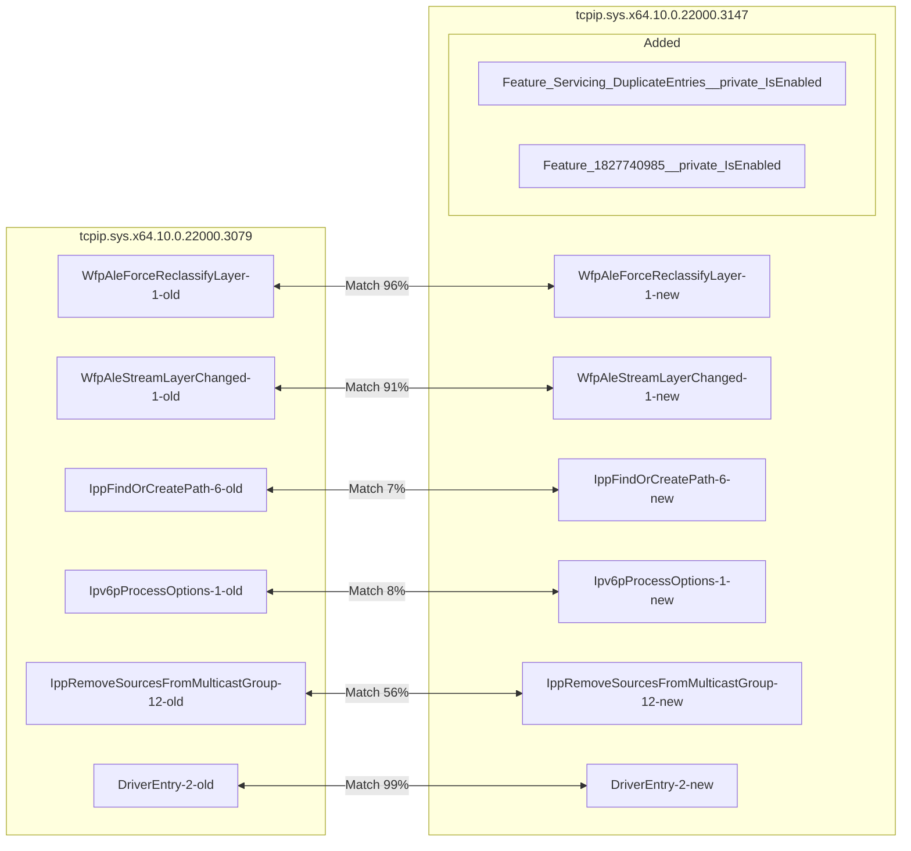
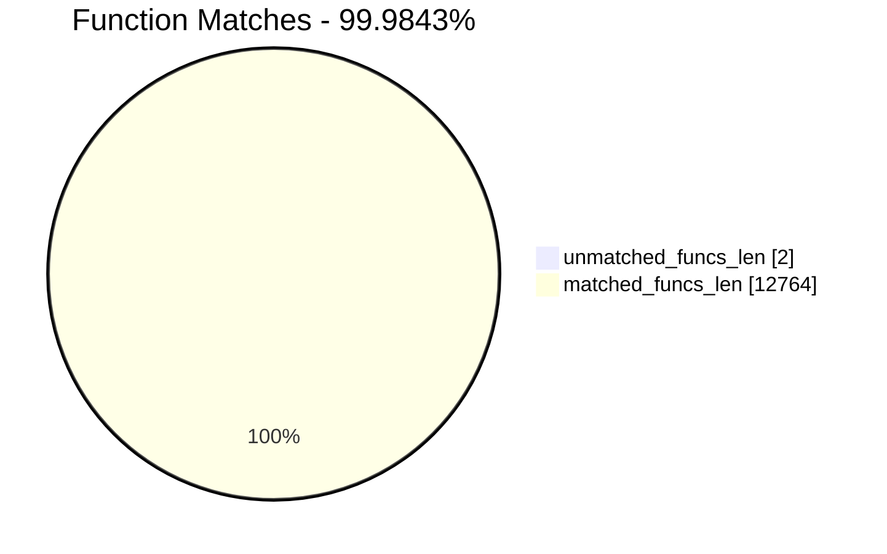
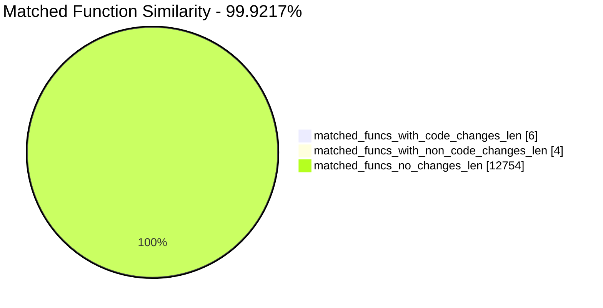
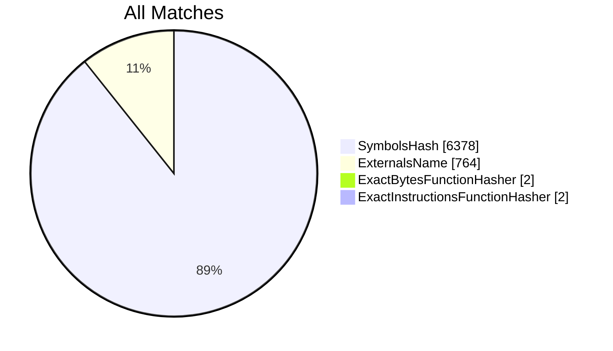
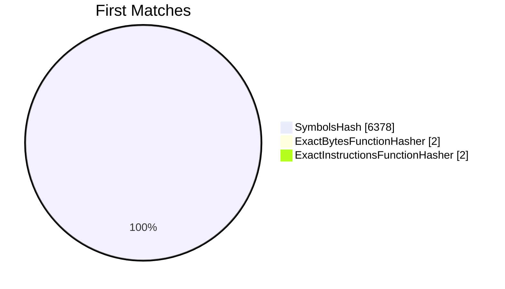
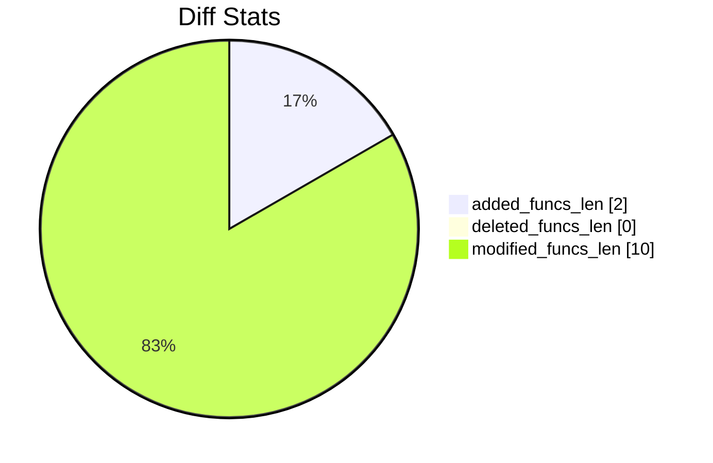
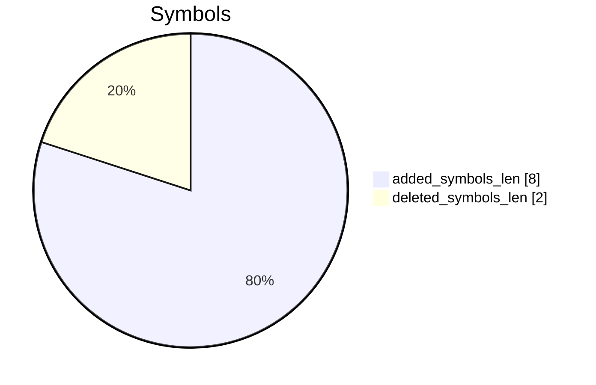

# tcpip.sys.x64.10.0.22000.3079-tcpip.sys.x64.10.0.22000.3147 Diff

# TOC

* [Visual Chart Diff](#visual-chart-diff)
* [Metadata](#metadata)
	* [Ghidra Diff Engine](#ghidra-diff-engine)
		* [Command Line](#command-line)
	* [Binary Metadata Diff](#binary-metadata-diff)
	* [Program Options](#program-options)
	* [Diff Stats](#diff-stats)
	* [Strings](#strings)
* [Deleted](#deleted)
* [Added](#added)
	* [Feature_Servicing_DuplicateEntries__private_IsEnabled](#feature_servicing_duplicateentries__private_isenabled)
	* [Feature_1827740985__private_IsEnabled](#feature_1827740985__private_isenabled)
* [Modified](#modified)
	* [WfpAleForceReclassifyLayer](#wfpaleforcereclassifylayer)
	* [WfpAleStreamLayerChanged](#wfpalestreamlayerchanged)
	* [IppFindOrCreatePath](#ippfindorcreatepath)
	* [Ipv6pProcessOptions](#ipv6pprocessoptions)
	* [IppRemoveSourcesFromMulticastGroup](#ippremovesourcesfrommulticastgroup)
	* [DriverEntry](#driverentry)
* [Modified (No Code Changes)](#modified-no-code-changes)
	* [OlmNotifyAddInterface](#olmnotifyaddinterface)
	* [wil_details_FeatureReporting_ReportUsageToService](#wil_details_featurereporting_reportusagetoservice)
	* [wil_details_FeatureStateCache_GetCachedFeatureEnabledState](#wil_details_featurestatecache_getcachedfeatureenabledstate)

# Visual Chart Diff










# Metadata

## Ghidra Diff Engine

### Command Line

#### Captured Command Line


```
ghidriff --project-location ghidra_projects --project-name ghidriff --symbols-path symbols --threaded --log-level INFO --file-log-level INFO --log-path ghidriff.log --min-func-len 10 --gdt ['ntddk_64.gdt'] --bsim --max-ram-percent 60.0 --max-section-funcs 200 tcpip.sys.x64.10.0.22000.3079 tcpip.sys.x64.10.0.22000.3147
```


#### Verbose Args


<details>

```
--old ['tcpip.sys.x64.10.0.22000.3079'] --new [['tcpip.sys.x64.10.0.22000.3147']] --engine VersionTrackingDiff --output-path ghidriffs --summary False --project-location ghidra_projects --project-name ghidriff --symbols-path symbols --threaded True --force-analysis False --force-diff False --no-symbols False --log-level INFO --file-log-level INFO --log-path ghidriff.log --va False --min-func-len 10 --use-calling-counts False --gdt ['ntddk_64.gdt'] --bsim True --bsim-full False --max-ram-percent 60.0 --print-flags False --jvm-args None --side-by-side False --max-section-funcs 200 --md-title None
```


</details>

#### Download Original PEs


```
wget https://msdl.microsoft.com/download/symbols/tcpip.sys/0578F210317000/tcpip.sys -O tcpip.sys.x64.10.0.22000.3079
wget https://msdl.microsoft.com/download/symbols/tcpip.sys/67023CB3318000/tcpip.sys -O tcpip.sys.x64.10.0.22000.3139
```


## Binary Metadata Diff


```diff
--- tcpip.sys.x64.10.0.22000.3079 Meta
+++ tcpip.sys.x64.10.0.22000.3147 Meta
@@ -1,44 +1,44 @@
-Program Name: tcpip.sys.x64.10.0.22000.3079
+Program Name: tcpip.sys.x64.10.0.22000.3147
 Language ID: x86:LE:64:default (4.0)
 Compiler ID: windows
 Processor: x86
 Endian: Little
 Address Size: 64
 Minimum Address: 1c0000000
 Maximum Address: ff0000184f
-# of Bytes: 3246148
+# of Bytes: 3246220
 # of Memory Blocks: 18
-# of Instructions: 505803
-# of Defined Data: 18190
-# of Functions: 6382
-# of Symbols: 69241
+# of Instructions: 505823
+# of Defined Data: 18196
+# of Functions: 6384
+# of Symbols: 69255
 # of Data Types: 1162
 # of Data Type Categories: 31
 Analyzed: true
 Compiler: visualstudio:unknown
 Created With Ghidra Version: 11.1
-Date Created: Fri Aug 16 17:00:07 UTC 2024
+Date Created: Fri Aug 16 17:00:11 UTC 2024
 Executable Format: Portable Executable (PE)
-Executable Location: /workspaces/ghidriff/tcpip.sys.x64.10.0.22000.3079
-Executable MD5: 13887b649adb01891a203c6969f6c311
-Executable SHA256: bd8c587dd50f83d34f90f371cd56bae4d0c7d10079e207e7fe0f51d4de3bbbfa
-FSRL: file:///workspaces/ghidriff/tcpip.sys.x64.10.0.22000.3079?MD5=13887b649adb01891a203c6969f6c311
+Executable Location: /workspaces/ghidriff/tcpip.sys.x64.10.0.22000.3147
+Executable MD5: ebb09305578013574fc0c57612cea611
+Executable SHA256: e8f6ab535d49ff06aca803dd5995007ed4680492402c81ea35767bce84cf8177
+FSRL: file:///workspaces/ghidriff/tcpip.sys.x64.10.0.22000.3147?MD5=ebb09305578013574fc0c57612cea611
 PDB Age: 1
 PDB File: tcpip.pdb
-PDB GUID: 40a06e27-e476-5e89-7a5a-9659b79634bb
+PDB GUID: 808705cc-83c8-3b31-8c63-d9d8bd42d065
 PDB Loaded: true
 PDB Version: RSDS
 PE Property[CompanyName]: Microsoft Corporation
 PE Property[FileDescription]: TCP/IP Driver
-PE Property[FileVersion]: 10.0.22000.3079 (WinBuild.160101.0800)
+PE Property[FileVersion]: 10.0.22000.3139 (WinBuild.160101.0800)
 PE Property[InternalName]: tcpip.sys
 PE Property[LegalCopyright]: © Microsoft Corporation. All rights reserved.
 PE Property[OriginalFilename]: tcpip.sys
 PE Property[ProductName]: Microsoft® Windows® Operating System
-PE Property[ProductVersion]: 10.0.22000.3079
+PE Property[ProductVersion]: 10.0.22000.3139
 PE Property[Translation]: 4b00409
 Preferred Root Namespace Category: 
 RTTI Found: false
 Relocatable: true
 SectionAlignment: 4096
 Should Ask To Analyze: false

```


## Program Options


<details>
<summary>Ghidra tcpip.sys.x64.10.0.22000.3079 Decompiler Options</summary>


|Decompiler Option|Value|
| :---: | :---: |
|Prototype Evaluation|__fastcall|

</details>


<details>
<summary>Ghidra tcpip.sys.x64.10.0.22000.3079 Specification extensions Options</summary>


|Specification extensions Option|Value|
| :---: | :---: |
|FormatVersion|0|
|VersionCounter|0|

</details>


<details>
<summary>Ghidra tcpip.sys.x64.10.0.22000.3079 Analyzers Options</summary>


|Analyzers Option|Value|
| :---: | :---: |
|ASCII Strings|true|
|ASCII Strings.Create Strings Containing Existing Strings|true|
|ASCII Strings.Create Strings Containing References|true|
|ASCII Strings.Force Model Reload|false|
|ASCII Strings.Minimum String Length|LEN_5|
|ASCII Strings.Model File|StringModel.sng|
|ASCII Strings.Require Null Termination for String|true|
|ASCII Strings.Search Only in Accessible Memory Blocks|true|
|ASCII Strings.String Start Alignment|ALIGN_1|
|ASCII Strings.String end alignment|4|
|Aggressive Instruction Finder|false|
|Aggressive Instruction Finder.Create Analysis Bookmarks|true|
|Apply Data Archives|true|
|Apply Data Archives.Archive Chooser|[Auto-Detect]|
|Apply Data Archives.Create Analysis Bookmarks|true|
|Apply Data Archives.GDT User File Archive Path|None|
|Apply Data Archives.User Project Archive Path|None|
|Call Convention ID|true|
|Call Convention ID.Analysis Decompiler Timeout (sec)|60|
|Call-Fixup Installer|true|
|Condense Filler Bytes|false|
|Condense Filler Bytes.Filler Value|Auto|
|Condense Filler Bytes.Minimum number of sequential bytes|1|
|Create Address Tables|true|
|Create Address Tables.Allow Offcut References|false|
|Create Address Tables.Auto Label Table|false|
|Create Address Tables.Create Analysis Bookmarks|true|
|Create Address Tables.Maxmimum Pointer Distance|16777215|
|Create Address Tables.Minimum Pointer Address|4132|
|Create Address Tables.Minimum Table Size|2|
|Create Address Tables.Pointer Alignment|1|
|Create Address Tables.Relocation Table Guide|true|
|Create Address Tables.Table Alignment|4|
|Data Reference|true|
|Data Reference.Address Table Alignment|1|
|Data Reference.Address Table Minimum Size|2|
|Data Reference.Align End of Strings|false|
|Data Reference.Ascii String References|true|
|Data Reference.Create Address Tables|true|
|Data Reference.Minimum String Length|5|
|Data Reference.References to Pointers|true|
|Data Reference.Relocation Table Guide|true|
|Data Reference.Respect Execute Flag|true|
|Data Reference.Subroutine References|true|
|Data Reference.Switch Table References|false|
|Data Reference.Unicode String References|true|
|Decompiler Parameter ID|true|
|Decompiler Parameter ID.Analysis Clear Level|ANALYSIS|
|Decompiler Parameter ID.Analysis Decompiler Timeout (sec)|60|
|Decompiler Parameter ID.Commit Data Types|true|
|Decompiler Parameter ID.Commit Void Return Values|false|
|Decompiler Parameter ID.Prototype Evaluation|__fastcall|
|Decompiler Switch Analysis|true|
|Decompiler Switch Analysis.Analysis Decompiler Timeout (sec)|60|
|Demangler Microsoft|true|
|Demangler Microsoft.Apply Function Calling Conventions|true|
|Demangler Microsoft.Apply Function Signatures|true|
|Disassemble Entry Points|true|
|Disassemble Entry Points.Respect Execute Flag|true|
|Embedded Media|true|
|Embedded Media.Create Analysis Bookmarks|true|
|External Entry References|true|
|Function ID|true|
|Function ID.Always Apply FID Labels|false|
|Function ID.Create Analysis Bookmarks|true|
|Function ID.Instruction Count Threshold|14.6|
|Function ID.Multiple Match Threshold|30.0|
|Function Start Search|true|
|Function Start Search.Bookmark Functions|false|
|Function Start Search.Search Data Blocks|false|
|Non-Returning Functions - Discovered|true|
|Non-Returning Functions - Discovered.Create Analysis Bookmarks|true|
|Non-Returning Functions - Discovered.Function Non-return Threshold|3|
|Non-Returning Functions - Discovered.Repair Flow Damage|true|
|Non-Returning Functions - Known|true|
|Non-Returning Functions - Known.Create Analysis Bookmarks|true|
|PDB MSDIA|false|
|PDB MSDIA.Search remote symbol servers|false|
|PDB Universal|true|
|PDB Universal.Search remote symbol servers|false|
|Reference|true|
|Reference.Address Table Alignment|1|
|Reference.Address Table Minimum Size|2|
|Reference.Align End of Strings|false|
|Reference.Ascii String References|true|
|Reference.Create Address Tables|true|
|Reference.Minimum String Length|5|
|Reference.References to Pointers|true|
|Reference.Relocation Table Guide|true|
|Reference.Respect Execute Flag|true|
|Reference.Subroutine References|true|
|Reference.Switch Table References|false|
|Reference.Unicode String References|true|
|Scalar Operand References|true|
|Scalar Operand References.Relocation Table Guide|true|
|Shared Return Calls|true|
|Shared Return Calls.Allow Conditional Jumps|false|
|Shared Return Calls.Assume Contiguous Functions Only|false|
|Stack|true|
|Stack.Create Local Variables|true|
|Stack.Create Param Variables|true|
|Stack.useNewFunctionStackAnalysis|true|
|Subroutine References|true|
|Subroutine References.Create Thunks Early|true|
|Variadic Function Signature Override|false|
|Variadic Function Signature Override.Create Analysis Bookmarks|false|
|Windows x86 PE Exception Handling|true|
|Windows x86 PE RTTI Analyzer|true|
|Windows x86 Thread Environment Block (TEB) Analyzer|true|
|Windows x86 Thread Environment Block (TEB) Analyzer.Starting Address of the TEB||
|Windows x86 Thread Environment Block (TEB) Analyzer.Windows OS Version|Windows 7|
|WindowsPE x86 Propagate External Parameters|false|
|WindowsResourceReference|true|
|WindowsResourceReference.Create Analysis Bookmarks|true|
|x86 Constant Reference Analyzer|true|
|x86 Constant Reference Analyzer.Create Data from pointer|false|
|x86 Constant Reference Analyzer.Function parameter/return Pointer analysis|true|
|x86 Constant Reference Analyzer.Max Threads|2|
|x86 Constant Reference Analyzer.Min absolute reference|4|
|x86 Constant Reference Analyzer.Require pointer param data type|false|
|x86 Constant Reference Analyzer.Speculative reference max|512|
|x86 Constant Reference Analyzer.Speculative reference min|1024|
|x86 Constant Reference Analyzer.Stored Value Pointer analysis|true|
|x86 Constant Reference Analyzer.Trust values read from writable memory|true|

</details>


<details>
<summary>Ghidra tcpip.sys.x64.10.0.22000.3147 Decompiler Options</summary>


|Decompiler Option|Value|
| :---: | :---: |
|Prototype Evaluation|__fastcall|

</details>


<details>
<summary>Ghidra tcpip.sys.x64.10.0.22000.3147 Specification extensions Options</summary>


|Specification extensions Option|Value|
| :---: | :---: |
|FormatVersion|0|
|VersionCounter|0|

</details>


<details>
<summary>Ghidra tcpip.sys.x64.10.0.22000.3147 Analyzers Options</summary>


|Analyzers Option|Value|
| :---: | :---: |
|ASCII Strings|true|
|ASCII Strings.Create Strings Containing Existing Strings|true|
|ASCII Strings.Create Strings Containing References|true|
|ASCII Strings.Force Model Reload|false|
|ASCII Strings.Minimum String Length|LEN_5|
|ASCII Strings.Model File|StringModel.sng|
|ASCII Strings.Require Null Termination for String|true|
|ASCII Strings.Search Only in Accessible Memory Blocks|true|
|ASCII Strings.String Start Alignment|ALIGN_1|
|ASCII Strings.String end alignment|4|
|Aggressive Instruction Finder|false|
|Aggressive Instruction Finder.Create Analysis Bookmarks|true|
|Apply Data Archives|true|
|Apply Data Archives.Archive Chooser|[Auto-Detect]|
|Apply Data Archives.Create Analysis Bookmarks|true|
|Apply Data Archives.GDT User File Archive Path|None|
|Apply Data Archives.User Project Archive Path|None|
|Call Convention ID|true|
|Call Convention ID.Analysis Decompiler Timeout (sec)|60|
|Call-Fixup Installer|true|
|Condense Filler Bytes|false|
|Condense Filler Bytes.Filler Value|Auto|
|Condense Filler Bytes.Minimum number of sequential bytes|1|
|Create Address Tables|true|
|Create Address Tables.Allow Offcut References|false|
|Create Address Tables.Auto Label Table|false|
|Create Address Tables.Create Analysis Bookmarks|true|
|Create Address Tables.Maxmimum Pointer Distance|16777215|
|Create Address Tables.Minimum Pointer Address|4132|
|Create Address Tables.Minimum Table Size|2|
|Create Address Tables.Pointer Alignment|1|
|Create Address Tables.Relocation Table Guide|true|
|Create Address Tables.Table Alignment|4|
|Data Reference|true|
|Data Reference.Address Table Alignment|1|
|Data Reference.Address Table Minimum Size|2|
|Data Reference.Align End of Strings|false|
|Data Reference.Ascii String References|true|
|Data Reference.Create Address Tables|true|
|Data Reference.Minimum String Length|5|
|Data Reference.References to Pointers|true|
|Data Reference.Relocation Table Guide|true|
|Data Reference.Respect Execute Flag|true|
|Data Reference.Subroutine References|true|
|Data Reference.Switch Table References|false|
|Data Reference.Unicode String References|true|
|Decompiler Parameter ID|true|
|Decompiler Parameter ID.Analysis Clear Level|ANALYSIS|
|Decompiler Parameter ID.Analysis Decompiler Timeout (sec)|60|
|Decompiler Parameter ID.Commit Data Types|true|
|Decompiler Parameter ID.Commit Void Return Values|false|
|Decompiler Parameter ID.Prototype Evaluation|__fastcall|
|Decompiler Switch Analysis|true|
|Decompiler Switch Analysis.Analysis Decompiler Timeout (sec)|60|
|Demangler Microsoft|true|
|Demangler Microsoft.Apply Function Calling Conventions|true|
|Demangler Microsoft.Apply Function Signatures|true|
|Disassemble Entry Points|true|
|Disassemble Entry Points.Respect Execute Flag|true|
|Embedded Media|true|
|Embedded Media.Create Analysis Bookmarks|true|
|External Entry References|true|
|Function ID|true|
|Function ID.Always Apply FID Labels|false|
|Function ID.Create Analysis Bookmarks|true|
|Function ID.Instruction Count Threshold|14.6|
|Function ID.Multiple Match Threshold|30.0|
|Function Start Search|true|
|Function Start Search.Bookmark Functions|false|
|Function Start Search.Search Data Blocks|false|
|Non-Returning Functions - Discovered|true|
|Non-Returning Functions - Discovered.Create Analysis Bookmarks|true|
|Non-Returning Functions - Discovered.Function Non-return Threshold|3|
|Non-Returning Functions - Discovered.Repair Flow Damage|true|
|Non-Returning Functions - Known|true|
|Non-Returning Functions - Known.Create Analysis Bookmarks|true|
|PDB MSDIA|false|
|PDB MSDIA.Search remote symbol servers|false|
|PDB Universal|true|
|PDB Universal.Search remote symbol servers|false|
|Reference|true|
|Reference.Address Table Alignment|1|
|Reference.Address Table Minimum Size|2|
|Reference.Align End of Strings|false|
|Reference.Ascii String References|true|
|Reference.Create Address Tables|true|
|Reference.Minimum String Length|5|
|Reference.References to Pointers|true|
|Reference.Relocation Table Guide|true|
|Reference.Respect Execute Flag|true|
|Reference.Subroutine References|true|
|Reference.Switch Table References|false|
|Reference.Unicode String References|true|
|Scalar Operand References|true|
|Scalar Operand References.Relocation Table Guide|true|
|Shared Return Calls|true|
|Shared Return Calls.Allow Conditional Jumps|false|
|Shared Return Calls.Assume Contiguous Functions Only|false|
|Stack|true|
|Stack.Create Local Variables|true|
|Stack.Create Param Variables|true|
|Stack.useNewFunctionStackAnalysis|true|
|Subroutine References|true|
|Subroutine References.Create Thunks Early|true|
|Variadic Function Signature Override|false|
|Variadic Function Signature Override.Create Analysis Bookmarks|false|
|Windows x86 PE Exception Handling|true|
|Windows x86 PE RTTI Analyzer|true|
|Windows x86 Thread Environment Block (TEB) Analyzer|true|
|Windows x86 Thread Environment Block (TEB) Analyzer.Starting Address of the TEB||
|Windows x86 Thread Environment Block (TEB) Analyzer.Windows OS Version|Windows 7|
|WindowsPE x86 Propagate External Parameters|false|
|WindowsResourceReference|true|
|WindowsResourceReference.Create Analysis Bookmarks|true|
|x86 Constant Reference Analyzer|true|
|x86 Constant Reference Analyzer.Create Data from pointer|false|
|x86 Constant Reference Analyzer.Function parameter/return Pointer analysis|true|
|x86 Constant Reference Analyzer.Max Threads|2|
|x86 Constant Reference Analyzer.Min absolute reference|4|
|x86 Constant Reference Analyzer.Require pointer param data type|false|
|x86 Constant Reference Analyzer.Speculative reference max|512|
|x86 Constant Reference Analyzer.Speculative reference min|1024|
|x86 Constant Reference Analyzer.Stored Value Pointer analysis|true|
|x86 Constant Reference Analyzer.Trust values read from writable memory|true|

</details>

## Diff Stats


|Stat|Value|
| :---: | :---: |
|added_funcs_len|2|
|deleted_funcs_len|0|
|modified_funcs_len|10|
|added_symbols_len|8|
|deleted_symbols_len|2|
|diff_time|17.811140298843384|
|deleted_strings_len|0|
|added_strings_len|0|
|match_types|Counter({'SymbolsHash': 6378, 'ExternalsName': 764, 'ExactBytesFunctionHasher': 2, 'ExactInstructionsFunctionHasher': 2})|
|items_to_process|22|
|diff_types|Counter({'address': 9, 'length': 7, 'code': 6, 'refcount': 5, 'called': 4, 'calling': 3, 'sig': 1})|
|unmatched_funcs_len|2|
|total_funcs_len|12766|
|matched_funcs_len|12764|
|matched_funcs_with_code_changes_len|6|
|matched_funcs_with_non_code_changes_len|4|
|matched_funcs_no_changes_len|12754|
|match_func_similarity_percent|99.9217%|
|func_match_overall_percent|99.9843%|
|first_matches|Counter({'SymbolsHash': 6378, 'ExactBytesFunctionHasher': 2, 'ExactInstructionsFunctionHasher': 2})|













## Strings


*No string differences found*

# Deleted

# Added

## Feature_Servicing_DuplicateEntries__private_IsEnabled

### Function Meta


|Key|tcpip.sys.x64.10.0.22000.3147|
| :---: | :---: |
|name|Feature_Servicing_DuplicateEntries__private_IsEnabled|
|fullname|Feature_Servicing_DuplicateEntries__private_IsEnabled|
|refcount|2|
|length|94|
|called|wil_details_FeatureReporting_ReportUsageToService<br>wil_details_FeatureStateCache_GetCachedFeatureEnabledState|
|calling|DriverEntry|
|paramcount|0|
|address|1c00c6798|
|sig|uint __fastcall Feature_Servicing_DuplicateEntries__private_IsEnabled(void)|
|sym_type|Function|
|sym_source|IMPORTED|
|external|False|


```diff
--- Feature_Servicing_DuplicateEntries__private_IsEnabled
+++ Feature_Servicing_DuplicateEntries__private_IsEnabled
@@ -0,0 +1,17 @@
+
+uint Feature_Servicing_DuplicateEntries__private_IsEnabled(void)
+
+{
+  ulonglong uVar1;
+  uint uVar2;
+  
+  uVar1 = wil_details_FeatureStateCache_GetCachedFeatureEnabledState
+                    ((uint *)&Feature_Servicing_DuplicateEntries__private_featureState,0x1c0204120);
+  uVar2 = (uint)(uVar1 >> 3) & 1;
+  wil_details_FeatureReporting_ReportUsageToService
+            ((uint *)&Feature_Servicing_DuplicateEntries__private_reporting,0x30492ea,
+             (uint)uVar1 >> 8 & 1,(uint)(uVar1 >> 9) & 1,
+             &Feature_Servicing_TcpBatchOptimization_logged_traits,uVar2);
+  return uVar2;
+}
+

```


## Feature_1827740985__private_IsEnabled

### Function Meta


|Key|tcpip.sys.x64.10.0.22000.3147|
| :---: | :---: |
|name|Feature_1827740985__private_IsEnabled|
|fullname|Feature_1827740985__private_IsEnabled|
|refcount|2|
|length|94|
|called|wil_details_FeatureReporting_ReportUsageToService<br>wil_details_FeatureStateCache_GetCachedFeatureEnabledState|
|calling|Ipv6pProcessOptions|
|paramcount|0|
|address|1c00c8904|
|sig|uint __fastcall Feature_1827740985__private_IsEnabled(void)|
|sym_type|Function|
|sym_source|IMPORTED|
|external|False|


```diff
--- Feature_1827740985__private_IsEnabled
+++ Feature_1827740985__private_IsEnabled
@@ -0,0 +1,16 @@
+
+uint Feature_1827740985__private_IsEnabled(void)
+
+{
+  ulonglong uVar1;
+  uint uVar2;
+  
+  uVar1 = wil_details_FeatureStateCache_GetCachedFeatureEnabledState
+                    ((uint *)&Feature_1827740985__private_featureState,0x1c0204180);
+  uVar2 = (uint)(uVar1 >> 3) & 1;
+  wil_details_FeatureReporting_ReportUsageToService
+            ((uint *)&Feature_1827740985__private_reporting,0x31b6205,(uint)uVar1 >> 8 & 1,
+             (uint)(uVar1 >> 9) & 1,&Feature_Servicing_CompartmentMemoryLeak_logged_traits,uVar2);
+  return uVar2;
+}
+

```


# Modified


*Modified functions contain code changes*
## WfpAleForceReclassifyLayer

### Match Info


|Key|tcpip.sys.x64.10.0.22000.3079 - tcpip.sys.x64.10.0.22000.3147|
| :---: | :---: |
|diff_type|code,length,address|
|ratio|0.93|
|i_ratio|0.72|
|m_ratio|0.96|
|b_ratio|0.96|
|match_types|SymbolsHash|

### Function Meta Diff


|Key|tcpip.sys.x64.10.0.22000.3079|tcpip.sys.x64.10.0.22000.3147|
| :---: | :---: | :---: |
|name|WfpAleForceReclassifyLayer|WfpAleForceReclassifyLayer|
|fullname|WfpAleForceReclassifyLayer|WfpAleForceReclassifyLayer|
|refcount|5|5|
|`length`|647|707|
|called|NTOSKRNL.EXE::KeReleaseInStackQueuedSpinLock<br>NTOSKRNL.EXE::RtlEndEnumerationHashTable<br>NTOSKRNL.EXE::RtlEnumerateEntryHashTable<br>NTOSKRNL.EXE::RtlInitEnumerationHashTable<br>RtlAcquireScalableWriteLock<br>WfpAleDecrementWaitRef<br>WfpAleReferenceEndpoint<br>WfpAlepReauthorizeOrReclassifyListen<br>WfpAlepReauthorizeOrReclassifyPort|NTOSKRNL.EXE::KeReleaseInStackQueuedSpinLock<br>NTOSKRNL.EXE::RtlEndEnumerationHashTable<br>NTOSKRNL.EXE::RtlEnumerateEntryHashTable<br>NTOSKRNL.EXE::RtlInitEnumerationHashTable<br>RtlAcquireScalableWriteLock<br>WfpAleDecrementWaitRef<br>WfpAleReferenceEndpoint<br>WfpAlepReauthorizeOrReclassifyListen<br>WfpAlepReauthorizeOrReclassifyPort|
|calling|InetStartInspectionModule|InetStartInspectionModule|
|paramcount|1|1|
|`address`|1c009f2a0|1c009f740|
|sig|ulonglong __fastcall WfpAleForceReclassifyLayer(ushort param_1)|ulonglong __fastcall WfpAleForceReclassifyLayer(ushort param_1)|
|sym_type|Function|Function|
|sym_source|IMPORTED|IMPORTED|
|external|False|False|

### WfpAleForceReclassifyLayer Diff


```diff
--- WfpAleForceReclassifyLayer
+++ WfpAleForceReclassifyLayer
@@ -1,173 +1,173 @@
 
 ulonglong WfpAleForceReclassifyLayer(ushort param_1)
 
 {
   int *piVar1;
   _SLIST_ENTRY *p_Var2;
   code *pcVar3;
   uint uVar4;
   int iVar5;
   longlong lVar6;
   undefined8 uVar7;
   ulonglong extraout_RAX;
   short sVar8;
   _SLIST_ENTRY *p_Var9;
   uint *puVar10;
   _SLIST_ENTRY *p_Var11;
   int iVar12;
   ulonglong unaff_RSI;
   ulonglong uVar13;
   longlong lVar14;
   longlong **pplVar15;
   ushort unaff_R12W;
   undefined2 unaff_R13W;
   uint uVar16;
   ulonglong uVar17;
   _SLIST_ENTRY *p_Var18;
   undefined8 uStackY_b0;
   undefined8 uStackY_a8;
   undefined auStackY_a0 [8];
   undefined8 uStackY_98;
   ushort *puStackY_90;
   undefined4 *in_stack_ffffffffffffff78;
   longlong **pplVar19;
   
   p_Var18 = (_SLIST_ENTRY *)(ulonglong)param_1;
   pplVar19 = (longlong **)&stack0xffffffffffffff88;
   uVar4 = 0;
   uVar13 = unaff_RSI & 0xffffffffffffff00;
   uVar17 = 0;
   p_Var11 = (_SLIST_ENTRY *)&stack0xffffffffffffff88;
   if (*endpointHandleTable != 0) {
     do {
-      uStackY_b0 = 0x1c009f320;
+      uStackY_b0 = 0x1c009f7c0;
       RtlAcquireScalableWriteLock
                 ((PKSPIN_LOCK)(endpointHandleTable + uVar17 * 0x60 + 0x10),
                  (PKLOCK_QUEUE_HANDLE)&stack0xffffffffffffff98);
       puVar10 = endpointHandleTable + uVar17 * 0x60 + 0x60;
-      uStackY_b0 = 0x1c009f33e;
+      uStackY_b0 = 0x1c009f7de;
       RtlInitEnumerationHashTable(puVar10,&stack0xffffffffffffffb8);
       p_Var11 = (_SLIST_ENTRY *)&DAT_0;
 LAB_1:
       iVar12 = (int)uVar13;
-      uStackY_b0 = 0x1c009f35b;
+      uStackY_b0 = 0x1c009f7fb;
       lVar6 = RtlEnumerateEntryHashTable(puVar10,&stack0xffffffffffffffb8);
       if (lVar6 != 0) {
         lVar14 = lVar6 + -0x200;
         if ((param_1 - 0x28 & 0xfffd) != 0) goto LAB_2;
         uVar16 = *(uint *)(lVar6 + -0x1cc) & 0x20;
         goto LAB_3;
       }
-      uStackY_b0 = 0x1c009f3eb;
+      uStackY_b0 = 0x1c009f88b;
       RtlEndEnumerationHashTable(puVar10,&stack0xffffffffffffffb8);
-      uStackY_b0 = 0x1c009f3fb;
+      uStackY_b0 = 0x1c009f89b;
       KeReleaseInStackQueuedSpinLock((PKLOCK_QUEUE_HANDLE)&stack0xffffffffffffff98);
       uVar16 = (int)uVar17 + 1;
       uVar17 = (ulonglong)uVar16;
     } while (uVar16 < *endpointHandleTable);
     p_Var11 = (_SLIST_ENTRY *)&stack0xffffffffffffff88;
     if ((char)uVar13 != '\0') {
       uVar4 = 0xc000022d;
       goto LAB_4;
     }
   }
   while( true ) {
     iVar12 = (int)uVar13;
     sVar8 = -3;
     if (p_Var11 == (_SLIST_ENTRY *)&stack0xffffffffffffff88) break;
     p_Var2 = p_Var11->Next;
     if ((p_Var11[1].Next != (_SLIST_ENTRY *)&stack0xffffffffffffff88) || (p_Var2[1].Next != p_Var11)
        ) goto LAB_5;
     p_Var2[1].Next = (_SLIST_ENTRY *)&stack0xffffffffffffff88;
     if ((param_1 - 0x28 & 0xfffd) == 0) {
       if ((*(uint *)((longlong)&p_Var11[-0x41].Next + 4) & 0x10) == 0) {
         p_Var9 = (_SLIST_ENTRY *)0x0;
       }
       else {
         p_Var9 = p_Var11[-0xc].Next;
       }
       in_stack_ffffffffffffff78 =
            (undefined4 *)CONCAT71((int7)((ulonglong)in_stack_ffffffffffffff78 >> 8),1);
-      uStackY_b0 = 0x1c009f48b;
+      uStackY_b0 = 0x1c009f92b;
       uVar4 = WfpAlepReauthorizeOrReclassifyListen
                         (p_Var11 + -0x47,p_Var9,*(ushort *)((longlong)&p_Var11[-0x40].Next + 6),
                          (undefined4 *)0x0,'\x01');
 LAB_6:
       if ((int)uVar4 < 0) break;
     }
     else if ((param_1 - 0x24 & 0xfffd) == 0) {
       if ((*(uint *)((longlong)&p_Var11[-0x41].Next + 4) & 0x10) == 0) {
         p_Var9 = (_SLIST_ENTRY *)0x0;
       }
       else {
         p_Var9 = p_Var11[-0xc].Next;
       }
       in_stack_ffffffffffffff78 = (undefined4 *)0x0;
-      uStackY_b0 = 0x1c009f4f1;
+      uStackY_b0 = 0x1c009f991;
       uVar4 = WfpAlepReauthorizeOrReclassifyPort
                         (p_Var11 + -0x47,*(short *)((longlong)&p_Var11[-0x40].Next + 4),p_Var9,
                          *(ushort *)((longlong)&p_Var11[-0x40].Next + 6),(undefined4 *)0x0,'\x01');
       goto LAB_6;
     }
     if ((gAleDebugEnabled != '\0') && (p_Var11[-0x34].Next != (_SLIST_ENTRY *)0xbadbadfabadbadfa)) {
       LOCK();
       piVar1 = (int *)((longlong)&p_Var11[-0x34].Next[7].Next + 4);
       *piVar1 = *piVar1 + -1;
       UNLOCK();
     }
-    uStackY_b0 = 0x1c009f4aa;
+    uStackY_b0 = 0x1c009f94a;
     WfpAleDecrementWaitRef((uint *)(p_Var11 + -0x37));
     p_Var11 = p_Var2;
   }
 LAB_4:
   return (ulonglong)uVar4;
 LAB_2:
   if (((param_1 - 0x24 & 0xfffd) == 0) && (*(int *)(lVar6 + -0x1d8) == 0x11)) {
     uVar16 = *(uint *)(lVar6 + -0x1cc) & 0x40;
 LAB_3:
     if (uVar16 == 0) {
       if ((*(uint *)(lVar6 + -0x1d0) & 0x8000) != 0) {
         uVar13 = CONCAT71((int7)(uVar13 >> 8),1);
       }
     }
     else {
       sVar8 = 0xf;
-      uStackY_b0 = 0x1c009f390;
+      uStackY_b0 = 0x1c009f830;
       uVar7 = WfpAleReferenceEndpoint(lVar14,0xf);
       if ((char)uVar7 != '\0') {
         pplVar15 = (longlong **)(lVar14 + 0x238);
         if (*pplVar19 != (longlong *)&stack0xffffffffffffff88) goto LAB_5;
         *pplVar15 = (longlong *)&stack0xffffffffffffff88;
         *(longlong ***)(lVar14 + 0x240) = pplVar19;
         *pplVar19 = (longlong *)pplVar15;
         pplVar19 = pplVar15;
       }
     }
   }
   goto LAB_1;
 LAB_5:
   pcVar3 = (code *)swi(0x29);
   (*pcVar3)(3);
   if (*(short *)((longlong)&p_Var18[7].Next + 6) == sVar8) {
-    uStackY_a8 = 0x1c011764c;
+    uStackY_a8 = 0x1c01175b2;
     iVar5 = KfdIsLayerEmpty(unaff_R13W);
     if (iVar5 != 0) goto LAB_7;
   }
   else {
 LAB_7:
     uVar13 = 0;
     if ((*(uint *)&p_Var18[6].Next & 0x4000) == 0) goto LAB_8;
   }
-  uStackY_a8 = 0x1c009f647;
+  uStackY_a8 = 0x1c009fae7;
   WfpAlepAuthorizeOrClassifyListen
             (p_Var18,unaff_R12W,puStackY_90,p_Var11,(undefined4 *)&uStackY_a8,uStackY_b0._2_2_,
              (char)uVar4,uStackY_98,iVar12,(int)uVar17,in_stack_ffffffffffffff78,
              uStackY_b0._1_1_ == '\0',uStackY_b0._1_1_,(char *)&uStackY_b0,
              (undefined (*) [16])&stack0xffffffffffffff80);
   uVar13 = uVar17;
 LAB_8:
-  uStackY_a8 = 0x1c009f65f;
+  uStackY_a8 = 0x1c009faff;
   __security_check_cookie(uVar13 ^ (ulonglong)auStackY_a0);
   return extraout_RAX;
 }
 

```


## WfpAleStreamLayerChanged

### Match Info


|Key|tcpip.sys.x64.10.0.22000.3079 - tcpip.sys.x64.10.0.22000.3147|
| :---: | :---: |
|diff_type|code,length,address,called|
|ratio|0.99|
|i_ratio|0.7|
|m_ratio|0.91|
|b_ratio|0.91|
|match_types|SymbolsHash|

### Function Meta Diff


|Key|tcpip.sys.x64.10.0.22000.3079|tcpip.sys.x64.10.0.22000.3147|
| :---: | :---: | :---: |
|name|WfpAleStreamLayerChanged|WfpAleStreamLayerChanged|
|fullname|WfpAleStreamLayerChanged|WfpAleStreamLayerChanged|
|refcount|3|3|
|`length`|1062|1270|
|`called`|<details><summary>Expand for full list:<br>AleAcquireEndpointLockEx<br>AleReleaseEndpointLock<br>IpNlpDereferenceNextHop<br>IppDereferenceInterface<br>IppInspectAcquireNexthopInterface<br>NETIO.SYS::KfdAleAcquireFlowHandleForFlow<br>NETIO.SYS::KfdAleReleaseFlowHandleForFlow<br>NETIO.SYS::WfpStreamIsFilterPresent<br>NTOSKRNL.EXE::KeAcquireInStackQueuedSpinLock<br>NTOSKRNL.EXE::KeAcquireSpinLockRaiseToDpc<br>NTOSKRNL.EXE::KeReleaseInStackQueuedSpinLock</summary>NTOSKRNL.EXE::KeReleaseSpinLock<br>NTOSKRNL.EXE::RtlEndEnumerationHashTable<br>NTOSKRNL.EXE::RtlEnumerateEntryHashTable<br>NTOSKRNL.EXE::RtlInitEnumerationHashTable<br>RtlAcquireScalableWriteLock<br>TcpDereferenceTcb<br>WfpAleDereferenceEndpoint<br>WfpAleOobAcquireStreamEndpoint<br>WfpAleReauthorizeConnection<br>WfpAleReferenceEndpoint</details>|<details><summary>Expand for full list:<br>AleAcquireEndpointLockEx<br>AleReleaseEndpointLock<br>AleRequestTcpConnectionAbort<br>IpNlpDereferenceNextHop<br>IppDereferenceInterface<br>IppInspectAcquireNexthopInterface<br>NETIO.SYS::KfdAleAcquireFlowHandleForFlow<br>NETIO.SYS::KfdAleReleaseFlowHandleForFlow<br>NETIO.SYS::WfpStreamIsFilterPresent<br>NTOSKRNL.EXE::KeAcquireInStackQueuedSpinLock<br>NTOSKRNL.EXE::KeAcquireSpinLockRaiseToDpc</summary>NTOSKRNL.EXE::KeReleaseInStackQueuedSpinLock<br>NTOSKRNL.EXE::KeReleaseSpinLock<br>NTOSKRNL.EXE::RtlEndEnumerationHashTable<br>NTOSKRNL.EXE::RtlEnumerateEntryHashTable<br>NTOSKRNL.EXE::RtlInitEnumerationHashTable<br>RtlAcquireScalableWriteLock<br>TcpDereferenceTcb<br>WfpAleDereferenceEndpoint<br>WfpAleOobAcquireStreamEndpoint<br>WfpAleReauthorizeConnection<br>WfpAleReferenceEndpoint<br>WfpPoolAllocNonPaged<br>WfpPoolFree<br>WfpStringCchCopyA</details>|
|calling|WfpAlepOnLayerChange|WfpAlepOnLayerChange|
|paramcount|1|1|
|`address`|1c009ff98|1c00a0438|
|sig|undefined __fastcall WfpAleStreamLayerChanged(short param_1)|undefined __fastcall WfpAleStreamLayerChanged(short param_1)|
|sym_type|Function|Function|
|sym_source|IMPORTED|IMPORTED|
|external|False|False|

### WfpAleStreamLayerChanged Called Diff


```diff
--- WfpAleStreamLayerChanged called
+++ WfpAleStreamLayerChanged called
@@ -2,0 +3 @@
+AleRequestTcpConnectionAbort
@@ -21,0 +23,3 @@
+WfpPoolAllocNonPaged
+WfpPoolFree
+WfpStringCchCopyA
```


### WfpAleStreamLayerChanged Diff


```diff
--- WfpAleStreamLayerChanged
+++ WfpAleStreamLayerChanged
@@ -1,266 +1,266 @@
 
 void WfpAleStreamLayerChanged(short param_1)
 
 {
   longlong ****pppplVar1;
   longlong ****pppplVar2;
   code *pcVar3;
   PVOID pvVar4;
   undefined uVar5;
   undefined7 uVar6;
   undefined uVar7;
   undefined7 uVar8;
   char cVar9;
   KIRQL NewIrql;
   byte bVar10;
   int iVar11;
   longlong lVar12;
   undefined8 uVar13;
   PKSPIN_LOCK SpinLock;
   PSLIST_ENTRY p_Var14;
   PKSPIN_LOCK pUVar15;
   byte bVar16;
   PKSPIN_LOCK unaff_RBX;
   uint uVar17;
   byte bVar18;
   _SLIST_ENTRY *p_Var19;
   PKSPIN_LOCK pUVar20;
   PSLIST_ENTRY p_Var21;
   undefined uVar22;
   undefined8 unaff_R15;
   bool bVar24;
   char *local_res10;
   PVOID local_res18;
   PSLIST_ENTRY local_res20;
   undefined auStackY_160 [24];
   undefined4 in_stack_fffffffffffffec4;
   undefined8 in_stack_fffffffffffffee0;
   longlong ****local_b8;
   longlong ****local_b0;
   undefined8 local_a8;
   undefined local_a0 [24];
   undefined local_88 [8];
   undefined8 uStack_80;
   undefined local_78 [16];
   undefined local_68 [15];
   undefined uStack_59;
   undefined local_58 [15];
   undefined uStack_49;
   undefined local_48 [7];
   undefined uStack_41;
   undefined7 uStack_40;
   undefined uStack_39;
   undefined7 uStack_38;
   undefined uStack_31;
   PSLIST_ENTRY p_Var23;
   
   uStack_38 = (undefined7)unaff_R15;
   uStack_31 = (undefined)((ulonglong)unaff_R15 >> 0x38);
   local_48[0] = '\0';
   local_48._1_6_ = 0;
   uStack_41 = 0;
   local_a0[0x10] = '\0';
   local_a0._17_7_ = 0;
   pUVar20 = (PKSPIN_LOCK)0x0;
   p_Var23 = (PSLIST_ENTRY)(ulonglong)(ushort)param_1;
   uVar22 = (undefined)param_1;
   local_b8 = (longlong ****)&local_b8;
   p_Var21 = (PSLIST_ENTRY)0x1;
   local_b0 = (longlong ****)&local_b8;
   _local_88 = ZEXT816(0);
   local_78 = ZEXT816(0);
   local_68 = SUB1615(ZEXT816(0),0);
   uStack_59 = 0;
   local_58._0_7_ = SUB167(ZEXT816(0),0);
   local_58[0] = '\0';
   local_58._1_6_ = 0;
   local_58._7_8_ = SUB168(ZEXT816(0),7);
   uStack_49 = 0;
   local_a0._0_16_ = ZEXT816(0);
   SpinLock = pUVar20;
   p_Var14 = p_Var21;
   if (*endpointHandleTable != 0) {
     do {
       RtlAcquireScalableWriteLock
                 ((PKSPIN_LOCK)(endpointHandleTable + (longlong)SpinLock * 0x60 + 0x10),
                  (PKLOCK_QUEUE_HANDLE)local_58);
       unaff_RBX = (PKSPIN_LOCK)(endpointHandleTable + (longlong)SpinLock * 0x60 + 0x60);
       RtlInitEnumerationHashTable(unaff_RBX,local_88 + 8);
       local_88 = (undefined  [8])unaff_RBX;
       while( true ) {
         lVar12 = RtlEnumerateEntryHashTable(local_88,local_88 + 8);
         if (lVar12 == 0) break;
         unaff_RBX = (PKSPIN_LOCK)(lVar12 + -0x200);
         local_res10 = (char *)0x0;
         pUVar15 = pUVar20;
         if ((gAleDebugEnabled != '\0') &&
            (pUVar15 = (PKSPIN_LOCK)WfpPoolAllocNonPaged(0x19,0x4c656c41,(longlong *)&local_res10),
            pUVar15 == (PKSPIN_LOCK)0x0)) {
-          WfpStringCchCopyA(0x1c01da188,0x19,local_res10);
+          WfpStringCchCopyA(0x1c01da168,0x19,local_res10);
         }
         KeAcquireInStackQueuedSpinLock(unaff_RBX,(PKLOCK_QUEUE_HANDLE)local_a0);
         do {
         } while (*(int *)(lVar12 + -0x1f8) != 0);
         bVar24 = gAleDebugEnabled == '\x01';
         *(void **)(lVar12 + -0x1f0) = SystemReserved1[0xf];
         if ((bVar24) && (pUVar15 == (PKSPIN_LOCK)0x0)) {
           *(char **)(lVar12 + -0x1e8) = local_res10;
         }
         if ((((*(int *)(lVar12 + -0x1d8) == 6) &&
              (((byte)*(undefined4 *)(lVar12 + -0x1d0) & 0x30) == 0x20)) &&
             ((*(uint *)(lVar12 + -0x1cc) & 0x100) == 0)) &&
            ((*(short *)(lVar12 + -0x1c4) == param_1 &&
             (uVar13 = WfpAleReferenceEndpoint((longlong)unaff_RBX,0xf), (char)uVar13 != '\0')))) {
           pppplVar1 = (longlong ****)(lVar12 + 0x28);
           if ((longlong *****)*local_b0 != &local_b8) goto LAB_0;
           *(longlong *****)(lVar12 + 0x30) = local_b0;
           *pppplVar1 = (longlong ***)&local_b8;
           *local_b0 = (longlong ***)pppplVar1;
           local_b0 = pppplVar1;
         }
         bVar24 = gAleDebugEnabled == '\x01';
         *(undefined8 *)(lVar12 + -0x1f0) = 0;
         local_res18 = (PVOID)0x0;
         if (bVar24) {
           local_res18 = *(PVOID *)(lVar12 + -0x1e8);
           *(undefined8 *)(lVar12 + -0x1e8) = 0;
         }
         pvVar4 = local_res18;
         KeReleaseInStackQueuedSpinLock((PKLOCK_QUEUE_HANDLE)local_a0);
         if ((gAleDebugEnabled == '\x01') && (pvVar4 != (PVOID)0x0)) {
           WfpPoolFree(&local_res18);
         }
       }
       RtlEndEnumerationHashTable(local_88,local_88 + 8);
       KeReleaseInStackQueuedSpinLock((PKLOCK_QUEUE_HANDLE)local_58);
       uVar17 = (int)SpinLock + 1;
       SpinLock = (PKSPIN_LOCK)(ulonglong)uVar17;
     } while (uVar17 < *endpointHandleTable);
   }
   while( true ) {
     pppplVar1 = local_b8;
     uVar22 = SUB81(p_Var23,0);
     if ((longlong *****)local_b8 == &local_b8) {
       return;
     }
     pppplVar2 = (longlong ****)*local_b8;
     if (((longlong *****)local_b8[1] != &local_b8) || ((longlong ****)pppplVar2[1] != local_b8))
     break;
     pppplVar2[1] = (longlong ***)&local_b8;
     p_Var19 = (_SLIST_ENTRY *)(local_b8 + -0x45);
     local_b8 = pppplVar2;
     SpinLock = (PKSPIN_LOCK)WfpAleOobAcquireStreamEndpoint((PKSPIN_LOCK)p_Var19);
     if (SpinLock != (PKSPIN_LOCK)0x0) {
       local_a8 = 0;
       local_res20 = (PSLIST_ENTRY)0x0;
       p_Var14 = (PSLIST_ENTRY)
                 IppInspectAcquireNexthopInterface((longlong *)SpinLock[3],(int **)&local_res20);
       KfdAleAcquireFlowHandleForFlow(p_Var19,0);
       p_Var23 = local_res20;
       iVar11 = WfpAleReauthorizeConnection
                          (p_Var19,*(short *)((longlong)pppplVar1 + -0x1ec),(_SLIST_ENTRY *)0x0,'\0',
                           (longlong *)pppplVar1[-10],*(ushort *)((longlong)pppplVar1 + -0x1ea),6,
                           (uint *)pppplVar1[-0x41],*(ushort *)(pppplVar1 + -0x3d),
                           in_stack_fffffffffffffee0,(uint *)0x0,0,0,p_Var14,0,0x40,0,local_res20,0,
                           (_SLIST_ENTRY **)0x0,(_SLIST_ENTRY *)0x0,0);
       if (p_Var14 != (PSLIST_ENTRY)0x0) {
         uVar17 = *(uint *)&p_Var14[5].Next;
         unaff_RBX = (PKSPIN_LOCK)(ulonglong)uVar17;
         IppDereferenceInterface(p_Var14);
         p_Var21 = (PSLIST_ENTRY)(ulonglong)(uVar17 != 0);
       }
       if (p_Var23 != (PSLIST_ENTRY)0x0) {
         IpNlpDereferenceNextHop((int *)p_Var23);
       }
       if (iVar11 < 0) {
         if (((*(uint *)(pppplVar1 + -0x3f) >> 0xb & 1) == 0) && ((int)p_Var21 == 1)) {
           LOCK();
           *(uint *)(pppplVar1 + -0x3f) = *(uint *)(pppplVar1 + -0x3f) | 0x800;
           UNLOCK();
           AleRequestTcpConnectionAbort
                     (*(short *)((longlong)pppplVar1 + -0x1ec),pppplVar1[-10],
                      *(short *)((longlong)pppplVar1 + -0x1ea),(undefined4 *)pppplVar1[-0x41],
                      *(undefined4 *)((longlong)pppplVar1 + -0x1fc),*(short *)(pppplVar1 + -0x3d));
         }
       }
       else {
         cVar9 = WfpStreamIsFilterPresent
                           (*(undefined2 *)((longlong)pppplVar1 + -0x1ec),
                            *(undefined2 *)((longlong)pppplVar1 + -0x1ea),
                            *(undefined2 *)(pppplVar1 + -0x3d));
         if (cVar9 != '\0') {
           NewIrql = KeAcquireSpinLockRaiseToDpc(SpinLock);
           *(uint *)(SpinLock + 0x59) = *(uint *)(SpinLock + 0x59) | 0x400;
           KeReleaseSpinLock(SpinLock,NewIrql);
-          AleAcquireEndpointLockEx((PKSPIN_LOCK)p_Var19,(PKLOCK_QUEUE_HANDLE)local_a0,0x1c01da188);
+          AleAcquireEndpointLockEx((PKSPIN_LOCK)p_Var19,(PKLOCK_QUEUE_HANDLE)local_a0,0x1c01da168);
           LOCK();
           *(uint *)((longlong)pppplVar1 + -500) = *(uint *)((longlong)pppplVar1 + -500) | 0x100;
           UNLOCK();
           if ((*(uint *)(pppplVar1 + -0x3f) & 0x1000000) == 0) {
             LOCK();
             *(uint *)((longlong)pppplVar1 + -500) = *(uint *)((longlong)pppplVar1 + -500) | 0x200;
             UNLOCK();
           }
           LOCK();
           *(uint *)((longlong)pppplVar1 + -500) = *(uint *)((longlong)pppplVar1 + -500) | 0x400;
           UNLOCK();
           AleReleaseEndpointLock((longlong)p_Var19,(PKLOCK_QUEUE_HANDLE)local_a0);
         }
       }
       KfdAleReleaseFlowHandleForFlow(p_Var19);
       TcpDereferenceTcb((longlong)SpinLock);
     }
     WfpAleDereferenceEndpoint((longlong)p_Var19,0xf);
   }
 LAB_0:
   pcVar3 = (code *)swi(0x29);
   (*pcVar3)(3);
   MicrosoftTelemetryAssertTriggeredMsgKM();
   uVar8 = local_58._0_7_;
   uVar7 = uStack_59;
   bVar18 = 0x80;
   if (DAT_1 != 0) {
     uStack_59 = SUB81(unaff_RBX,0);
     uVar5 = uStack_59;
     local_58._0_7_ = (undefined7)((ulonglong)unaff_RBX >> 8);
     uVar6 = local_58._0_7_;
     if (((TcpipTraceFiltersExist == '\0') || ((*(byte *)((longlong)unaff_RBX + 0x8b) & 4) != 0)) &&
        ((DAT_2 & 8) != 0)) {
       local_58._7_8_ = (_KSPIN_LOCK_QUEUE *)0x0;
       McTemplateK0phqp_EtwWriteTransfer
                 (&MICROSOFT_TCPIP_PROVIDER_Context,&TCP_ACQUIRE_WEAKREF_PORT,&uStack_59,unaff_RBX,
                  (char)((ushort)uRam0000000000000000 >> 8),uVar22,(char)p_Var14);
       uVar7 = uStack_59;
       uVar8 = local_58._0_7_;
     }
     local_58._0_7_ = uVar8;
     uStack_59 = uVar7;
     if ((DAT_1 != 0) &&
        (((TcpipTraceFiltersExist == '\0' || ((*(byte *)((longlong)unaff_RBX + 0x8b) & 4) != 0)) &&
         ((DAT_2 & 0x80) != 0)))) {
       uStack_41 = 0;
       uStack_40 = 0;
       uStack_49 = uVar5;
       local_48 = (undefined  [7])uVar6;
       McTemplateK0pqz_EtwWriteTransfer
                 (&MICROSOFT_TCPIP_PROVIDER_Context,L"Initializing Template SYNTCB",&uStack_49,
                  unaff_RBX,
                  CONCAT44(in_stack_fffffffffffffec4,
                           CONCAT22((short)(char)((uint)*(undefined4 *)(unaff_RBX + 0x16) >> 0x10),
                                    (short)*(undefined4 *)(unaff_RBX + 0x16))),
                  L"Initializing Template SYNTCB");
     }
   }
   bVar10 = *(byte *)((longlong)unaff_RBX + 0x8a) & 0x7f;
   bVar16 = *(char *)((longlong)&p_Var21[0x14].Next + 2) << 7;
   *(byte *)((longlong)unaff_RBX + 0x8a) = bVar16 | bVar10;
   if ((bVar16 == 0) || ((*(byte *)((longlong)SpinLock + 0xd) & 0xc0) != 0xc0)) {
     bVar18 = 0;
   }
   *(byte *)((longlong)unaff_RBX + 0x8a) = bVar10 | bVar18;
   TcpValidateSynOptions((longlong)SpinLock,(char **)(local_88 + 7));
   TcpApplySynOptionsToSynTcb((longlong)unaff_RBX,(longlong *)(local_88 + 7));
   __security_check_cookie(CONCAT71(uStack_38,uStack_39) ^ (ulonglong)auStackY_160);
   return;
 }
 

```


## IppFindOrCreatePath

### Match Info


|Key|tcpip.sys.x64.10.0.22000.3079 - tcpip.sys.x64.10.0.22000.3147|
| :---: | :---: |
|diff_type|code,refcount,length,sig|
|ratio|0.32|
|i_ratio|0.04|
|m_ratio|0.06|
|b_ratio|0.07|
|match_types|SymbolsHash|

### Function Meta Diff


|Key|tcpip.sys.x64.10.0.22000.3079|tcpip.sys.x64.10.0.22000.3147|
| :---: | :---: | :---: |
|name|IppFindOrCreatePath|IppFindOrCreatePath|
|fullname|IppFindOrCreatePath|IppFindOrCreatePath|
|`refcount`|9|8|
|`length`|4130|3731|
|called|<details><summary>Expand for full list:<br>CarAcquireCacheAwareReference<br>IppAllocatePathUnderLock<br>IppCleanupLocalAddress<br>IppCleanupNeighbor<br>IppDereferenceLocalAddress<br>IppDereferenceLocalMulticastAddress<br>IppDereferenceNeighbor<br>IppDereferenceRoute<br>IppFindBestSourceAddressOnHost<br>IppFindBestSourceAddressOnInterfaceUnderLock<br>IppFindNextHopAtDpcHelper</summary>IppFindPathUnderLock<br>IppFreeRoute<br>IppGetInterfaceScopeZoneInline<br>IppGetNextHopFromPath<br>IppLogRouteLookupEvent<br>IppLogSrcAddrLookupEvent<br>IppUpdateBestSourceAddress<br>NETIO.SYS::RtlCompute37Hash<br>NTOSKRNL.EXE::KeAcquireInStackQueuedSpinLockAtDpcLevel<br>NTOSKRNL.EXE::KeBugCheck<br>NTOSKRNL.EXE::KeLowerIrql<br>NTOSKRNL.EXE::KeReleaseInStackQueuedSpinLockFromDpcLevel<br>NTOSKRNL.EXE::KeTestSpinLock<br>NTOSKRNL.EXE::KfRaiseIrql<br>NTOSKRNL.EXE::RtlEnumerateGenericTableLikeADirectory<br>RtlAcquireReadLockAtDpcLevel<br>__security_check_cookie<br>_guard_dispatch_icall<br>memcpy</details>|<details><summary>Expand for full list:<br>CarAcquireCacheAwareReference<br>IppAllocatePathUnderLock<br>IppCleanupLocalAddress<br>IppCleanupNeighbor<br>IppDereferenceLocalAddress<br>IppDereferenceLocalMulticastAddress<br>IppDereferenceNeighbor<br>IppDereferenceRoute<br>IppFindBestSourceAddressOnHost<br>IppFindBestSourceAddressOnInterfaceUnderLock<br>IppFindNextHopAtDpcHelper</summary>IppFindPathUnderLock<br>IppFreeRoute<br>IppGetInterfaceScopeZoneInline<br>IppGetNextHopFromPath<br>IppLogRouteLookupEvent<br>IppLogSrcAddrLookupEvent<br>IppUpdateBestSourceAddress<br>NETIO.SYS::RtlCompute37Hash<br>NTOSKRNL.EXE::KeAcquireInStackQueuedSpinLockAtDpcLevel<br>NTOSKRNL.EXE::KeBugCheck<br>NTOSKRNL.EXE::KeLowerIrql<br>NTOSKRNL.EXE::KeReleaseInStackQueuedSpinLockFromDpcLevel<br>NTOSKRNL.EXE::KeTestSpinLock<br>NTOSKRNL.EXE::KfRaiseIrql<br>NTOSKRNL.EXE::RtlEnumerateGenericTableLikeADirectory<br>RtlAcquireReadLockAtDpcLevel<br>__security_check_cookie<br>_guard_dispatch_icall<br>memcpy</details>|
|calling|IppEvaluateSortInformation<br>IppGetAllBestRouteParameters<br>IppJoinPath<br>IppProcessPhysicalInterfaceRequest<br>IppRouteToDestination<br>Ipv4SetAllPathParameters<br>Ipv6SetAllPathParameters|IppEvaluateSortInformation<br>IppGetAllBestRouteParameters<br>IppJoinPath<br>IppProcessPhysicalInterfaceRequest<br>IppRouteToDestination<br>Ipv4SetAllPathParameters<br>Ipv6SetAllPathParameters|
|paramcount|6|6|
|address|1c00504c0|1c00504c0|
|`sig`|undefined __fastcall IppFindOrCreatePath(longlong param_1, int * param_2, uint param_3, _SLIST_ENTRY * param_4, PRTL_AVL_TABLE param_5, PRTL_AVL_TABLE * param_6)|undefined __fastcall IppFindOrCreatePath(longlong param_1, int * param_2, undefined4 param_3, uint * * param_4, _SLIST_ENTRY * param_5, _SLIST_ENTRY * * param_6)|
|sym_type|Function|Function|
|sym_source|IMPORTED|IMPORTED|
|external|False|False|

### IppFindOrCreatePath Diff


```diff
--- IppFindOrCreatePath
+++ IppFindOrCreatePath
@@ -1,737 +1,755 @@
 
 /* WARNING: Function: _guard_dispatch_icall replaced with injection: guard_dispatch_icall */
 
-void IppFindOrCreatePath(longlong param_1,int *param_2,uint param_3,_SLIST_ENTRY *param_4,
-                        PRTL_AVL_TABLE param_5,PRTL_AVL_TABLE *param_6)
+void IppFindOrCreatePath(longlong param_1,int *param_2,uint param_3,uint **param_4,
+                        _SLIST_ENTRY *param_5,_SLIST_ENTRY **param_6)
 
 {
-  _SLIST_ENTRY *p_Var1;
-  longlong *plVar2;
-  bool bVar3;
-  RTL_BALANCED_LINKS *pRVar4;
-  longlong lVar5;
-  KIRQL KVar6;
-  BOOLEAN BVar7;
-  byte bVar8;
-  uint uVar9;
-  int iVar10;
-  undefined4 uVar11;
-  PRTL_AVL_TABLE p_Var12;
-  PRTL_AVL_TABLE p_Var13;
-  ulonglong *puVar14;
-  PRTL_AVL_TABLE extraout_RAX;
-  PRTL_AVL_TABLE p_Var15;
-  int *piVar16;
-  PKSPIN_LOCK pUVar17;
-  _SLIST_ENTRY *p_Var18;
-  _SLIST_ENTRY *p_Var19;
-  int *piVar20;
-  int *piVar21;
-  uint uVar22;
+  CHAR *pCVar1;
+  _SLIST_ENTRY *p_Var2;
+  longlong lVar3;
+  undefined4 uVar4;
+  uint uVar5;
+  int iVar6;
+  undefined8 uVar7;
+  PRTL_AVL_TABLE Table;
+  _RTL_BALANCED_LINKS **pp_Var8;
+  KIRQL KVar9;
+  BOOLEAN BVar10;
+  byte bVar11;
+  uint uVar12;
+  _RTL_BALANCED_LINKS *p_Var13;
+  _RTL_BALANCED_LINKS *p_Var14;
+  PVOID pvVar15;
+  UCHAR *pUVar16;
+  _RTL_BALANCED_LINKS *p_Var17;
+  _RTL_BALANCED_LINKS *extraout_RAX;
+  uint uVar20;
+  int iVar21;
+  _RTL_BALANCED_LINKS *p_Var18;
+  ulonglong *puVar19;
+  int *piVar22;
   PRTL_AVL_TABLE p_Var23;
-  PRTL_AVL_TABLE p_Var24;
-  ulonglong uVar25;
-  ulonglong uVar26;
-  _SLIST_ENTRY *p_Var27;
-  PKSPIN_LOCK SpinLock;
-  PRTL_AVL_TABLE p_Var28;
-  _SLIST_ENTRY *p_Var29;
-  undefined auStackY_268 [32];
-  ulonglong in_stack_fffffffffffffdc8;
-  undefined *Buffer;
-  KIRQL local_216;
-  uint local_214;
-  _SLIST_ENTRY *local_210;
-  undefined8 local_208;
-  _SLIST_ENTRY *local_200;
-  int *local_1f8;
-  undefined8 local_1f0;
-  uint local_1e8;
-  _SLIST_ENTRY *local_1e0;
-  PRTL_AVL_TABLE local_1d8;
-  _SLIST_ENTRY *local_1d0;
-  PRTL_AVL_TABLE local_1c8;
-  int local_1c0;
-  _SLIST_ENTRY *local_1b8;
+  ulonglong uVar24;
+  _RTL_BALANCED_LINKS **pp_Var25;
+  longlong *plVar26;
+  longlong *plVar27;
+  _RTL_BALANCED_LINKS *p_Var28;
+  longlong *plVar29;
+  _RTL_BALANCED_LINKS *p_Var30;
+  undefined auStackY_248 [32];
+  ulonglong in_stack_fffffffffffffde8;
+  undefined *puVar31;
+  char local_1f8;
+  KIRQL local_1f7;
+  uint local_1f4;
+  PRTL_AVL_TABLE local_1f0;
+  longlong local_1e8;
+  _RTL_BALANCED_LINKS *local_1e0;
+  uint local_1d8;
+  int local_1d4;
+  longlong *local_1d0;
+  _RTL_BALANCED_LINKS *local_1c8;
+  _RTL_BALANCED_LINKS *local_1c0;
+  _RTL_BALANCED_LINKS *local_1b8;
   undefined4 local_1b0;
-  _SLIST_ENTRY *local_1a8;
+  _RTL_BALANCED_LINKS **local_1a8;
   _SLIST_ENTRY *local_1a0;
-  PRTL_AVL_TABLE local_198;
-  uint local_190;
-  uint local_18c;
-  int local_188;
-  uint local_184;
+  _RTL_BALANCED_LINKS *local_198;
+  _RTL_BALANCED_LINKS *local_190;
+  uint local_188;
+  int local_184;
   uint local_180;
   uint local_17c;
-  PRTL_AVL_TABLE local_178;
-  int local_170 [2];
-  longlong local_168;
-  ulonglong local_160;
-  PRTL_AVL_TABLE local_158;
-  PRTL_AVL_TABLE *local_150;
-  _SLIST_ENTRY *local_148;
-  ulonglong local_140;
-  PKSPIN_LOCK local_138;
+  uint local_178;
+  uint local_174;
+  int local_170;
+  uint local_16c;
+  uint local_168;
+  _RTL_BALANCED_LINKS **local_160;
+  _RTL_BALANCED_LINKS *local_158;
+  PRTL_AVL_TABLE local_150;
+  _RTL_BALANCED_LINKS *local_148;
+  _RTL_BALANCED_LINKS *local_140;
+  ulonglong local_138;
   _SLIST_ENTRY *local_130;
   undefined local_128 [24];
   undefined local_110 [24];
   undefined local_f8 [24];
   undefined local_e0 [24];
   undefined local_c8 [24];
   undefined local_b0 [24];
-  undefined local_98 [15];
-  undefined uStack_89;
+  undefined local_98 [16];
   undefined local_88 [16];
   undefined local_78 [8];
-  PRTL_AVL_TABLE p_Stack_70;
+  _RTL_BALANCED_LINKS *p_Stack_70;
   undefined local_68 [16];
   ulonglong local_58;
   
-  local_58 = __security_cookie ^ (ulonglong)auStackY_268;
-  p_Var24 = (PRTL_AVL_TABLE)0x0;
-  local_1c8 = param_5;
-  uVar26 = (ulonglong)param_3;
+  local_58 = __security_cookie ^ (ulonglong)auStackY_248;
+  p_Var14 = (_RTL_BALANCED_LINKS *)0x0;
+  local_1c8 = (_RTL_BALANCED_LINKS *)param_5;
+  local_1a8 = (_RTL_BALANCED_LINKS **)param_6;
+  local_1f8 = '\0';
   local_128[0x10] = '\0';
   local_128._17_7_ = 0;
   local_1b0 = *(undefined4 *)(param_1 + 0x14);
   local_128._0_16_ = ZEXT816(0);
-  local_150 = param_6;
-  local_1c0 = 0;
-  local_208 = (PRTL_AVL_TABLE)0x0;
-  bVar3 = false;
-  local_216 = 0xff;
-  local_210 = (_SLIST_ENTRY *)0x0;
-  local_1b8 = (_SLIST_ENTRY *)0x0;
-  local_214 = 0;
-  local_1f8 = param_2;
-  local_1a8 = param_4;
-  local_180 = param_3;
-  local_168 = param_1;
-  uVar9 = RtlCompute37Hash(g_37HashSeed,param_2,
-                           *(undefined2 *)(*(longlong *)(*(longlong *)(param_1 + 0x28) + 0x10) + 6))
-  ;
-  SpinLock = (PKSPIN_LOCK)(param_1 + 0x300);
-  local_17c = uVar9 | 0x80000000;
-  local_138 = SpinLock;
-  KVar6 = KfRaiseIrql('\x02');
-  uVar22 = SystemReserved1[0x12]._4_4_;
+  local_1d4 = 0;
+  local_1f7 = 0xff;
+  local_1f0 = (PRTL_AVL_TABLE)0x0;
+  local_1a0 = (_SLIST_ENTRY *)0x0;
+  local_1f4 = 0;
+  local_1e8 = param_1;
+  local_1d0 = (longlong *)param_2;
+  local_1b8 = (_RTL_BALANCED_LINKS *)param_4;
+  local_17c = param_3;
+  local_1d8 = RtlCompute37Hash(g_37HashSeed,param_2,
+                               *(undefined2 *)
+                                (*(longlong *)(*(longlong *)(param_1 + 0x28) + 0x10) + 6));
+  local_1d8 = local_1d8 | 0x80000000;
+  KVar9 = KfRaiseIrql('\x02');
+  uVar12 = SystemReserved1[0x12]._4_4_;
   local_110[0x10] = '\0';
   local_110._17_7_ = 0;
-  local_200 = (_SLIST_ENTRY *)
-              (SpinLock +
-              ((ulonglong)(*(uint *)(param_1 + 0x308) & SystemReserved1[0x12]._4_4_) + 1) * 8);
+  piVar22 = (int *)(param_1 + 0x300 +
+                   ((ulonglong)(*(uint *)(param_1 + 0x308) & SystemReserved1[0x12]._4_4_) + 1) *
+                   0x40);
   local_110._0_16_ = ZEXT816(0);
   LOCK();
-  *(int *)&local_200->Next = *(int *)&local_200->Next + 1;
+  *piVar22 = *piVar22 + 1;
   UNLOCK();
-  BVar7 = KeTestSpinLock(SpinLock);
-  if (BVar7 == '\0') {
+  BVar10 = KeTestSpinLock((PKSPIN_LOCK)(local_1e8 + 0x300));
+  if (BVar10 == '\0') {
     LOCK();
-    *(int *)&local_200->Next = *(int *)&local_200->Next + -1;
+    *piVar22 = *piVar22 + -1;
     UNLOCK();
-    KeAcquireInStackQueuedSpinLockAtDpcLevel(SpinLock,(PKLOCK_QUEUE_HANDLE)local_110);
+    KeAcquireInStackQueuedSpinLockAtDpcLevel
+              ((PKSPIN_LOCK)(local_1e8 + 0x300),(PKLOCK_QUEUE_HANDLE)local_110);
     LOCK();
-    *(int *)&local_200->Next = *(int *)&local_200->Next + 1;
+    *piVar22 = *piVar22 + 1;
     UNLOCK();
     KeReleaseInStackQueuedSpinLockFromDpcLevel((PKLOCK_QUEUE_HANDLE)local_110);
   }
-  Buffer = (undefined *)(in_stack_fffffffffffffdc8 & 0xffffffffffffff00);
-  p_Var12 = (PRTL_AVL_TABLE)
+  p_Var18 = local_1c8;
+  puVar31 = (undefined *)(in_stack_fffffffffffffde8 & 0xffffffffffffff00);
+  p_Var17 = local_1c8;
+  p_Var13 = (_RTL_BALANCED_LINKS *)
             IppFindPathUnderLock
-                      (param_1,uVar9 | 0x80000000,local_1f8,param_3,(uint **)local_1a8,
-                       (longlong)local_1c8,'\0');
+                      (local_1e8,local_1d8,param_2,param_3,local_1b8,(longlong)local_1c8,'\0');
   LOCK();
-  *(int *)(SpinLock + ((ulonglong)(*(uint *)(param_1 + 0x308) & uVar22) + 1) * 8) =
-       *(int *)(SpinLock + ((ulonglong)(*(uint *)(param_1 + 0x308) & uVar22) + 1) * 8) + -1;
+  piVar22 = (int *)(((ulonglong)(*(uint *)(local_1e8 + 0x308) & uVar12) + 1) * 0x40 + 0x300 +
+                   local_1e8);
+  *piVar22 = *piVar22 + -1;
   UNLOCK();
-  KeLowerIrql(KVar6);
-  if (p_Var12 == (PRTL_AVL_TABLE)0x0) {
+  KeLowerIrql(KVar9);
+  plVar29 = local_1d0;
+  if (p_Var13 == (_RTL_BALANCED_LINKS *)0x0) {
     while( true ) {
-      local_216 = KfRaiseIrql('\x02');
-      p_Var18 = local_1a8;
-      piVar16 = local_1f8;
-      local_1c0 = IppFindNextHopAtDpcHelper
-                            (param_1,(longlong *)local_1a8,local_1f8,uVar26,local_1c8,!bVar3,Buffer,
-                             &local_210,&local_1b8,&local_214);
-      piVar20 = local_1f8;
-      p_Var27 = local_210;
-      p_Var12 = p_Var24;
-      if (local_1c0 < 0) break;
-      bVar3 = false;
-      local_1d8 = local_1c8;
-      local_1d0 = p_Var18;
-      local_208 = (PRTL_AVL_TABLE)0x0;
-      local_148 = local_210;
-      if ((*(int *)&local_210->Next == 0x616c7049) && (*(int *)&local_210[3].Next == 4)) {
-        local_1d0 = local_210[1].Next;
-      }
-      local_1e0 = local_210[1].Next;
-      if (local_1c8 == (PRTL_AVL_TABLE)0x0) {
-        if (local_1d0 == (_SLIST_ENTRY *)0x0) {
-          local_1a0 = local_1e0->Next;
-          local_198 = (PRTL_AVL_TABLE)0x0;
+      p_Var13 = (_RTL_BALANCED_LINKS *)0x0;
+      local_1f7 = KfRaiseIrql('\x02');
+      p_Var30 = local_1b8;
+      p_Var17 = (_RTL_BALANCED_LINKS *)(CONCAT71((int7)((ulonglong)p_Var17 >> 8),local_1f8) ^ 1);
+      local_1d4 = IppFindNextHopAtDpcHelper
+                            (local_1e8,local_1b8,plVar29,param_3,p_Var18,(int)p_Var17,puVar31,
+                             &local_1f0,(longlong **)&local_1a0,&local_1f4);
+      p_Var23 = local_1f0;
+      if (local_1d4 < 0) break;
+      local_1e0 = p_Var30;
+      local_1f8 = '\0';
+      local_150 = local_1f0;
+      if ((*(int *)&(local_1f0->BalancedRoot).Parent == 0x616c7049) &&
+         (iVar21._0_1_ = (local_1f0->BalancedRoot).Balance,
+         iVar21._1_1_ = (local_1f0->BalancedRoot).Reserved[0],
+         iVar21._2_1_ = (local_1f0->BalancedRoot).Reserved[1],
+         iVar21._3_1_ = (local_1f0->BalancedRoot).Reserved[2], iVar21 == 4)) {
+        local_1e0 = (local_1f0->BalancedRoot).LeftChild;
+      }
+      p_Var30 = (local_1f0->BalancedRoot).LeftChild;
+      local_1c0 = p_Var18;
+      local_140 = p_Var30;
+      if (p_Var18 == (_RTL_BALANCED_LINKS *)0x0) {
+        if (local_1e0 == (_RTL_BALANCED_LINKS *)0x0) {
+          local_198 = p_Var30->Parent;
+          local_190 = (_RTL_BALANCED_LINKS *)0x0;
+          local_180 = 0;
           local_184 = 0;
-          local_188 = 0;
-          uVar22 = (uint)*(ushort *)((longlong)&(local_1a0[5].Next[2].Next)->Next + 6);
-          local_18c = uVar22;
-          uVar11 = (*(code *)local_1a0[5].Next[0x15].Next)(local_1f8);
-          local_200 = (_SLIST_ENTRY *)piVar20;
-          local_208 = (PRTL_AVL_TABLE)CONCAT44(local_208._4_4_,uVar11);
-          _local_98 = ZEXT816(0);
-          if (uVar22 != 0x10) {
-            iVar10 = *piVar20;
+          uVar12 = (uint)*(ushort *)((longlong)&(local_198[1].LeftChild)->RightChild->Parent + 6);
+          local_168 = uVar12;
+          local_188 = (*(code *)local_198[1].LeftChild[5].LeftChild)(plVar29);
+          local_98 = ZEXT816(0);
+          plVar27 = plVar29;
+          if (uVar12 != 0x10) {
+            uVar4 = *(undefined4 *)plVar29;
+            plVar27 = (longlong *)local_98;
             local_98._0_12_ = ZEXT412(0xffff0000) << 0x40;
-            local_98[0xc] = (char)iVar10;
-            local_98[0xd] = 0;
-            local_98[0xe] = (char)((uint)iVar10 >> 0x10);
-            local_200 = (_SLIST_ENTRY *)local_98;
-            uStack_89 = (char)((uint)iVar10 >> 0x18);
-            local_98[0xd] = (char)((uint)iVar10 >> 8);
-          }
-          KVar6 = KfRaiseIrql('\x02');
+            local_98[0xc] = (char)uVar4;
+            local_98[0xd] = (char)((uint)uVar4 >> 8);
+            local_98[0xe] = (char)((uint)uVar4 >> 0x10);
+            local_98[0xf] = (char)((uint)uVar4 >> 0x18);
+          }
+          KVar9 = KfRaiseIrql('\x02');
           local_f8[0x10] = '\0';
           local_f8._17_7_ = 0;
           local_f8._0_16_ = ZEXT816(0);
           LOCK();
           DAT_0 = DAT_0 + 1;
           UNLOCK();
-          BVar7 = KeTestSpinLock((PKSPIN_LOCK)&PrefixPolicyTable);
-          if (BVar7 == '\0') {
+          BVar10 = KeTestSpinLock((PKSPIN_LOCK)&PrefixPolicyTable);
+          if (BVar10 == '\0') {
             LOCK();
             DAT_0 = DAT_0 + -1;
             UNLOCK();
             KeAcquireInStackQueuedSpinLockAtDpcLevel
                       ((PKSPIN_LOCK)&PrefixPolicyTable,(PKLOCK_QUEUE_HANDLE)local_f8);
             LOCK();
             DAT_0 = DAT_0 + 1;
             UNLOCK();
             KeReleaseInStackQueuedSpinLockFromDpcLevel((PKLOCK_QUEUE_HANDLE)local_f8);
           }
           if (DAT_1 == 0) {
 LAB_2:
-            p_Var28 = (PRTL_AVL_TABLE)&NullPrefixPolicy;
+            p_Var13 = (_RTL_BALANCED_LINKS *)&NullPrefixPolicy;
           }
           else {
-            uVar25 = (ulonglong)DAT_1;
-            p_Var15 = p_Var24;
-            p_Var13 = DAT_3;
+            uVar24 = (ulonglong)DAT_1;
+            p_Var14 = DAT_3;
             do {
-              uVar22 = *(uint *)&(p_Var13->BalancedRoot).RightChild;
-              p_Var23 = p_Var13;
-              piVar16 = (int *)local_200;
-              for (uVar9 = uVar22; p_Var28 = p_Var15, 8 < uVar9; uVar9 = uVar9 - 8) {
-                bVar8 = *(byte *)piVar16;
-                piVar16 = (int *)((longlong)piVar16 + 1);
-                pRVar4 = &p_Var23->BalancedRoot;
-                p_Var23 = (PRTL_AVL_TABLE)((longlong)&(p_Var23->BalancedRoot).Parent + 1);
-                if (bVar8 != *(byte *)&pRVar4->Parent) goto LAB_4;
+              p_Var18 = p_Var14;
+              plVar26 = plVar27;
+              for (uVar12 = *(uint *)&p_Var14->RightChild; 8 < uVar12; uVar12 = uVar12 - 8) {
+                bVar11 = *(byte *)plVar26;
+                plVar26 = (longlong *)((longlong)plVar26 + 1);
+                pp_Var8 = &p_Var18->Parent;
+                p_Var18 = (_RTL_BALANCED_LINKS *)((longlong)&p_Var18->Parent + 1);
+                if (bVar11 != *(byte *)pp_Var8) goto LAB_4;
               }
-              if ((((uVar9 == 0) ||
-                   (bVar8 = 8 - (char)uVar9,
-                   *(byte *)piVar16 >> (bVar8 & 0x1f) ==
-                   *(byte *)&(p_Var23->BalancedRoot).Parent >> (bVar8 & 0x1f))) &&
-                  (p_Var28 = p_Var13, p_Var15 != (PRTL_AVL_TABLE)0x0)) &&
-                 (uVar22 <= *(uint *)&(p_Var15->BalancedRoot).RightChild)) {
-                p_Var28 = p_Var15;
+              if (((uVar12 == 0) ||
+                  (bVar11 = 8 - (char)uVar12,
+                  *(byte *)plVar26 >> (bVar11 & 0x1f) ==
+                  *(byte *)&p_Var18->Parent >> (bVar11 & 0x1f))) &&
+                 ((p_Var13 == (_RTL_BALANCED_LINKS *)0x0 ||
+                  (*(uint *)&p_Var13->RightChild < *(uint *)&p_Var14->RightChild)))) {
+                p_Var13 = p_Var14;
               }
 LAB_4:
-              p_Var13 = (PRTL_AVL_TABLE)&(p_Var13->BalancedRoot).field_0x1c;
-              uVar25 = uVar25 - 1;
-              p_Var15 = p_Var28;
-            } while (uVar25 != 0);
-            param_6 = local_150;
-            piVar20 = local_1f8;
-            local_1f0 = p_Var28;
-            if (p_Var28 == (PRTL_AVL_TABLE)0x0) goto LAB_2;
+              p_Var14 = (_RTL_BALANCED_LINKS *)&p_Var14->field_0x1c;
+              uVar24 = uVar24 - 1;
+            } while (uVar24 != 0);
+            if (p_Var13 == (_RTL_BALANCED_LINKS *)0x0) goto LAB_2;
           }
           LOCK();
           DAT_0 = DAT_0 + -1;
           UNLOCK();
-          local_140 = *(ulonglong *)((longlong)&(p_Var28->BalancedRoot).RightChild + 4) >> 0x20;
-          KeLowerIrql(KVar6);
-          p_Var18 = local_1a0;
-          p_Var29 = local_1a0 + 0x12;
+          local_138 = *(ulonglong *)((longlong)&p_Var13->RightChild + 4) >> 0x20;
+          KeLowerIrql(KVar9);
+          p_Var18 = local_198;
+          p_Var14 = local_198 + 4;
           local_e0[0x10] = '\0';
           local_e0._17_7_ = 0;
           local_e0._0_16_ = ZEXT816(0);
           LOCK();
-          *(int *)&local_1a0[0x13].Next = *(int *)&local_1a0[0x13].Next + 1;
+          *(int *)&local_198[4].Balance = *(int *)&local_198[4].Balance + 1;
           UNLOCK();
-          BVar7 = KeTestSpinLock((PKSPIN_LOCK)p_Var29);
-          if (BVar7 == '\0') {
+          BVar10 = KeTestSpinLock((PKSPIN_LOCK)&p_Var14->RightChild);
+          if (BVar10 == '\0') {
             LOCK();
-            p_Var1 = p_Var18 + 0x13;
-            *(int *)&p_Var1->Next = *(int *)&p_Var1->Next + -1;
+            pCVar1 = &p_Var18[4].Balance;
+            *(int *)pCVar1 = *(int *)pCVar1 + -1;
             UNLOCK();
             KeAcquireInStackQueuedSpinLockAtDpcLevel
-                      ((PKSPIN_LOCK)p_Var29,(PKLOCK_QUEUE_HANDLE)local_e0);
+                      ((PKSPIN_LOCK)&p_Var14->RightChild,(PKLOCK_QUEUE_HANDLE)local_e0);
             LOCK();
-            p_Var18 = p_Var18 + 0x13;
-            *(int *)&p_Var18->Next = *(int *)&p_Var18->Next + 1;
+            pCVar1 = &p_Var18[4].Balance;
+            *(int *)pCVar1 = *(int *)pCVar1 + 1;
             UNLOCK();
             KeReleaseInStackQueuedSpinLockFromDpcLevel((PKLOCK_QUEUE_HANDLE)local_e0);
           }
-          p_Var18 = local_1a0[0x14].Next;
-          local_200 = p_Var18;
-          if (p_Var18 != local_1a0 + 0x14) {
+          p_Var14 = local_198[5].Parent;
+          p_Var23 = local_150;
+          local_148 = p_Var14;
+          if (p_Var14 != local_198 + 5) {
             do {
-              p_Var29 = p_Var18 + -0x16;
-              p_Var1 = (p_Var27[1].Next)->Next[5].Next;
-              p_Var19 = p_Var18;
-              if (p_Var29->Next[5].Next == p_Var1) {
-                local_200 = p_Var18;
-                iVar10 = (*(code *)p_Var1[0x15].Next)(piVar20);
-                p_Var1 = p_Var27[1].Next;
-                if (iVar10 < 2) {
-                  uVar22 = *(uint *)&p_Var18[-0x15].Next;
-                  uVar9 = *(uint *)&p_Var1[1].Next;
+              plVar29 = local_1d0;
+              p_Var13 = (_RTL_BALANCED_LINKS *)0x0;
+              pp_Var8 = &p_Var14[-6].RightChild;
+              p_Var18 = ((p_Var23->BalancedRoot).LeftChild)->Parent[1].LeftChild;
+              local_160 = pp_Var8;
+              local_148 = p_Var14;
+              if ((*pp_Var8)[1].LeftChild == p_Var18) {
+                iVar21 = (*(code *)p_Var18[5].LeftChild)(local_1d0);
+                p_Var18 = (p_Var23->BalancedRoot).LeftChild;
+                if (iVar21 < 2) {
+                  uVar12._0_1_ = p_Var14[-6].Balance;
+                  uVar12._1_1_ = p_Var14[-6].Reserved[0];
+                  uVar12._2_1_ = p_Var14[-6].Reserved[1];
+                  uVar12._3_1_ = p_Var14[-6].Reserved[2];
+                  uVar20 = *(uint *)&p_Var18->LeftChild;
                 }
-                else if (iVar10 < 0xe) {
-                  uVar22 = *(uint *)((longlong)&p_Var18[0x4c].Next + (longlong)(iVar10 + -2) * 4) &
+                else if (iVar21 < 0xe) {
+                  uVar12 = *(uint *)((longlong)&p_Var14[0x13].Parent + (longlong)(iVar21 + -2) * 4)
+                           & 0xfffffff;
+                  uVar20 = *(uint *)(p_Var18[0x18].Reserved + (longlong)(iVar21 + -2) * 4 + -9) &
                            0xfffffff;
-                  uVar9 = *(uint *)((longlong)&p_Var1[0x62].Next + (longlong)(iVar10 + -2) * 4) &
-                          0xfffffff;
                 }
                 else {
-                  uVar22 = *(uint *)&p_Var29->Next->Next;
-                  uVar9 = *(uint *)&p_Var1->Next->Next;
+                  uVar12 = *(uint *)&(*pp_Var8)->Parent;
+                  uVar20 = *(uint *)&p_Var18->Parent->Parent;
                 }
-                if ((uVar22 == uVar9) &&
-                   ((p_Var29 == p_Var1 || ((*(byte *)&p_Var18[0x1d].Next & 0x30) != 0)))) {
+                if ((uVar12 == uVar20) &&
+                   (((_RTL_BALANCED_LINKS *)pp_Var8 == p_Var18 ||
+                    ((*(byte *)&p_Var14[7].LeftChild & 0x30) != 0)))) {
                   local_c8._0_16_ = ZEXT816(0);
                   local_c8[0x10] = '\0';
                   local_c8._17_7_ = 0;
                   LOCK();
-                  *(int *)&p_Var18[0x1c].Next = *(int *)&p_Var18[0x1c].Next + 1;
+                  *(uint *)&p_Var14[7].Parent = *(uint *)&p_Var14[7].Parent + 1;
                   UNLOCK();
-                  BVar7 = KeTestSpinLock((PKSPIN_LOCK)(p_Var18 + 0x1b));
-                  if (BVar7 == '\0') {
+                  BVar10 = KeTestSpinLock((PKSPIN_LOCK)&p_Var14[6].Balance);
+                  if (BVar10 == '\0') {
                     LOCK();
-                    *(int *)&p_Var18[0x1c].Next = *(int *)&p_Var18[0x1c].Next + -1;
+                    *(uint *)&p_Var14[7].Parent = *(uint *)&p_Var14[7].Parent - 1;
                     UNLOCK();
                     KeAcquireInStackQueuedSpinLockAtDpcLevel
-                              ((PKSPIN_LOCK)(p_Var18 + 0x1b),(PKLOCK_QUEUE_HANDLE)local_c8);
+                              ((PKSPIN_LOCK)&p_Var14[6].Balance,(PKLOCK_QUEUE_HANDLE)local_c8);
                     LOCK();
-                    *(int *)&p_Var18[0x1c].Next = *(int *)&p_Var18[0x1c].Next + 1;
+                    *(uint *)&p_Var14[7].Parent = *(uint *)&p_Var14[7].Parent + 1;
                     UNLOCK();
                     KeReleaseInStackQueuedSpinLockFromDpcLevel((PKLOCK_QUEUE_HANDLE)local_c8);
                   }
-                  local_178 = (PRTL_AVL_TABLE)0x0;
-                  local_170[0] = 0;
-                  local_190 = 0;
-                  p_Var27 = p_Var29->Next[5].Next;
+                  local_158 = (_RTL_BALANCED_LINKS *)0x0;
+                  local_170 = 0;
+                  local_16c = 0;
                   local_68._0_12_ = ZEXT812(0);
                   _local_78 = ZEXT816(0);
-                  uVar22 = (uint)*(ushort *)((longlong)&(p_Var27[2].Next)->Next + 6);
-                  local_1e8 = uVar22;
-                  uVar11 = (*(code *)p_Var27[0x15].Next)(piVar20);
-                  local_1f0 = (PRTL_AVL_TABLE)CONCAT44(local_1f0._4_4_,uVar11);
+                  uVar12 = (uint)*(ushort *)
+                                  ((longlong)&((*pp_Var8)[1].LeftChild)->RightChild->Parent + 6);
+                  local_178 = uVar12;
+                  local_174 = (*(code *)(*pp_Var8)[1].LeftChild[5].LeftChild)(plVar29);
                   local_88 = ZEXT816(0);
-                  piVar16 = piVar20;
-                  if (uVar22 != 0x10) {
-                    iVar10 = *piVar20;
-                    piVar16 = (int *)local_88;
+                  if (uVar12 != 0x10) {
+                    iVar21 = *(int *)plVar29;
+                    plVar29 = (longlong *)local_88;
                     local_88._0_12_ = ZEXT412(0xffff0000) << 0x40;
-                    local_88[0xc] = (char)iVar10;
-                    local_88[0xd] = (char)((uint)iVar10 >> 8);
-                    local_88[0xe] = (char)((uint)iVar10 >> 0x10);
-                    local_88[0xf] = (char)((uint)iVar10 >> 0x18);
+                    local_88[0xc] = (char)iVar21;
+                    local_88[0xd] = (char)((uint)iVar21 >> 8);
+                    local_88[0xe] = (char)((uint)iVar21 >> 0x10);
+                    local_88[0xf] = (char)((uint)iVar21 >> 0x18);
                   }
-                  KVar6 = KfRaiseIrql('\x02');
+                  KVar9 = KfRaiseIrql('\x02');
                   local_b0[0x10] = '\0';
                   local_b0._17_7_ = 0;
                   local_b0._0_16_ = ZEXT816(0);
                   LOCK();
                   DAT_0 = DAT_0 + 1;
                   UNLOCK();
-                  BVar7 = KeTestSpinLock((PKSPIN_LOCK)&PrefixPolicyTable);
-                  if (BVar7 == '\0') {
+                  BVar10 = KeTestSpinLock((PKSPIN_LOCK)&PrefixPolicyTable);
+                  if (BVar10 == '\0') {
                     LOCK();
                     DAT_0 = DAT_0 + -1;
                     UNLOCK();
                     KeAcquireInStackQueuedSpinLockAtDpcLevel
                               ((PKSPIN_LOCK)&PrefixPolicyTable,(PKLOCK_QUEUE_HANDLE)local_b0);
                     LOCK();
                     DAT_0 = DAT_0 + 1;
                     UNLOCK();
                     KeReleaseInStackQueuedSpinLockFromDpcLevel((PKLOCK_QUEUE_HANDLE)local_b0);
                   }
                   if (DAT_1 == 0) {
 LAB_5:
-                    p_Var28 = (PRTL_AVL_TABLE)&NullPrefixPolicy;
+                    p_Var13 = (_RTL_BALANCED_LINKS *)&NullPrefixPolicy;
                   }
                   else {
-                    uVar26 = (ulonglong)DAT_1;
-                    p_Var15 = DAT_3;
-                    p_Var13 = p_Var24;
+                    uVar24 = (ulonglong)DAT_1;
+                    p_Var18 = DAT_3;
                     do {
-                      uVar22 = *(uint *)&(p_Var15->BalancedRoot).RightChild;
-                      p_Var23 = p_Var15;
-                      piVar21 = piVar16;
-                      for (uVar9 = uVar22; p_Var28 = p_Var13, 8 < uVar9; uVar9 = uVar9 - 8) {
-                        bVar8 = *(byte *)piVar21;
-                        piVar21 = (int *)((longlong)piVar21 + 1);
-                        pRVar4 = &p_Var23->BalancedRoot;
-                        p_Var23 = (PRTL_AVL_TABLE)((longlong)&(p_Var23->BalancedRoot).Parent + 1);
-                        if (bVar8 != *(byte *)&pRVar4->Parent) goto LAB_6;
+                      p_Var30 = p_Var18;
+                      plVar27 = plVar29;
+                      for (uVar12 = *(uint *)&p_Var18->RightChild; 8 < uVar12; uVar12 = uVar12 - 8)
+                      {
+                        bVar11 = *(byte *)plVar27;
+                        plVar27 = (longlong *)((longlong)plVar27 + 1);
+                        pp_Var8 = &p_Var30->Parent;
+                        p_Var30 = (_RTL_BALANCED_LINKS *)((longlong)&p_Var30->Parent + 1);
+                        if (bVar11 != *(byte *)pp_Var8) goto LAB_6;
                       }
-                      if (((uVar9 == 0) ||
-                          (bVar8 = 8 - (char)uVar9,
-                          *(byte *)piVar21 >> (bVar8 & 0x1f) ==
-                          *(byte *)&(p_Var23->BalancedRoot).Parent >> (bVar8 & 0x1f))) &&
-                         ((p_Var28 = p_Var15, p_Var13 != (PRTL_AVL_TABLE)0x0 &&
-                          (uVar22 <= *(uint *)&(p_Var13->BalancedRoot).RightChild)))) {
-                        p_Var28 = p_Var13;
+                      if (((uVar12 == 0) ||
+                          (bVar11 = 8 - (char)uVar12,
+                          *(byte *)plVar27 >> (bVar11 & 0x1f) ==
+                          *(byte *)&p_Var30->Parent >> (bVar11 & 0x1f))) &&
+                         ((p_Var13 == (_RTL_BALANCED_LINKS *)0x0 ||
+                          (*(uint *)&p_Var13->RightChild < *(uint *)&p_Var18->RightChild)))) {
+                        p_Var13 = p_Var18;
                       }
 LAB_6:
-                      p_Var15 = (PRTL_AVL_TABLE)&(p_Var15->BalancedRoot).field_0x1c;
-                      uVar26 = uVar26 - 1;
-                      p_Var13 = p_Var28;
-                    } while (uVar26 != 0);
-                    if (p_Var28 == (PRTL_AVL_TABLE)0x0) goto LAB_5;
+                      p_Var18 = (_RTL_BALANCED_LINKS *)&p_Var18->field_0x1c;
+                      uVar24 = uVar24 - 1;
+                    } while (uVar24 != 0);
+                    if (p_Var13 == (_RTL_BALANCED_LINKS *)0x0) goto LAB_5;
                   }
+                  uVar7 = *(undefined8 *)((longlong)&p_Var13->RightChild + 4);
                   LOCK();
                   DAT_0 = DAT_0 + -1;
                   UNLOCK();
-                  local_160 = *(ulonglong *)((longlong)&(p_Var28->BalancedRoot).RightChild + 4) >>
-                              0x20;
-                  KeLowerIrql(KVar6);
-                  uVar26 = local_160;
-                  uVar22 = local_1e8;
-                  p_Var27 = local_210;
-                  p_Var15 = (PRTL_AVL_TABLE)(p_Var18 + 0x36);
+                  KeLowerIrql(KVar9);
+                  uVar12 = local_178;
+                  p_Var23 = local_1f0;
+                  pp_Var8 = &p_Var14[0xd].RightChild;
                   _local_78 = ZEXT816(0);
                   local_68 = ZEXT816(0);
                   do {
-                    if (p_Var18[0x37].Next == (_SLIST_ENTRY *)0x0) {
-                      p_Var13 = (PRTL_AVL_TABLE)(p_Var15->BalancedRoot).Parent;
-                      local_160 = (ulonglong)*(uint *)&p_Var13->AllocateRoutine;
-                      local_1e8 = *(uint *)&p_Var13->FreeRoutine;
-                      Buffer = local_68 + -local_160;
-                      local_158 = (PRTL_AVL_TABLE)
-                                  RtlEnumerateGenericTableLikeADirectory
-                                            (p_Var13,(PRTL_AVL_MATCH_FUNCTION)0x0,(PVOID)0x0,1,
-                                             (PVOID *)(local_78 + 8),(PULONG)local_78,Buffer);
-                      if (local_158 == (PRTL_AVL_TABLE)0x0) break;
-                      memcpy(local_68,(local_158->BalancedRoot).Reserved + (local_160 - 0x19),
-                             (ulonglong)local_1e8);
-                      p_Var13 = (PRTL_AVL_TABLE)&local_158[-1].CompareRoutine;
+                    lVar3._0_1_ = p_Var14[0xd].Balance;
+                    lVar3._1_1_ = p_Var14[0xd].Reserved[0];
+                    lVar3._2_1_ = p_Var14[0xd].Reserved[1];
+                    lVar3._3_1_ = p_Var14[0xd].Reserved[2];
+                    lVar3._4_4_ = *(undefined4 *)&p_Var14[0xd].field_0x1c;
+                    iVar21 = (int)((ulonglong)uVar7 >> 0x20);
+                    if (lVar3 == 0) {
+                      Table = (PRTL_AVL_TABLE)*pp_Var8;
+                      uVar20 = *(uint *)&Table->AllocateRoutine;
+                      uVar5 = *(uint *)&Table->FreeRoutine;
+                      puVar31 = local_68 + -(ulonglong)uVar20;
+                      p_Var17 = (_RTL_BALANCED_LINKS *)local_78;
+                      pvVar15 = RtlEnumerateGenericTableLikeADirectory
+                                          (Table,(PRTL_AVL_MATCH_FUNCTION)0x0,(PVOID)0x0,1,
+                                           (PVOID *)(local_78 + 8),(PULONG)p_Var17,puVar31);
+                      pp_Var25 = local_160;
+                      plVar29 = local_1d0;
+                      if (pvVar15 == (PVOID)0x0) break;
+                      memcpy(local_68,(void *)((ulonglong)uVar20 + (longlong)pvVar15),
+                             (ulonglong)uVar5);
+                      p_Var13 = (_RTL_BALANCED_LINKS *)((longlong)pvVar15 + -0x20);
                     }
                     else {
-                      p_Var13 = p_Stack_70;
-                      if (p_Stack_70 == (PRTL_AVL_TABLE)0x0) {
-                        p_Var13 = (PRTL_AVL_TABLE)(p_Var15->BalancedRoot).Parent;
+                      p_Var18 = p_Stack_70;
+                      if (p_Stack_70 == (_RTL_BALANCED_LINKS *)0x0) {
+                        p_Var18 = *pp_Var8;
                       }
-                      if (p_Var13 == p_Var15) {
-                        p_Stack_70 = (PRTL_AVL_TABLE)0x0;
-                        p_Var13 = p_Var24;
+                      if (p_Var18 == (_RTL_BALANCED_LINKS *)pp_Var8) {
+                        p_Stack_70 = (_RTL_BALANCED_LINKS *)0x0;
                       }
                       else {
-                        p_Stack_70 = (PRTL_AVL_TABLE)(p_Var13->BalancedRoot).Parent;
+                        p_Stack_70 = p_Var18->Parent;
+                      }
+                      p_Var13 = (_RTL_BALANCED_LINKS *)0x0;
+                      if (p_Var18 != (_RTL_BALANCED_LINKS *)pp_Var8) {
+                        p_Var13 = p_Var18;
                       }
                     }
-                    if (p_Var13 == (PRTL_AVL_TABLE)0x0) break;
-                    Buffer = (undefined *)CONCAT44((int)((ulonglong)Buffer >> 0x20),(int)uVar26);
-                    iVar10 = IppUpdateBestSourceAddress
-                                       ((longlong)&p_Var13[-1].OrderedPointer,(longlong *)&local_178
-                                        ,&local_190,local_170,piVar20,(int)local_1f0,(int)uVar26,
-                                        uVar22,(longlong *)(p_Var18 + -0x16),(int *)p_Var27);
-                  } while (iVar10 != 1);
-                  p_Var27 = local_148;
-                  p_Var15 = local_178;
-                  p_Var19 = local_200;
-                  if (local_178 != (PRTL_AVL_TABLE)0x0) {
-                    plVar2 = (longlong *)local_178->OrderedPointer;
-                    puVar14 = (ulonglong *)
+                    pp_Var25 = local_160;
+                    plVar29 = local_1d0;
+                    if (p_Var13 == (_RTL_BALANCED_LINKS *)0x0) break;
+                    puVar31 = (undefined *)CONCAT44((int)((ulonglong)puVar31 >> 0x20),iVar21);
+                    p_Var17 = (_RTL_BALANCED_LINKS *)(ulonglong)local_174;
+                    iVar21 = IppUpdateBestSourceAddress
+                                       ((longlong)&p_Var13[-3].Balance,(longlong *)&local_158,
+                                        &local_16c,&local_170,(int *)local_1d0,local_174,iVar21,
+                                        uVar12,(longlong *)local_160,(int *)p_Var23);
+                  } while (iVar21 != 1);
+                  p_Var18 = local_158;
+                  p_Var14 = local_190;
+                  if (local_158 != (_RTL_BALANCED_LINKS *)0x0) {
+                    p_Var13 = local_158[1].Parent;
+                    pUVar16 = p_Var13->Parent->Reserved +
                               ((ulonglong)
-                               ((SystemReserved1[0x12]._4_4_ % *(uint *)((longlong)plVar2 + 0x14)) *
-                               *(int *)(plVar2 + 2)) + *plVar2);
+                               ((SystemReserved1[0x12]._4_4_ %
+                                *(uint *)((longlong)&p_Var13->RightChild + 4)) *
+                               *(int *)&p_Var13->RightChild) - 0x19);
                     LOCK();
-                    uVar26 = *puVar14;
-                    *puVar14 = *puVar14 + 2;
+                    uVar24 = *(ulonglong *)pUVar16;
+                    *(ulonglong *)pUVar16 = *(ulonglong *)pUVar16 + 2;
                     UNLOCK();
-                    if ((uVar26 & 1) != 0) {
+                    if ((uVar24 & 1) != 0) {
                       LOCK();
-                      plVar2[3] = plVar2[3] + 2;
+                      *(longlong *)&p_Var13->Balance = *(longlong *)&p_Var13->Balance + 2;
                       UNLOCK();
                     }
                   }
                   LOCK();
-                  *(int *)&p_Var18[0x1c].Next = *(int *)&p_Var18[0x1c].Next + -1;
+                  *(int *)(pp_Var25 + 0x32) = *(int *)(pp_Var25 + 0x32) + -1;
                   UNLOCK();
-                  if (local_178 != (PRTL_AVL_TABLE)0x0) {
-                    local_158 = local_198;
-                    Buffer = (undefined *)CONCAT44((int)((ulonglong)Buffer >> 0x20),(int)local_140);
-                    uVar11 = IppUpdateBestSourceAddress
-                                       ((longlong)local_178,(longlong *)&local_198,&local_184,
-                                        &local_188,piVar20,(int)local_208,(int)local_140,local_18c,
-                                        (longlong *)local_1e0,(int *)local_210);
-                    local_1f0 = (PRTL_AVL_TABLE)CONCAT44(local_1f0._4_4_,uVar11);
-                    if ((local_198 != p_Var15) ||
-                       (p_Var15 = local_158, local_158 != (PRTL_AVL_TABLE)0x0)) {
-                      IppDereferenceLocalAddress(p_Var15);
+                  p_Var23 = local_150;
+                  if (local_158 != (_RTL_BALANCED_LINKS *)0x0) {
+                    puVar31 = (undefined *)
+                              CONCAT44((int)((ulonglong)puVar31 >> 0x20),(int)local_138);
+                    p_Var17 = (_RTL_BALANCED_LINKS *)(ulonglong)local_188;
+                    iVar21 = IppUpdateBestSourceAddress
+                                       ((longlong)local_158,(longlong *)&local_190,&local_180,
+                                        &local_184,(int *)plVar29,local_188,(int)local_138,local_168
+                                        ,(longlong *)local_140,(int *)local_1f0);
+                    if ((local_190 != p_Var18) ||
+                       (p_Var18 = p_Var14, p_Var14 != (_RTL_BALANCED_LINKS *)0x0)) {
+                      IppDereferenceLocalAddress(p_Var18);
                     }
-                    if ((int)local_1f0 == 1) break;
+                    p_Var23 = local_150;
+                    plVar29 = local_1d0;
+                    param_3 = local_17c;
+                    if (iVar21 == 1) break;
                   }
                 }
               }
-              p_Var18 = p_Var19->Next;
-              local_200 = p_Var18;
-            } while (p_Var18 != local_1a0 + 0x14);
-            uVar26 = (ulonglong)local_180;
-            param_6 = local_150;
-            SpinLock = local_138;
+              p_Var14 = local_148->Parent;
+              plVar29 = local_1d0;
+              local_148 = p_Var14;
+              param_3 = local_17c;
+            } while (p_Var14 != local_198 + 5);
           }
           LOCK();
-          *(int *)&local_1a0[0x13].Next = *(int *)&local_1a0[0x13].Next + -1;
+          *(int *)&local_198[4].Balance = *(int *)&local_198[4].Balance + -1;
           UNLOCK();
           p_Var18 = local_1e0;
-          p_Var13 = local_1d8;
-          p_Var27 = local_210;
-          p_Var15 = local_198;
-          local_208 = local_198;
+          p_Var14 = local_190;
+          p_Var28 = local_1c0;
+          p_Var30 = local_140;
+          p_Var23 = local_1f0;
         }
         else {
-          KVar6 = KfRaiseIrql('\x02');
-          RtlAcquireReadLockAtDpcLevel((PKSPIN_LOCK)(local_1d0 + 0x31));
-          p_Var18 = local_1d0;
-          local_1d8 = (PRTL_AVL_TABLE)
+          KVar9 = KfRaiseIrql('\x02');
+          RtlAcquireReadLockAtDpcLevel((PKSPIN_LOCK)&local_1e0[0xc].LeftChild);
+          p_Var14 = local_1e0;
+          local_1c0 = (_RTL_BALANCED_LINKS *)
                       IppFindBestSourceAddressOnInterfaceUnderLock
-                                ((longlong *)local_1d0,local_1f8,(int *)p_Var27);
+                                ((longlong *)local_1e0,(int *)plVar29,(int *)p_Var23);
           LOCK();
-          *(int *)&p_Var18[0x32].Next = *(int *)&p_Var18[0x32].Next + -1;
+          *(int *)&p_Var14[0xc].RightChild = *(int *)&p_Var14[0xc].RightChild + -1;
           UNLOCK();
-          KeLowerIrql(KVar6);
+          KeLowerIrql(KVar9);
           p_Var18 = local_1e0;
-          p_Var13 = local_1d8;
-          p_Var27 = local_210;
-          p_Var15 = p_Var24;
-          if (local_1d8 != (PRTL_AVL_TABLE)0x0) goto LAB_7;
+          p_Var14 = p_Var13;
+          p_Var28 = local_1c0;
+          p_Var23 = local_1f0;
+          if (local_1c0 != (_RTL_BALANCED_LINKS *)0x0) goto LAB_7;
         }
       }
       else {
-        CarAcquireCacheAwareReference((longlong *)local_1c8->OrderedPointer,1);
+        CarAcquireCacheAwareReference((longlong *)p_Var18[1].Parent,1);
 LAB_7:
+        p_Var14 = (_RTL_BALANCED_LINKS *)
+                  IppFindBestSourceAddressOnHost((longlong *)p_Var30,(int *)plVar29,(int *)p_Var23);
+        if (p_Var14 == local_1c0) {
+          if (local_1e0 != p_Var30) {
+            local_1f4 = local_1f4 | 2;
+          }
+        }
+        else {
+          local_1f4 = local_1f4 | 1;
+        }
+        if (p_Var14 != (_RTL_BALANCED_LINKS *)0x0) {
+          IppDereferenceLocalAddress(p_Var14);
+        }
+        p_Var14 = local_1c0;
+        uVar20 = *(uint *)&local_1c0->RightChild->LeftChild >> 0x1c;
+        p_Var28 = local_1c0;
+        uVar12 = IppGetInterfaceScopeZoneInline((uint **)p_Var30,uVar20);
         p_Var18 = local_1e0;
-        p_Var15 = (PRTL_AVL_TABLE)
-                  IppFindBestSourceAddressOnHost((longlong *)local_1e0,local_1f8,(int *)p_Var27);
-        p_Var29 = local_1d0;
-        if (p_Var15 == local_1d8) {
-          if (local_1d0 != p_Var18) {
-            local_214 = local_214 | 2;
-          }
+        uVar20 = IppGetInterfaceScopeZoneInline((uint **)local_1e0,uVar20);
+        if (uVar12 != uVar20) {
+          IppDereferenceLocalAddress(p_Var28);
+          local_1f8 = '\x01';
+          p_Var18 = local_1e0;
+          p_Var14 = p_Var13;
+          p_Var28 = local_1c0;
+        }
+      }
+      uVar12 = local_1f4;
+      p_Var13 = (_RTL_BALANCED_LINKS *)0x0;
+      if ((DAT_8 & 0x20) != 0) {
+        if (p_Var14 == (_RTL_BALANCED_LINKS *)0x0) {
+          p_Var17 = (_RTL_BALANCED_LINKS *)0x0;
         }
         else {
-          local_214 = local_214 | 1;
-        }
-        if (p_Var15 != (PRTL_AVL_TABLE)0x0) {
-          IppDereferenceLocalAddress(p_Var15);
-        }
-        p_Var15 = local_1d8;
-        local_208 = local_1d8;
-        uVar9 = *(uint *)(&((local_1d8->BalancedRoot).RightChild)->Parent + 1) >> 0x1c;
-        p_Var18 = local_1e0;
-        p_Var13 = local_1d8;
-        uVar22 = IppGetInterfaceScopeZoneInline((uint **)local_1e0,uVar9);
-        uVar9 = IppGetInterfaceScopeZoneInline((uint **)p_Var29,uVar9);
-        if (uVar22 != uVar9) {
-          IppDereferenceLocalAddress(p_Var13);
-          bVar3 = true;
-          p_Var18 = local_1e0;
-          p_Var13 = local_1d8;
-          p_Var15 = p_Var24;
-          local_208 = p_Var24;
-        }
-      }
-      uVar22 = local_214;
-      if ((DAT_8 & 0x20) != 0) {
-        p_Var23 = p_Var24;
-        if (p_Var15 != (PRTL_AVL_TABLE)0x0) {
-          p_Var23 = (PRTL_AVL_TABLE)((p_Var15->BalancedRoot).RightChild)->Parent;
-        }
-        p_Var28 = p_Var24;
-        if (p_Var13 != (PRTL_AVL_TABLE)0x0) {
-          p_Var28 = (PRTL_AVL_TABLE)((p_Var13->BalancedRoot).RightChild)->Parent;
-        }
-        Buffer = (undefined *)CONCAT44((int)((ulonglong)Buffer >> 0x20),local_214);
+          p_Var17 = p_Var14->RightChild->Parent;
+        }
+        if (p_Var28 == (_RTL_BALANCED_LINKS *)0x0) {
+          p_Var28 = (_RTL_BALANCED_LINKS *)0x0;
+        }
+        else {
+          p_Var28 = p_Var28->RightChild->Parent;
+        }
+        puVar31 = (undefined *)CONCAT44((int)((ulonglong)puVar31 >> 0x20),local_1f4);
         IppLogSrcAddrLookupEvent
-                  ((longlong)p_Var18->Next,local_1f8,(undefined4 *)p_Var28,(undefined4 *)p_Var23,
-                   local_1d0,p_Var18,local_214);
-      }
-      if (!bVar3) {
-        if (p_Var15 == (PRTL_AVL_TABLE)0x0) {
-          p_Var15 = (PRTL_AVL_TABLE)0x0;
-        }
-        else {
-          KeAcquireInStackQueuedSpinLockAtDpcLevel(SpinLock,(PKLOCK_QUEUE_HANDLE)local_128);
-          lVar5 = local_168;
-          piVar16 = local_1f8;
-          if (-1 < *(int *)(SpinLock + 1)) {
-            pUVar17 = SpinLock + 8;
+                  ((longlong)p_Var30->Parent,(undefined4 *)plVar29,(undefined4 *)p_Var28,
+                   (undefined4 *)p_Var17,p_Var18,p_Var30,local_1f4);
+        p_Var17 = p_Var30;
+      }
+      lVar3 = local_1e8;
+      if (local_1f8 == '\0') {
+        if (p_Var14 != (_RTL_BALANCED_LINKS *)0x0) {
+          KeAcquireInStackQueuedSpinLockAtDpcLevel
+                    ((PKSPIN_LOCK)(local_1e8 + 0x300),(PKLOCK_QUEUE_HANDLE)local_128);
+          iVar21 = 0;
+          if (-1 < *(int *)(lVar3 + 0x308)) {
+            piVar22 = (int *)(lVar3 + 0x340);
             do {
               do {
-              } while (*(int *)pUVar17 != 0);
-              uVar9 = (int)p_Var12 + 1;
-              p_Var12 = (PRTL_AVL_TABLE)(ulonglong)uVar9;
-              pUVar17 = pUVar17 + 8;
-              p_Var27 = local_210;
-              uVar22 = local_214;
-            } while ((int)uVar9 <= *(int *)(SpinLock + 1));
-          }
-          p_Var12 = (PRTL_AVL_TABLE)
+              } while (*piVar22 != 0);
+              iVar21 = iVar21 + 1;
+              piVar22 = piVar22 + 0x10;
+              p_Var23 = local_1f0;
+              uVar12 = local_1f4;
+            } while (iVar21 <= *(int *)(lVar3 + 0x308));
+          }
+          p_Var17 = local_1c8;
+          if (((g_DuplicateEntries_IsEnabled_Cached != '\0') &&
+              (local_1b8 != (_RTL_BALANCED_LINKS *)0x0)) &&
+             (local_1c8 == (_RTL_BALANCED_LINKS *)0x0)) {
+            p_Var17 = p_Var14;
+          }
+          p_Var17 = (_RTL_BALANCED_LINKS *)
                     IppFindPathUnderLock
-                              (local_168,local_17c,local_1f8,(uint)uVar26,(uint **)local_1a8,
-                               (longlong)local_1c8,'\x01');
-          if ((p_Var12 == (PRTL_AVL_TABLE)0x0) &&
+                              (lVar3,local_1d8,plVar29,param_3,local_1b8,(longlong)p_Var17,'\x01');
+          if ((p_Var17 == (_RTL_BALANCED_LINKS *)0x0) &&
              (IppAllocatePathUnderLock
-                        (lVar5,uVar22,piVar16,(_SLIST_ENTRY *)local_208,p_Var27,local_1b8,local_1b0)
-             , p_Var12 = extraout_RAX, extraout_RAX == (PRTL_AVL_TABLE)0x0)) {
+                        (lVar3,uVar12,plVar29,(_SLIST_ENTRY *)p_Var14,(_SLIST_ENTRY *)p_Var23,
+                         local_1a0,local_1b0), p_Var17 = extraout_RAX,
+             extraout_RAX == (_RTL_BALANCED_LINKS *)0x0)) {
             KeReleaseInStackQueuedSpinLockFromDpcLevel((PKLOCK_QUEUE_HANDLE)local_128);
-            p_Var15 = local_208;
-            p_Var12 = p_Var24;
           }
           else {
+            p_Var13 = p_Var17;
             KeReleaseInStackQueuedSpinLockFromDpcLevel((PKLOCK_QUEUE_HANDLE)local_128);
-            p_Var15 = local_208;
           }
         }
         goto LAB_9;
       }
-      if (*(int *)&p_Var27->Next == 0x616c7049) {
-        IppDereferenceLocalAddress(p_Var27);
-      }
-      else if (*(int *)&p_Var27->Next == 0x656e7049) {
-        IppDereferenceNeighbor(p_Var27);
-      }
-      local_210 = (_SLIST_ENTRY *)0x0;
-      if (local_1b8 != (_SLIST_ENTRY *)0x0) {
-        IppDereferenceRoute(local_1b8);
-        local_1b8 = (_SLIST_ENTRY *)0x0;
-      }
-      local_214 = 0;
-      KeLowerIrql(local_216);
-      param_1 = local_168;
+      iVar21 = *(int *)&(p_Var23->BalancedRoot).Parent;
+      if (iVar21 == 0x616c7049) {
+        IppDereferenceLocalAddress(p_Var23);
+      }
+      else if (iVar21 == 0x656e7049) {
+        IppDereferenceNeighbor(p_Var23);
+      }
+      local_1f0 = (PRTL_AVL_TABLE)0x0;
+      if (local_1a0 != (_SLIST_ENTRY *)0x0) {
+        IppDereferenceRoute(local_1a0);
+        local_1a0 = (_SLIST_ENTRY *)0x0;
+      }
+      local_1f4 = 0;
+      KeLowerIrql(local_1f7);
+      p_Var18 = local_1c8;
     }
-    p_Var15 = local_208;
     if ((DAT_8 & 0x20) != 0) {
-      if (local_1c8 != (PRTL_AVL_TABLE)0x0) {
-        p_Var24 = (PRTL_AVL_TABLE)((local_1c8->BalancedRoot).RightChild)->Parent;
+      p_Var17 = p_Var13;
+      if (p_Var18 != (_RTL_BALANCED_LINKS *)0x0) {
+        p_Var17 = p_Var18->RightChild->Parent;
       }
       IppLogRouteLookupEvent
-                (local_168,"IppFindOrCreatePath",piVar16,(undefined4 *)p_Var24,local_1a8,
-                 (int *)local_210);
-      p_Var15 = local_208;
-      p_Var12 = (PRTL_AVL_TABLE)0x0;
+                (local_1e8,"IppFindOrCreatePath",(undefined4 *)plVar29,(undefined4 *)p_Var17,p_Var30
+                 ,(int *)local_1f0);
     }
   }
   else {
-    *param_6 = p_Var12;
-    p_Var27 = local_210;
-    p_Var15 = local_208;
+    *local_1a8 = p_Var13;
+    p_Var23 = local_1f0;
     if ((DAT_8 & 0x20) != 0) {
-      piVar16 = IppGetNextHopFromPath((longlong *)p_Var12);
-      if (local_1c8 != (PRTL_AVL_TABLE)0x0) {
-        p_Var24 = (PRTL_AVL_TABLE)((local_1c8->BalancedRoot).RightChild)->Parent;
+      piVar22 = IppGetNextHopFromPath((longlong *)p_Var13);
+      p_Var17 = p_Var14;
+      if (local_1c8 != (_RTL_BALANCED_LINKS *)0x0) {
+        p_Var17 = local_1c8->RightChild->Parent;
       }
       IppLogRouteLookupEvent
-                (param_1,"IppFindPath",local_1f8,(undefined4 *)p_Var24,local_1a8,piVar16);
-      p_Var27 = local_210;
-      p_Var15 = local_208;
-      if (piVar16 != (int *)0x0) {
-        if (*piVar16 == 0x616c7049) {
-          IppDereferenceLocalAddress(piVar16);
-          p_Var27 = local_210;
-          p_Var15 = local_208;
-        }
-        else if (*piVar16 == 0x656e7049) {
-          IppDereferenceNeighbor(piVar16);
-          p_Var27 = local_210;
-          p_Var15 = local_208;
+                (local_1e8,"IppFindPath",(undefined4 *)local_1d0,(undefined4 *)p_Var17,local_1b8,
+                 piVar22);
+      p_Var23 = local_1f0;
+      if (piVar22 != (int *)0x0) {
+        if (*piVar22 == 0x616c7049) {
+          IppDereferenceLocalAddress(piVar22);
+          p_Var14 = (_RTL_BALANCED_LINKS *)0x0;
+          p_Var23 = local_1f0;
+        }
+        else if (*piVar22 == 0x656e7049) {
+          IppDereferenceNeighbor(piVar22);
+          p_Var23 = local_1f0;
         }
       }
     }
   }
 LAB_9:
-  *param_6 = p_Var12;
-  if (local_216 != 0xff) {
-    KeLowerIrql(local_216);
-  }
-  if (p_Var15 != (PRTL_AVL_TABLE)0x0) {
-    IppDereferenceLocalAddress(p_Var15);
-  }
-  if (p_Var27 == (_SLIST_ENTRY *)0x0) goto LAB_10;
-  if (*(int *)&p_Var27->Next == 0x616c7049) {
-    if (*(int *)&p_Var27[3].Next == 3) {
-      IppDereferenceLocalMulticastAddress(p_Var27);
+  *local_1a8 = p_Var13;
+  if (local_1f7 != 0xff) {
+    KeLowerIrql(local_1f7);
+  }
+  if (p_Var14 != (_RTL_BALANCED_LINKS *)0x0) {
+    IppDereferenceLocalAddress(p_Var14);
+  }
+  if (p_Var23 == (PRTL_AVL_TABLE)0x0) goto LAB_10;
+  iVar21 = *(int *)&(p_Var23->BalancedRoot).Parent;
+  if (iVar21 == 0x616c7049) {
+    iVar6._0_1_ = (p_Var23->BalancedRoot).Balance;
+    iVar6._1_1_ = (p_Var23->BalancedRoot).Reserved[0];
+    iVar6._2_1_ = (p_Var23->BalancedRoot).Reserved[1];
+    iVar6._3_1_ = (p_Var23->BalancedRoot).Reserved[2];
+    if (iVar6 == 3) {
+      IppDereferenceLocalMulticastAddress(p_Var23);
     }
     else {
-      p_Var27 = p_Var27[4].Next;
-      puVar14 = (ulonglong *)
-                ((longlong)&p_Var27->Next->Next +
+      plVar29 = (longlong *)p_Var23->OrderedPointer;
+      puVar19 = (ulonglong *)
+                (*plVar29 +
                 (ulonglong)
-                ((SystemReserved1[0x12]._4_4_ % *(uint *)((longlong)&p_Var27[2].Next + 4)) *
-                *(int *)&p_Var27[2].Next));
+                ((SystemReserved1[0x12]._4_4_ % *(uint *)((longlong)plVar29 + 0x14)) *
+                *(int *)(plVar29 + 2)));
       LOCK();
-      uVar26 = *puVar14;
-      *puVar14 = *puVar14 - 2;
+      uVar24 = *puVar19;
+      *puVar19 = *puVar19 - 2;
       UNLOCK();
-      if ((uVar26 & 1) != 0) {
+      if ((uVar24 & 1) != 0) {
         LOCK();
-        p_Var27 = p_Var27 + 3;
-        p_Var18 = p_Var27->Next;
-        p_Var27->Next = (_SLIST_ENTRY *)((longlong)&p_Var27->Next[-1].Next + 6);
+        plVar29 = plVar29 + 3;
+        lVar3 = *plVar29;
+        *plVar29 = *plVar29 + -2;
         UNLOCK();
-        if (p_Var18 == (_SLIST_ENTRY *)0x2) {
-          IppCleanupLocalAddress(local_210);
+        if (lVar3 == 2) {
+          IppCleanupLocalAddress(local_1f0);
         }
       }
     }
     goto LAB_10;
   }
-  if (*(int *)&p_Var27->Next != 0x656e7049) goto LAB_10;
-  iVar10 = *(int *)((longlong)&p_Var27->Next + 4);
-  if (iVar10 == 2) {
-    if ((*(byte *)((longlong)&p_Var27[8].Next + 5) & 9) == 8) {
+  if (iVar21 != 0x656e7049) goto LAB_10;
+  iVar21 = *(int *)((longlong)&(p_Var23->BalancedRoot).Parent + 4);
+  if (iVar21 == 2) {
+    if (((p_Var23->field_0x45 & 1) == 0) && ((p_Var23->field_0x45 & 8) != 0)) {
       LOCK();
-      piVar16 = (int *)((longlong)&p_Var27[1].Next[0x27].Next + 4);
-      *piVar16 = *piVar16 + 1;
+      puVar31 = &(p_Var23->BalancedRoot).LeftChild[9].field_0x1c;
+      *(int *)puVar31 = *(int *)puVar31 + 1;
       UNLOCK();
       LOCK();
-      p_Var18 = p_Var27[1].Next[0x2b].Next + 7;
-      *(int *)&p_Var18->Next = *(int *)&p_Var18->Next + 1;
+      piVar22 = (int *)(*(longlong *)&(p_Var23->BalancedRoot).LeftChild[10].Balance + 0x38);
+      *piVar22 = *piVar22 + 1;
       UNLOCK();
-      iVar10 = *(int *)((longlong)&p_Var27->Next + 4);
+      iVar21 = *(int *)((longlong)&(p_Var23->BalancedRoot).Parent + 4);
       goto LAB_11;
     }
   }
   else {
 LAB_11:
-    if (iVar10 < 1) {
+    if (iVar21 < 1) {
                     /* WARNING: Subroutine does not return */
       KeBugCheck(0x1c);
     }
   }
   LOCK();
-  piVar16 = (int *)((longlong)&p_Var27->Next + 4);
-  iVar10 = *piVar16;
-  *piVar16 = *piVar16 + -1;
+  piVar22 = (int *)((longlong)&(p_Var23->BalancedRoot).Parent + 4);
+  iVar21 = *piVar22;
+  *piVar22 = *piVar22 + -1;
   UNLOCK();
-  if (iVar10 == 1) {
-    IppCleanupNeighbor(local_210);
+  if (iVar21 == 1) {
+    IppCleanupNeighbor(local_1f0);
   }
 LAB_10:
-  if (local_1b8 != (_SLIST_ENTRY *)0x0) {
-    local_130 = local_1b8;
+  if (local_1a0 != (_SLIST_ENTRY *)0x0) {
+    local_130 = local_1a0;
     LOCK();
-    p_Var27 = local_1b8 + 4;
-    iVar10 = *(int *)&p_Var27->Next;
-    *(int *)&p_Var27->Next = *(int *)&p_Var27->Next + -1;
+    p_Var2 = local_1a0 + 4;
+    iVar21 = *(int *)&p_Var2->Next;
+    *(int *)&p_Var2->Next = *(int *)&p_Var2->Next + -1;
     UNLOCK();
-    if (iVar10 == 1) {
+    if (iVar21 == 1) {
       IppFreeRoute(&local_130);
     }
   }
-  __security_check_cookie(local_58 ^ (ulonglong)auStackY_268);
+  __security_check_cookie(local_58 ^ (ulonglong)auStackY_248);
   return;
 }
 

```


## Ipv6pProcessOptions

### Match Info


|Key|tcpip.sys.x64.10.0.22000.3079 - tcpip.sys.x64.10.0.22000.3147|
| :---: | :---: |
|diff_type|code,refcount,length,address,called|
|ratio|0.51|
|i_ratio|0.31|
|m_ratio|0.53|
|b_ratio|0.08|
|match_types|SymbolsHash|

### Function Meta Diff


|Key|tcpip.sys.x64.10.0.22000.3079|tcpip.sys.x64.10.0.22000.3147|
| :---: | :---: | :---: |
|name|Ipv6pProcessOptions|Ipv6pProcessOptions|
|fullname|Ipv6pProcessOptions|Ipv6pProcessOptions|
|`refcount`|4|3|
|`length`|1040|1068|
|`called`|IppDiscardReceivedPackets<br>IppSendErrorList<br>NDIS.SYS::NdisAdvanceNetBufferDataStart<br>NDIS.SYS::NdisGetDataBuffer<br>NetioAdvanceNetBuffer<br>__security_check_cookie|Feature_1827740985__private_IsEnabled<br>IppDiscardReceivedPackets<br>IppSendError<br>IppSendErrorList<br>NDIS.SYS::NdisAdvanceNetBufferDataStart<br>NDIS.SYS::NdisGetDataBuffer<br>NetioAdvanceNetBuffer<br>__security_check_cookie|
|calling|Ipv6pReceiveDestinationOptions<br>Ipv6pValidateNetBuffer|Ipv6pReceiveDestinationOptions<br>Ipv6pValidateNetBuffer|
|paramcount|1|1|
|`address`|1c0080724|1c0080954|
|sig|undefined __fastcall Ipv6pProcessOptions(longlong * param_1)|undefined __fastcall Ipv6pProcessOptions(longlong * param_1)|
|sym_type|Function|Function|
|sym_source|IMPORTED|IMPORTED|
|external|False|False|

### Ipv6pProcessOptions Called Diff


```diff
--- Ipv6pProcessOptions called
+++ Ipv6pProcessOptions called
@@ -0,0 +1 @@
+Feature_1827740985__private_IsEnabled
@@ -1,0 +3 @@
+IppSendError
```


### Ipv6pProcessOptions Diff


```diff
--- Ipv6pProcessOptions
+++ Ipv6pProcessOptions
@@ -1,207 +1,212 @@
 
 void Ipv6pProcessOptions(longlong *param_1)
 
 {
   uint uVar1;
   longlong lVar2;
   bool bVar3;
   bool bVar4;
   int iVar5;
-  byte *pbVar6;
+  uint uVar6;
   byte *pbVar7;
-  longlong lVar8;
-  ulonglong uVar9;
-  byte bVar10;
-  uint uVar11;
-  int iVar12;
+  byte *pbVar8;
+  longlong lVar9;
+  ulonglong uVar10;
+  byte bVar11;
+  uint uVar12;
   int iVar13;
-  undefined4 uVar14;
-  char cVar15;
-  char cVar16;
-  uint uVar17;
-  uint uVar18;
+  uint uVar14;
+  undefined4 uVar15;
+  int iVar16;
+  char cVar17;
+  char cVar18;
   undefined auStackY_88 [32];
   char local_47;
   undefined2 local_44 [2];
   undefined2 local_40 [2];
   undefined4 local_3c;
   undefined2 local_38;
   ulonglong local_30;
   
   local_30 = __security_cookie ^ (ulonglong)auStackY_88;
   bVar3 = true;
-  cVar15 = '\0';
+  cVar17 = '\0';
   local_47 = '\0';
   bVar4 = true;
-  cVar16 = '\0';
+  cVar18 = '\0';
   lVar2 = *(longlong *)(param_1[1] + 8);
   local_44[0] = 0;
   local_40[0] = 0;
   local_3c = 0;
   local_38 = 0;
   if (*(uint *)(lVar2 + 0x18) < 2) {
-    iVar12 = 5;
-    uVar14 = 0xe0004112;
-    uVar18 = 4;
-    cVar16 = cVar15;
+    iVar13 = 5;
+    uVar15 = 0xe0004112;
+    uVar14 = 4;
+    local_47 = cVar17;
   }
   else {
-    pbVar6 = (byte *)NdisGetDataBuffer(lVar2,2,local_44);
-    uVar18 = (uint)pbVar6[1] * 8 + 8;
-    if (uVar18 <= *(uint *)(lVar2 + 0x18)) {
-      uVar17 = (uint)pbVar6[1] * 8 + 6;
-      uVar11 = *(int *)(lVar2 + 0x10) + 2;
-      if (uVar11 < *(uint *)(*(longlong *)(lVar2 + 8) + 0x28)) {
+    pbVar7 = (byte *)NdisGetDataBuffer(lVar2,2,local_44);
+    uVar14 = (uint)pbVar7[1] * 8 + 8;
+    if (uVar14 <= *(uint *)(lVar2 + 0x18)) {
+      uVar6 = (uint)pbVar7[1] * 8 + 6;
+      uVar12 = *(int *)(lVar2 + 0x10) + 2;
+      if (uVar12 < *(uint *)(*(longlong *)(lVar2 + 8) + 0x28)) {
         *(int *)(lVar2 + 0x28) = *(int *)(lVar2 + 0x28) + 2;
         *(uint *)(lVar2 + 0x18) = *(uint *)(lVar2 + 0x18) - 2;
-        *(uint *)(lVar2 + 0x10) = uVar11;
+        *(uint *)(lVar2 + 0x10) = uVar12;
       }
       else {
         NdisAdvanceNetBufferDataStart(lVar2,2,0,0);
       }
-      iVar12 = 5;
+      iVar13 = 5;
       do {
-        uVar11 = uVar17;
-        if (2 < uVar17) {
-          uVar11 = 2;
-        }
-        pbVar7 = (byte *)NdisGetDataBuffer(lVar2,uVar11,local_40);
-        bVar10 = *pbVar7;
-        if (bVar10 == 0) {
-          iVar13 = 1;
+        uVar12 = uVar6;
+        if (2 < uVar6) {
+          uVar12 = 2;
+        }
+        pbVar8 = (byte *)NdisGetDataBuffer(lVar2,uVar12,local_40);
+        bVar11 = *pbVar8;
+        if (bVar11 == 0) {
+          iVar16 = 1;
         }
         else {
+          cVar17 = cVar18;
           bVar3 = bVar4;
-          if ((uVar17 < 2) || (uVar17 < pbVar7[1] + 2)) {
-            uVar14 = 0xe0004114;
+          if ((uVar6 < 2) || (uVar6 < pbVar8[1] + 2)) {
+            uVar15 = 0xe0004114;
             goto LAB_0;
           }
-          iVar13 = pbVar7[1] + 2;
-          if (1 < bVar10) {
-            if (bVar10 == 5) {
+          iVar16 = pbVar8[1] + 2;
+          if (1 < bVar11) {
+            if (bVar11 == 5) {
               if (*(int *)((longlong)param_1 + 0x2c) == 0) {
-                if (iVar13 != 4) {
-                  uVar14 = 0xe000411c;
+                if (iVar16 != 4) {
+                  uVar15 = 0xe000411c;
                   goto LAB_0;
                 }
                 if ((*(byte *)((longlong)param_1 + 0xb1) & 2) == 0) {
                   *(byte *)((longlong)param_1 + 0xb1) = *(byte *)((longlong)param_1 + 0xb1) | 2;
                   goto LAB_1;
                 }
-                iVar12 = 0x11e;
-                uVar14 = 0xe000411d;
+                iVar13 = 0x11e;
+                uVar15 = 0xe000411d;
               }
               else {
-                iVar12 = 0x11e;
-                uVar14 = 0xe000411b;
+                iVar13 = 0x11e;
+                uVar15 = 0xe000411b;
               }
             }
-            else if (bVar10 == 0xc2) {
+            else if (bVar11 == 0xc2) {
               if (*(int *)((longlong)param_1 + 0x2c) == 0) {
-                if (iVar13 == 6) {
+                if (iVar16 == 6) {
                   if ((*(byte *)((longlong)param_1 + 0xb1) & 4) == 0) {
                     if (*(short *)(param_1[0x22] + 4) == 0) {
-                      lVar8 = NdisGetDataBuffer(lVar2,6,&local_3c);
-                      uVar11 = *(uint *)(lVar8 + 2);
-                      uVar11 = uVar11 >> 0x18 | (uVar11 & 0xff0000) >> 8 | (uVar11 & 0xff00) << 8 |
-                               uVar11 << 0x18;
-                      if (uVar11 < 0x10000) {
-                        iVar12 = 0x11e;
-                        uVar14 = 0xe0004119;
+                      lVar9 = NdisGetDataBuffer(lVar2,6,&local_3c);
+                      uVar12 = *(uint *)(lVar9 + 2);
+                      uVar12 = uVar12 >> 0x18 | (uVar12 & 0xff0000) >> 8 | (uVar12 & 0xff00) << 8 |
+                               uVar12 << 0x18;
+                      if (uVar12 < 0x10000) {
+                        iVar13 = 0x11e;
+                        uVar15 = 0xe0004119;
                       }
                       else {
                         *(byte *)((longlong)param_1 + 0xb1) =
                              *(byte *)((longlong)param_1 + 0xb1) | 4;
                         uVar1 = *(uint *)(lVar2 + 0x18);
-                        if (uVar11 - (uVar18 - uVar17) <= uVar1) {
-                          iVar5 = (uVar1 - uVar11) + (uVar18 - uVar17);
+                        if (uVar12 - (uVar14 - uVar6) <= uVar1) {
+                          iVar5 = (uVar1 - uVar12) + (uVar14 - uVar6);
                           *(uint *)(lVar2 + 0x18) = uVar1 - iVar5;
                           *(int *)(lVar2 + 0x58) = *(int *)(lVar2 + 0x58) + iVar5;
                           goto LAB_1;
                         }
-                        uVar14 = 0xe000411a;
+                        uVar15 = 0xe000411a;
                       }
                       NetioAdvanceNetBuffer(lVar2,1);
-                      uVar17 = uVar17 - 1;
+                      uVar6 = uVar6 - 1;
                       goto LAB_0;
                     }
-                    iVar12 = 0x11e;
-                    uVar14 = 0xe0004118;
+                    iVar13 = 0x11e;
+                    uVar15 = 0xe0004118;
                   }
                   else {
-                    iVar12 = 0x11e;
-                    uVar14 = 0xe0004117;
+                    iVar13 = 0x11e;
+                    uVar15 = 0xe0004117;
                   }
                 }
                 else {
-                  uVar14 = 0xe0004116;
+                  uVar15 = 0xe0004116;
 LAB_0:
                   NetioAdvanceNetBuffer(lVar2,1);
-                  uVar17 = uVar17 - 1;
+                  uVar6 = uVar6 - 1;
                 }
               }
               else {
-                iVar12 = 0x11e;
-                uVar14 = 0xe0004115;
+                iVar13 = 0x11e;
+                uVar15 = 0xe0004115;
               }
             }
             else {
-              bVar10 = bVar10 & 0xc0;
-              if (bVar10 == 0x40) {
-                cVar16 = '\x02';
-                iVar12 = 0x11e;
-                uVar14 = 0xe000411e;
+              bVar11 = bVar11 & 0xc0;
+              if (bVar11 == 0x40) {
+                iVar13 = 0x11e;
+                uVar15 = 0xe000411e;
+                cVar17 = '\x02';
                 bVar3 = false;
               }
               else {
-                if (bVar10 == 0x80) {
+                if (bVar11 == 0x80) {
                   local_47 = '\x01';
                 }
-                else if (bVar10 != 0xc0) goto LAB_1;
-                cVar16 = '\x02';
-                iVar12 = 0x11e;
-                uVar14 = 0xe000411f;
+                else if (bVar11 != 0xc0) goto LAB_1;
+                iVar13 = 0x11e;
+                uVar15 = 0xe000411f;
+                cVar17 = '\x02';
               }
             }
-            *(uint *)(param_1 + 6) = *(int *)(param_1 + 6) + (uVar18 - uVar17);
-            uVar18 = *(uint *)(param_1 + 6);
-            cVar15 = local_47;
+            *(uint *)(param_1 + 6) = *(int *)(param_1 + 6) + (uVar14 - uVar6);
+            uVar14 = *(uint *)(param_1 + 6);
             goto LAB_2;
           }
         }
 LAB_1:
-        uVar11 = *(int *)(lVar2 + 0x10) + iVar13;
-        if (uVar11 < *(uint *)(*(longlong *)(lVar2 + 8) + 0x28)) {
-          *(int *)(lVar2 + 0x28) = *(int *)(lVar2 + 0x28) + iVar13;
-          *(int *)(lVar2 + 0x18) = *(int *)(lVar2 + 0x18) - iVar13;
-          *(uint *)(lVar2 + 0x10) = uVar11;
+        uVar12 = *(int *)(lVar2 + 0x10) + iVar16;
+        if (uVar12 < *(uint *)(*(longlong *)(lVar2 + 8) + 0x28)) {
+          *(int *)(lVar2 + 0x28) = *(int *)(lVar2 + 0x28) + iVar16;
+          *(int *)(lVar2 + 0x18) = *(int *)(lVar2 + 0x18) - iVar16;
+          *(uint *)(lVar2 + 0x10) = uVar12;
         }
         else {
-          NdisAdvanceNetBufferDataStart(lVar2,iVar13,0,0);
-        }
-        uVar17 = uVar17 - iVar13;
-      } while (uVar17 != 0);
-      *(uint *)(param_1 + 6) = *(int *)(param_1 + 6) + uVar18;
-      *(uint *)((longlong)param_1 + 0x2c) = (uint)*pbVar6;
+          NdisAdvanceNetBufferDataStart(lVar2,iVar16,0,0);
+        }
+        uVar6 = uVar6 - iVar16;
+      } while (uVar6 != 0);
+      *(uint *)(param_1 + 6) = *(int *)(param_1 + 6) + uVar14;
+      *(uint *)((longlong)param_1 + 0x2c) = (uint)*pbVar7;
       goto LAB_3;
     }
     bVar3 = true;
-    iVar12 = 5;
-    uVar14 = 0xe0004113;
-    uVar18 = 4;
-    cVar16 = cVar15;
+    iVar13 = 5;
+    uVar15 = 0xe0004113;
+    uVar14 = 4;
+    local_47 = cVar17;
   }
 LAB_2:
   *(undefined4 *)((longlong)param_1 + 0x2c) = 0x3b;
   *(undefined4 *)(param_1[1] + 0x8c) = 0xc000021b;
-  uVar9 = IppDiscardReceivedPackets(0x1c0205050,iVar12,(ulonglong)param_1,0,0,0,uVar14);
-  if (((int)uVar9 == 0) && (bVar3)) {
-    IppSendErrorList(1,&Ipv6Global,param_1,4,cVar16,
-                     uVar18 >> 0x18 | (uVar18 & 0xff0000) >> 8 | (uVar18 & 0xff00) << 8 |
-                     uVar18 << 0x18,cVar15);
+  uVar10 = IppDiscardReceivedPackets(0x1c0205050,iVar13,(ulonglong)param_1,0,0,0,uVar15);
+  if (((int)uVar10 == 0) && (bVar3)) {
+    uVar6 = Feature_1827740985__private_IsEnabled();
+    uVar14 = uVar14 >> 0x18 | (uVar14 & 0xff0000) >> 8 | (uVar14 & 0xff00) << 8 | uVar14 << 0x18;
+    if (uVar6 == 0) {
+      IppSendErrorList(1,&Ipv6Global,param_1,4,cVar17,uVar14,local_47);
+    }
+    else {
+      IppSendError(1,&Ipv6Global,(longlong)param_1,4,cVar17,uVar14,local_47);
+    }
   }
 LAB_3:
   __security_check_cookie(local_30 ^ (ulonglong)auStackY_88);
   return;
 }
 

```


## IppRemoveSourcesFromMulticastGroup

### Match Info


|Key|tcpip.sys.x64.10.0.22000.3079 - tcpip.sys.x64.10.0.22000.3147|
| :---: | :---: |
|diff_type|code,length,address,called|
|ratio|0.98|
|i_ratio|0.53|
|m_ratio|0.56|
|b_ratio|0.56|
|match_types|SymbolsHash|

### Function Meta Diff


|Key|tcpip.sys.x64.10.0.22000.3079|tcpip.sys.x64.10.0.22000.3147|
| :---: | :---: | :---: |
|name|IppRemoveSourcesFromMulticastGroup|IppRemoveSourcesFromMulticastGroup|
|fullname|IppRemoveSourcesFromMulticastGroup|IppRemoveSourcesFromMulticastGroup|
|refcount|4|4|
|`length`|106|270|
|`called`||IppFindLocalMulticastSource<br>IppMulticastTraceInfo<br>NTOSKRNL.EXE::ExFreePoolWithTag|
|calling|IppAddSourcesToMulticastGroup<br>IppModifyMulticastGroupUnderLock|IppAddSourcesToMulticastGroup<br>IppModifyMulticastGroupUnderLock|
|paramcount|12|12|
|`address`|1c008d300|1c008d7a0|
|sig|ulonglong __fastcall IppRemoveSourcesFromMulticastGroup(longlong param_1, int param_2, uint param_3, ulonglong param_4, undefined8 * param_5, char param_6, undefined8 param_7, longlong param_8, int param_9, uint param_10, ulonglong param_11, undefined8 * param_12)|ulonglong __fastcall IppRemoveSourcesFromMulticastGroup(longlong param_1, int param_2, uint param_3, ulonglong param_4, undefined8 * param_5, char param_6, undefined8 param_7, longlong param_8, int param_9, uint param_10, ulonglong param_11, undefined8 * param_12)|
|sym_type|Function|Function|
|sym_source|IMPORTED|IMPORTED|
|external|False|False|

### IppRemoveSourcesFromMulticastGroup Called Diff


```diff
--- IppRemoveSourcesFromMulticastGroup called
+++ IppRemoveSourcesFromMulticastGroup called
@@ -0,0 +1,3 @@
+IppFindLocalMulticastSource
+IppMulticastTraceInfo
+NTOSKRNL.EXE::ExFreePoolWithTag
```


### IppRemoveSourcesFromMulticastGroup Diff


```diff
--- IppRemoveSourcesFromMulticastGroup
+++ IppRemoveSourcesFromMulticastGroup
@@ -1,134 +1,134 @@
 
 ulonglong IppRemoveSourcesFromMulticastGroup
                     (longlong param_1,int param_2,uint param_3,ulonglong param_4,undefined8 *param_5
                     ,char param_6,undefined8 param_7,longlong param_8,int param_9,uint param_10,
                     ulonglong param_11,undefined8 *param_12)
 
 {
   longlong *plVar1;
   uint **ppuVar2;
   uint *puVar3;
   code *pcVar4;
   longlong **pplVar5;
   ulonglong uVar6;
   longlong **pplVar7;
   undefined8 *puVar8;
   undefined *puVar9;
   int iVar10;
   ulonglong uVar11;
   ulonglong uVar12;
   uint unaff_R12D;
   uint uVar13;
   undefined auStack_40 [8];
   undefined auStack_38 [16];
   
   uVar11 = 0;
   uVar6 = *(ulonglong *)(**(longlong **)(param_1 + 8) + 0x28);
   uVar13 = (uint)*(ushort *)(*(longlong *)(uVar6 + 0x10) + 6);
   uVar12 = param_4;
   if (param_3 != 0) {
     do {
       iVar10 = (int)uVar11;
       if (param_4 == 0) {
         puVar8 = param_5 + 2;
         param_5 = (undefined8 *)*param_5;
       }
       else {
         puVar8 = (undefined8 *)(uVar13 * iVar10 + param_4);
       }
       pplVar5 = IppFindLocalMulticastSource((longlong **)(param_1 + 0x68),puVar8,(ulonglong)uVar13);
       if (param_2 == 0) {
         *(int *)(pplVar5 + 2) = *(int *)(pplVar5 + 2) + -1;
       }
       else {
         *(int *)((longlong)pplVar5 + 0x14) = *(int *)((longlong)pplVar5 + 0x14) + -1;
       }
       if ((((param_6 != '\0') && (*(int *)(pplVar5 + 2) == 0)) &&
           (*(int *)((longlong)pplVar5 + 0x14) == 0)) &&
          ((*(int *)(pplVar5 + 3) == 0 && (*(char *)((longlong)pplVar5 + 0x1c) == '\0')))) {
         plVar1 = *pplVar5;
         if (((longlong **)plVar1[1] != pplVar5) ||
            (pplVar7 = (longlong **)pplVar5[1], (longlong **)*pplVar7 != pplVar5)) {
           uVar6 = 3;
           pcVar4 = (code *)swi(0x29);
           (*pcVar4)();
           puVar9 = auStack_40;
           pplVar5 = (longlong **)(param_5 + 0xd);
           goto LAB_0;
         }
         *pplVar7 = plVar1;
         plVar1[1] = (longlong)pplVar7;
         ExFreePoolWithTag(pplVar5,0);
       }
       uVar11 = (ulonglong)(iVar10 + 1U);
     } while (iVar10 + 1U < param_3);
     uVar6 = IppMulticastTraceInfo();
   }
   return uVar6;
 LAB_0:
   uVar13 = (uint)param_4;
   if (uVar12 == 0) {
     puVar8 = param_12 + 2;
     param_12 = (undefined8 *)*param_12;
   }
   else {
     puVar8 = (undefined8 *)((int)uVar6 * uVar13 + uVar12);
   }
   pplVar7 = IppFindLocalMulticastSource(pplVar5,puVar8,uVar6 & 0xffffffff);
   if (pplVar7 == (longlong **)0x0) {
     uVar6 = 0x676e7049;
     pplVar7 = (longlong **)ExAllocatePool2(0x40,*(undefined2 *)(param_8 + 0x38));
     if (pplVar7 == (longlong **)0x0) {
 LAB_1:
       if (DAT_2 < '\0') {
-        *(undefined8 *)(puVar9 + -8) = 0x1c0113235;
+        *(undefined8 *)(puVar9 + -8) = 0x1c011319b;
         McTemplateK0z_EtwWriteTransfer
                   (&MICROSOFT_TCPIP_PROVIDER_Context,&TCPIP_MEMORY_FAILURES,uVar6,
                    L"multicast source entry (IPNG)");
       }
       ppuVar2 = (uint **)param_5[2];
       plVar1 = (longlong *)param_5[1];
       *(undefined4 *)(puVar9 + 0x20) = 0xc000009a;
       puVar3 = *ppuVar2;
-      *(undefined8 *)(puVar9 + -8) = 0x1c0113258;
+      *(undefined8 *)(puVar9 + -8) = 0x1c01131be;
       IppMulticastTraceError(7,plVar1,puVar3,(char)param_4,*(undefined4 *)(puVar9 + 0x20));
       puVar9[0x28] = 1;
       *(undefined8 **)(puVar9 + 0x20) = param_12;
-      *(undefined8 *)(puVar9 + -8) = 0x1c011327c;
+      *(undefined8 *)(puVar9 + -8) = 0x1c01131e2;
       IppRemoveSourcesFromMulticastGroup
                 ((longlong)param_5,*(int *)(puVar9 + 0x88),uVar13,*(ulonglong *)(puVar9 + 0x98),
                  *(undefined8 **)(puVar9 + 0x20),puVar9[0x28],*(undefined8 *)(puVar9 + 0x30),
                  *(longlong *)(puVar9 + 0x38),*(int *)(puVar9 + 0x40),*(uint *)(puVar9 + 0x48),
                  *(ulonglong *)(puVar9 + 0x50),*(undefined8 **)(puVar9 + 0x58));
       return 0xc000009a;
     }
     uVar6 = (ulonglong)param_10;
     memcpy(pplVar7 + 4,puVar8,uVar6);
     plVar1 = (longlong *)param_5[0xe];
     if ((longlong **)*plVar1 != pplVar5) {
       pcVar4 = (code *)swi(0x29);
       (*pcVar4)(3);
       puVar9 = auStack_38;
       goto LAB_1;
     }
     *pplVar7 = (longlong *)pplVar5;
     pplVar7[1] = plVar1;
     *plVar1 = (longlong)pplVar7;
     param_5[0xe] = pplVar7;
   }
   if (param_9 == iVar10) {
     *(int *)(pplVar7 + 2) = *(int *)(pplVar7 + 2) + 1;
   }
   else {
     *(int *)((longlong)pplVar7 + 0x14) = *(int *)((longlong)pplVar7 + 0x14) + 1;
   }
   param_4 = (ulonglong)(uVar13 + 1);
   if (unaff_R12D <= uVar13 + 1) {
     IppMulticastTraceInfo();
     return uVar11;
   }
   uVar6 = (ulonglong)param_10;
   uVar12 = param_11;
   goto LAB_0;
 }
 

```


## DriverEntry

### Match Info


|Key|tcpip.sys.x64.10.0.22000.3079 - tcpip.sys.x64.10.0.22000.3147|
| :---: | :---: |
|diff_type|code,length,address,called|
|ratio|0.99|
|i_ratio|0.34|
|m_ratio|0.99|
|b_ratio|0.99|
|match_types|SymbolsHash|

### Function Meta Diff


|Key|tcpip.sys.x64.10.0.22000.3079|tcpip.sys.x64.10.0.22000.3147|
| :---: | :---: | :---: |
|name|DriverEntry|DriverEntry|
|fullname|DriverEntry|DriverEntry|
|refcount|2|2|
|`length`|1128|1144|
|`called`|<details><summary>Expand for full list:<br>Feature_Servicing_TcpBatchOptimization__private_IsEnabled<br>FlCleanup<br>FlStartup<br>GetPortTrackerModeFromRegistry<br>GetProductType<br>GetWcosLoopbackSupportedValue<br>InitializeMemoryUsageTracking<br>InitializeTelemetryAssertsKM<br>IpsLbStartup<br>IsSystemRunningAsVailGuest<br>NETIO.SYS::NetioInitializeNetBufferListLibrary</summary>NETIO.SYS::NetioRegisterProcessorAddCallback<br>NETIO.SYS::NetioSetTriageBlock<br>NETIO.SYS::NetioUnInitializeNetBufferListLibrary<br>NETIO.SYS::NetioUnRegisterProcessorAddCallback<br>NETIO.SYS::NmrRegisterClient<br>NETIO.SYS::RtlInvokeStartRoutines<br>NETIO.SYS::RtlInvokeStopRoutines<br>NTOSKRNL.EXE::IoCreateDevice<br>NTOSKRNL.EXE::IoDeleteDevice<br>NTOSKRNL.EXE::KeInitializeMutex<br>NTOSKRNL.EXE::KeQueryActiveProcessorCountEx<br>NTOSKRNL.EXE::KeReleaseMutex<br>NTOSKRNL.EXE::KeWaitForSingleObject<br>NTOSKRNL.EXE::PsGetCurrentProcess<br>NTOSKRNL.EXE::RtlGetVersion<br>NlCleanup<br>NlStartup<br>PktMonClientUninitialize<br>TcpipPcwCleanup<br>TcpipPcwStartup<br>TcpipPktMonRegistrationCallback<br>TcpipPowerStartup<br>TcpipProcessorAddCallback<br>TcpipStartTrace<br>TcpipStopTrace<br>TlCleanup<br>TlStartup<br>TlgRegisterAggregateProvider<br>TraceLoggingRegisterEx_EtwRegister_EtwSetInformation<br>WppCleanupKm<br>WppInitKm<br>WppLoadTracingSupport<br>__security_check_cookie<br>memset<br>wil_InitializeFeatureStaging<br>wil_UninitializeFeatureStaging</details>|<details><summary>Expand for full list:<br>Feature_Servicing_DuplicateEntries__private_IsEnabled<br>Feature_Servicing_TcpBatchOptimization__private_IsEnabled<br>FlCleanup<br>FlStartup<br>GetPortTrackerModeFromRegistry<br>GetProductType<br>GetWcosLoopbackSupportedValue<br>InitializeMemoryUsageTracking<br>InitializeTelemetryAssertsKM<br>IpsLbStartup<br>IsSystemRunningAsVailGuest</summary>NETIO.SYS::NetioInitializeNetBufferListLibrary<br>NETIO.SYS::NetioRegisterProcessorAddCallback<br>NETIO.SYS::NetioSetTriageBlock<br>NETIO.SYS::NetioUnInitializeNetBufferListLibrary<br>NETIO.SYS::NetioUnRegisterProcessorAddCallback<br>NETIO.SYS::NmrRegisterClient<br>NETIO.SYS::RtlInvokeStartRoutines<br>NETIO.SYS::RtlInvokeStopRoutines<br>NTOSKRNL.EXE::IoCreateDevice<br>NTOSKRNL.EXE::IoDeleteDevice<br>NTOSKRNL.EXE::KeInitializeMutex<br>NTOSKRNL.EXE::KeQueryActiveProcessorCountEx<br>NTOSKRNL.EXE::KeReleaseMutex<br>NTOSKRNL.EXE::KeWaitForSingleObject<br>NTOSKRNL.EXE::PsGetCurrentProcess<br>NTOSKRNL.EXE::RtlGetVersion<br>NlCleanup<br>NlStartup<br>PktMonClientUninitialize<br>TcpipPcwCleanup<br>TcpipPcwStartup<br>TcpipPktMonRegistrationCallback<br>TcpipPowerStartup<br>TcpipProcessorAddCallback<br>TcpipStartTrace<br>TcpipStopTrace<br>TlCleanup<br>TlStartup<br>TlgRegisterAggregateProvider<br>TraceLoggingRegisterEx_EtwRegister_EtwSetInformation<br>WppCleanupKm<br>WppInitKm<br>WppLoadTracingSupport<br>__security_check_cookie<br>memset<br>wil_InitializeFeatureStaging<br>wil_UninitializeFeatureStaging</details>|
|calling|entry|entry|
|paramcount|2|2|
|`address`|1c0270fbc|1c0271fbc|
|sig|undefined __fastcall DriverEntry(PDRIVER_OBJECT param_1, ushort * param_2)|undefined __fastcall DriverEntry(PDRIVER_OBJECT param_1, ushort * param_2)|
|sym_type|Function|Function|
|sym_source|IMPORTED|IMPORTED|
|external|False|False|

### DriverEntry Called Diff


```diff
--- DriverEntry called
+++ DriverEntry called
@@ -0,0 +1 @@
+Feature_Servicing_DuplicateEntries__private_IsEnabled
```


### DriverEntry Diff


```diff
--- DriverEntry
+++ DriverEntry
@@ -1,161 +1,165 @@
 
 /* WARNING: Globals starting with '_' overlap smaller symbols at the same address */
 
 void DriverEntry(PDRIVER_OBJECT param_1,ushort *param_2)
 
 {
   char cVar1;
   uint uVar2;
   int iVar3;
   NTSTATUS NVar4;
   ulonglong uVar5;
   PRTL_OSVERSIONINFOW lpVersionInformation;
   undefined8 uVar6;
   undefined8 *puVar7;
   char *pcVar8;
   undefined4 uVar9;
   undefined auStackY_198 [32];
   int local_158 [4];
   undefined local_148 [282];
   char local_2e;
   ulonglong local_28;
   
   local_28 = __security_cookie ^ (ulonglong)auStackY_198;
   wil_InitializeFeatureStaging();
   uVar2 = Feature_Servicing_TcpBatchOptimization__private_IsEnabled();
   if (uVar2 != 0) {
     TcpBatchOptimizationFeatureIsEnabled = 1;
+  }
+  uVar2 = Feature_Servicing_DuplicateEntries__private_IsEnabled();
+  if (uVar2 != 0) {
+    g_DuplicateEntries_IsEnabled_Cached = 1;
   }
   TcpipSystemProcess = PsGetCurrentProcess();
   TcpipDriverObject = param_1;
   KeInitializeMutex((PRKMUTEX)&DAT_0,0);
   TcpipIsVailGuest = IsSystemRunningAsVailGuest();
   TcpipProductType = GetProductType();
   uVar9 = 0;
   if ((TcpipProductType - 0xc0U & 0xfffffffd) == 0) {
     uVar9 = 1;
   }
   else {
     local_158[0] = 0;
     iVar3 = GetPortTrackerModeFromRegistry
                       (L"\\Registry\\Machine\\Devices\\Networking\\Tcpip\\",local_158);
     if (iVar3 < 0) {
       iVar3 = GetPortTrackerModeFromRegistry
                         (L"\\Registry\\Machine\\SYSTEM\\CurrentControlSet\\Services\\Tcpip\\Parameters"
                          ,local_158);
       if (iVar3 < 0) goto LAB_1;
     }
     if (local_158[0] == 1) {
       uVar9 = 2;
     }
     else if (local_158[0] == 2) {
       uVar9 = 3;
     }
     else if (local_158[0] == 3) {
       uVar9 = 4;
     }
   }
 LAB_1:
   TcpipPortTrackerMode = uVar9;
   NetioSetTriageBlock(1);
   InitializeTelemetryAssertsKM(param_2);
   uVar6 = 0;
   memset(local_148 + 4,0,0x118);
   lpVersionInformation = (PRTL_OSVERSIONINFOW)local_148;
   local_148._0_4_ = 0x11c;
   NVar4 = RtlGetVersion(lpVersionInformation);
   if ((-1 < NVar4) && (local_2e != '\x01')) {
     TcpipIsServerSKU = 1;
   }
   iVar3 = TcpipStartTrace(lpVersionInformation,uVar6);
   if (-1 < iVar3) {
     KeInitializeMutex((PRKMUTEX)&PktMonCompMutex,0);
     DAT_2 = &PktMonCompList;
     PktMonCompList = &PktMonCompList;
     _DAT_3 = &NPI_MS_TCP_MODULEID;
     DAT_4 = TcpipPktMonRegistrationCallback;
     iVar3 = NmrRegisterClient(&PktMonClientNotify,&PktMon,&PktMon);
     if (-1 < iVar3) {
       iVar3 = TcpipPcwStartup();
       if (-1 < iVar3) {
         NVar4 = InitializeMemoryUsageTracking();
         if (-1 < NVar4) {
           NVar4 = IoCreateDevice(param_1,0,(PUNICODE_STRING)0x0,0x12,0,'\0',&TcpipDeviceObject);
           if (-1 < NVar4) {
             pcVar8 = (char *)0x0;
             KeWaitForSingleObject(&DAT_0,Executive,'\0','\0',(PLARGE_INTEGER)0x0);
             iVar3 = NetioRegisterProcessorAddCallback(&DAT_5,TcpipProcessorAddCallback,0);
             if (-1 < iVar3) {
               DAT_6 = KeQueryActiveProcessorCountEx(0xffff);
               iVar3 = NetioInitializeNetBufferListLibrary();
               if (-1 < iVar3) {
                 _WPP_MAIN_CB = 0;
                 DAT_7 = &WPP_ThisDir_CTLGUID_NETIO;
                 DAT_8 = 0;
                 _DAT_9 = 0;
                 _DAT_10 = 1;
                 WppLoadTracingSupport();
                 _DAT_9 = 0;
                 WppInitKm();
                 puVar7 = &RssStartedModules;
                 uVar5 = 5;
                 iVar3 = RtlInvokeStartRoutines(&RssStartStopRoutines);
                 RssPagesLocked = 0;
                 if (-1 < iVar3) {
                   iVar3 = TlStartup();
                   if (-1 < iVar3) {
                     uVar5 = NlStartup(param_1,uVar5,(ulonglong)puVar7,pcVar8);
                     if (-1 < (int)uVar5) {
                       iVar3 = FlStartup();
                       if (-1 < iVar3) {
                         uVar2 = TcpipPowerStartup();
                         if (-1 < (int)uVar2) {
                           TlgRegisterAggregateProvider(0x1c02117d8);
                           TraceLoggingRegisterEx_EtwRegister_EtwSetInformation(0x1c0211810,0,0);
                           cVar1 = IsSystemRunningAsVailGuest();
                           if (cVar1 != '\0') {
                             local_158[0] = 0;
                             iVar3 = GetWcosLoopbackSupportedValue
                                               (L"\\Registry\\Machine\\Devices\\Networking\\Tcpip\\",
                                                local_158);
                             if (iVar3 < 0) {
                               GetWcosLoopbackSupportedValue
                                         (L"\\Registry\\Machine\\SYSTEM\\CurrentControlSet\\Services\\Tcpip\\Parameters"
                                          ,local_158);
                             }
                             if (local_158[0] == 1) {
                               IpsLbStartup();
                             }
                           }
                           KeReleaseMutex((PRKMUTEX)&DAT_0,'\0');
                           goto LAB_11;
                         }
                         FlCleanup();
                       }
                       NlCleanup();
                     }
                     TlCleanup();
                   }
                   RtlInvokeStopRoutines(&RssStartStopRoutines,5,&RssStartedModules);
                 }
                 WppCleanupKm();
                 NetioUnInitializeNetBufferListLibrary();
               }
               NetioUnRegisterProcessorAddCallback(&DAT_5);
             }
             KeReleaseMutex((PRKMUTEX)&DAT_0,'\0');
             IoDeleteDevice(TcpipDeviceObject);
           }
         }
         TcpipPcwCleanup();
       }
       PktMonClientUninitialize();
     }
     TcpipStopTrace();
   }
   wil_UninitializeFeatureStaging();
 LAB_11:
   __security_check_cookie(local_28 ^ (ulonglong)auStackY_198);
   return;
 }
 

```


# Modified (No Code Changes)


*Slightly modified functions have no code changes, rather differnces in:*
- refcount
- length
- called
- calling
- name
- fullname

## OlmNotifyAddInterface

### Match Info


|Key|tcpip.sys.x64.10.0.22000.3079 - tcpip.sys.x64.10.0.22000.3147|
| :---: | :---: |
|diff_type|length,address|
|ratio|1.0|
|i_ratio|0.71|
|m_ratio|0.97|
|b_ratio|0.97|
|match_types|SymbolsHash|

### Function Meta Diff


|Key|tcpip.sys.x64.10.0.22000.3079|tcpip.sys.x64.10.0.22000.3147|
| :---: | :---: | :---: |
|name|OlmNotifyAddInterface|OlmNotifyAddInterface|
|fullname|OlmNotifyAddInterface|OlmNotifyAddInterface|
|refcount|3|3|
|`length`|629|675|
|called|<details><summary>Expand for full list:<br>NTOSKRNL.EXE::ExAcquireFastMutex<br>NTOSKRNL.EXE::ExAllocatePool2<br>NTOSKRNL.EXE::ExReleaseFastMutex<br>NTOSKRNL.EXE::KeAcquireSpinLockRaiseToDpc<br>NTOSKRNL.EXE::KeInitializeSpinLock<br>NTOSKRNL.EXE::KeLowerIrql<br>NTOSKRNL.EXE::KeReleaseSpinLock<br>NTOSKRNL.EXE::KfRaiseIrql<br>OlmActivateAfInterface<br>OlmQueryNsiForTcpInterfaceParameters<br>OlmQuerySetRscCapabilities</summary>OlmRssUpdateTimers<br>OlmSearchInterface<br>OlmUpdateTcpInterfaceParameters<br>_guard_dispatch_icall</details>|<details><summary>Expand for full list:<br>NTOSKRNL.EXE::ExAcquireFastMutex<br>NTOSKRNL.EXE::ExAllocatePool2<br>NTOSKRNL.EXE::ExReleaseFastMutex<br>NTOSKRNL.EXE::KeAcquireSpinLockRaiseToDpc<br>NTOSKRNL.EXE::KeInitializeSpinLock<br>NTOSKRNL.EXE::KeLowerIrql<br>NTOSKRNL.EXE::KeReleaseSpinLock<br>NTOSKRNL.EXE::KfRaiseIrql<br>OlmActivateAfInterface<br>OlmQueryNsiForTcpInterfaceParameters<br>OlmQuerySetRscCapabilities</summary>OlmRssUpdateTimers<br>OlmSearchInterface<br>OlmUpdateTcpInterfaceParameters<br>_guard_dispatch_icall</details>|
|calling|TcpNlClientAddInterface|TcpNlClientAddInterface|
|paramcount|4|4|
|`address`|1c00a430c|1c00a47ac|
|sig|undefined __fastcall OlmNotifyAddInterface(longlong param_1, longlong param_2, longlong param_3, longlong param_4)|undefined __fastcall OlmNotifyAddInterface(longlong param_1, longlong param_2, longlong param_3, longlong param_4)|
|sym_type|Function|Function|
|sym_source|IMPORTED|IMPORTED|
|external|False|False|

## wil_details_FeatureReporting_ReportUsageToService

### Match Info


|Key|tcpip.sys.x64.10.0.22000.3079 - tcpip.sys.x64.10.0.22000.3147|
| :---: | :---: |
|diff_type|refcount,address,calling|
|ratio|1.0|
|i_ratio|0.82|
|m_ratio|1.0|
|b_ratio|1.0|
|match_types|SymbolsHash|

### Function Meta Diff


|Key|tcpip.sys.x64.10.0.22000.3079|tcpip.sys.x64.10.0.22000.3147|
| :---: | :---: | :---: |
|name|wil_details_FeatureReporting_ReportUsageToService|wil_details_FeatureReporting_ReportUsageToService|
|fullname|wil_details_FeatureReporting_ReportUsageToService|wil_details_FeatureReporting_ReportUsageToService|
|`refcount`|4|6|
|length|135|135|
|called|_guard_dispatch_icall<br>wil_details_FeatureReporting_ReportUsageToServiceDirect<br>wil_details_MapReportingKind|_guard_dispatch_icall<br>wil_details_FeatureReporting_ReportUsageToServiceDirect<br>wil_details_MapReportingKind|
|`calling`|Feature_1467384127__private_IsEnabled<br>Feature_Servicing_CompartmentMemoryLeak__private_IsEnabled<br>Feature_Servicing_TcpBatchOptimization__private_IsEnabled|Feature_1467384127__private_IsEnabled<br>Feature_1827740985__private_IsEnabled<br>Feature_Servicing_CompartmentMemoryLeak__private_IsEnabled<br>Feature_Servicing_DuplicateEntries__private_IsEnabled<br>Feature_Servicing_TcpBatchOptimization__private_IsEnabled|
|paramcount|6|6|
|`address`|1c00c66a8|1c00c6bb0|
|sig|undefined __fastcall wil_details_FeatureReporting_ReportUsageToService(uint * param_1, undefined4 param_2, int param_3, int param_4, undefined8 param_5, int param_6)|undefined __fastcall wil_details_FeatureReporting_ReportUsageToService(uint * param_1, undefined4 param_2, int param_3, int param_4, undefined8 param_5, int param_6)|
|sym_type|Function|Function|
|sym_source|IMPORTED|IMPORTED|
|external|False|False|

### wil_details_FeatureReporting_ReportUsageToService Calling Diff


```diff
--- wil_details_FeatureReporting_ReportUsageToService calling
+++ wil_details_FeatureReporting_ReportUsageToService calling
@@ -1,0 +2 @@
+Feature_1827740985__private_IsEnabled
@@ -2,0 +4 @@
+Feature_Servicing_DuplicateEntries__private_IsEnabled
```


## wil_details_FeatureStateCache_GetCachedFeatureEnabledState

### Match Info


|Key|tcpip.sys.x64.10.0.22000.3079 - tcpip.sys.x64.10.0.22000.3147|
| :---: | :---: |
|diff_type|refcount,address,calling|
|ratio|1.0|
|i_ratio|0.77|
|m_ratio|1.0|
|b_ratio|1.0|
|match_types|SymbolsHash|

### Function Meta Diff


|Key|tcpip.sys.x64.10.0.22000.3079|tcpip.sys.x64.10.0.22000.3147|
| :---: | :---: | :---: |
|name|wil_details_FeatureStateCache_GetCachedFeatureEnabledState|wil_details_FeatureStateCache_GetCachedFeatureEnabledState|
|fullname|wil_details_FeatureStateCache_GetCachedFeatureEnabledState|wil_details_FeatureStateCache_GetCachedFeatureEnabledState|
|`refcount`|5|7|
|length|45|45|
|called|wil_details_FeatureStateCache_ReevaluateCachedFeatureEnabledState|wil_details_FeatureStateCache_ReevaluateCachedFeatureEnabledState|
|`calling`|Feature_1467384127__private_IsEnabled<br>Feature_Servicing_CompartmentMemoryLeak__private_IsEnabled<br>Feature_Servicing_TcpBatchOptimization__private_IsEnabled<br>wil_details_GetCurrentFeatureEnabledState|Feature_1467384127__private_IsEnabled<br>Feature_1827740985__private_IsEnabled<br>Feature_Servicing_CompartmentMemoryLeak__private_IsEnabled<br>Feature_Servicing_DuplicateEntries__private_IsEnabled<br>Feature_Servicing_TcpBatchOptimization__private_IsEnabled<br>wil_details_GetCurrentFeatureEnabledState|
|paramcount|2|2|
|`address`|1c00c682c|1c00c6d34|
|sig|ulonglong __fastcall wil_details_FeatureStateCache_GetCachedFeatureEnabledState(uint * param_1, longlong param_2)|ulonglong __fastcall wil_details_FeatureStateCache_GetCachedFeatureEnabledState(uint * param_1, longlong param_2)|
|sym_type|Function|Function|
|sym_source|IMPORTED|IMPORTED|
|external|False|False|

### wil_details_FeatureStateCache_GetCachedFeatureEnabledState Calling Diff


```diff
--- wil_details_FeatureStateCache_GetCachedFeatureEnabledState calling
+++ wil_details_FeatureStateCache_GetCachedFeatureEnabledState calling
@@ -1,0 +2 @@
+Feature_1827740985__private_IsEnabled
@@ -2,0 +4 @@
+Feature_Servicing_DuplicateEntries__private_IsEnabled
```


<sub>Generated with `ghidriff` version: 0.7.2 on 2024-08-16T17:03:00</sub>